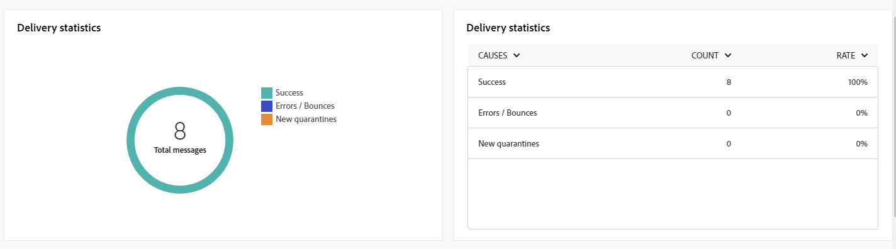

# Algemene rapporten voor het SMS-kanaal {#campaign-reports-sms}

De globale rapporten verstrekken gebruikers van een uitvoerig overzicht van verkeer en betrokkenheidsmetriek op kanaal-niveau.

Ga naar de **[!UICONTROL Reports]** in het menu **[!UICONTROL Reporting]** sectie. U kunt de gegevens filteren op basis van de rapportdatum, -map of -regels. [Meer informatie](global-reports.md)

## Leveringsoverzicht {#delivery-summary-sms}

### Overzicht van levering {#delivery-overview-sms}

De **[!UICONTROL Delivery Overview]** Het rapport biedt uitvoerige zeer belangrijke prestatiesindicatoren (KPIs) die diepgaand inzicht in de interactiepatronen van uw bezoekers met elke levering van SMS verstrekken. De volgende cijfers worden hieronder beschreven.

+++ Meer informatie over overzichtsmetriek voor levering.

* **[!UICONTROL Messages to deliver]**: Het totale aantal berichten dat tijdens de voorbereiding van de levering wordt verwerkt.

* **[!UICONTROL Delivered]**: Percentage berichten dat succesvol is verzonden, in verhouding tot het totale aantal verzonden berichten.

* **[!UICONTROL Click-through rate]**: Percentage duidelijke ontvangers die minstens één keer op een levering hebben geklikt.

* **[!UICONTROL Errors]**: Percentage fouten gecumuleerd tijdens levering en automatische terugkeerverwerking met betrekking tot het totale aantal verzonden berichten.

+++

### Gericht publiek {#delivery-summary-sms-initial-target}

De **[!UICONTROL Targeted audience]** tabel en grafiek geven gegevens weer met betrekking tot uw ontvangers voor elke verzonden SMS-levering. De cijfers worden hieronder beschreven.

+++ Meer informatie over de meetgegevens voor doelgroepen.

* **[!UICONTROL Targeted audience]**: Totaal aantal beoogde ontvangers.

* **[!UICONTROL Message to deliver]**: Totaal aantal berichten dat na de voorbereiding van de levering moet worden bezorgd.

* **[!UICONTROL Exclusion]**: Het totale aantal adressen dat tijdens de analyse wordt genegeerd wanneer het toepassen van regels: adres ontbreekt, quarantined, op lijst van gewezen personen, enz.

+++

### Leveringsstatistieken {#delivery-summary-sms-exec-stats}

De **[!UICONTROL Delivery statistics]** in de tabel wordt aangegeven hoe succesvol je levering via SMS is. De cijfers worden hieronder beschreven.

+++ Meer informatie over de statistieken van de Levering metriek.

* **[!UICONTROL Total messages]**: Totaal aantal berichten dat na de voorbereiding van de levering moet worden bezorgd.

* **[!UICONTROL Success]**: Het aantal berichten dat met succes is verwerkt in verhouding tot het aantal te leveren berichten.

* **[!UICONTROL Errors / Bounces]**: Totaal aantal fouten bij leveringen en automatische oplevering in verhouding tot het aantal te leveren berichten.

* **[!UICONTROL New quarantines]**: Het totale aantal adressen dat in quarantaine wordt geplaatst na een mislukte levering (onbekend, ongeldig domein) in verhouding tot het aantal te leveren berichten.

  Typen SMS-fouten worden vermeld in het dialoogvenster [Adobe Campaign v8-documentatie (clientconsole)](https://experienceleague.adobe.com/docs/campaign/campaign-v8/send/failures/delivery-failures.html#sms-quarantines){target="_blank"}.

+++

### Oorzaken van uitsluiting {#causes-exclusion}

De **[!UICONTROL Causes of exclusion]** de grafiek en de lijst tonen de redenen die gebruikersprofielen, die van de gerichte profielen werden uitgesloten, van het ontvangen van uw leveringen van SMS verhinderden.

Fouttypen worden vermeld in het dialoogvenster [Adobe Campaign v8-documentatie (clientconsole)](https://experienceleague.adobe.com/docs/campaign/campaign-v8/send/failures/delivery-failures.html#email-error-types){target="_blank"}.

## Leveringsdoorvoer {#delivery-throughput-sms}

Dit rapport bevat uitgebreide informatie over de leveringstijd binnen een opgegeven tijdsperiode.
