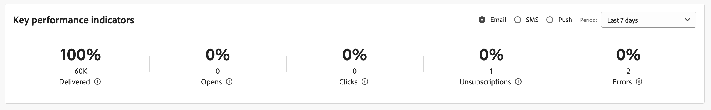

# Belangrijkste prestatie-indicatoren {#kpis}

>[!CONTEXTUALHELP]
>id="acw_home_kpi"
>title="Belangrijkste prestatie-indicatoren"
>abstract="De **Belangrijkste prestatie-indicatoren** kunt u de doeltreffendheid van uw platform controleren via veelgebruikte KPI&#39;s."

>[!CONTEXTUALHELP]
>id="acw_keyindicators_spam"
>title="Spam"
>abstract="Spam KPI"

Blader naar de startpagina om de belangrijkste prestatie-indicatoren voor uw platform te controleren. Deze indicatoren tonen het aantal en het percentage geleverde, geopende, geklikte berichten, unsubscription, en foutenpercentages.

Metrische gegevens worden standaard berekend voor leveringen die in de afgelopen 7 dagen zijn verzonden. U kunt de punt van de drop-down lijst op de hogere juiste sectie van de kaart veranderen. Berichten die naar testprofielen worden verzonden, worden uitgesloten.

U kunt het kanaal selecteren dat u wilt weergeven. Deze indicatoren weerspiegelen standaard de cijfers voor het e-mailkanaal.

## Bericht bezorgd {#ui-delivered-kpi}

>[!CONTEXTUALHELP]
>id="acw_keyindicators_delivered"
>title="Geleverd"
>abstract="Deze metrische toont, voor het geselecteerde kanaal, de som van alle berichten die met succes worden verwerkt, en het percentage van bericht dat met succes in vergelijking met het totale aantal verzonden berichten wordt geleverd."

Het aantal geleverde berichten komt overeen met de snelheid van de levering. Het kan nooit 100% om de volgende redenen zijn: sommige adressen of telefoonnummers kunnen onjuist zijn, spamblokkers bij e-mailproviders kunnen uw berichten afwijzen of er kunnen zich problemen voordoen met de leverantie.

De **Geleverd** de indicator toont de volgende KPIs, voor elk kanaal:

* Percentage van het aantal berichten dat met succes wordt geleverd in verhouding tot het totale aantal verzonden berichten.

* De som van alle berichten die met succes zijn verwerkt.

In Adobe Campaign geldt de regel om een bericht te markeren als &quot;Afgeleverd&quot;:

Aantal berichten waarvoor het veld &quot;zaadadres&quot; gelijk is aan &quot;Nee&quot; en met een status die gelijk is aan &quot;Rekening gehouden door de dienstverlener&quot; (voor SMS) of &quot;Verzonden&quot; (voor e-mails) of &quot;Ontvangen op de mobiele telefoon&quot; (voor pushberichten).

## Totaal openen {#ui-open-kpi}

>[!CONTEXTUALHELP]
>id="acw_keyindicators_opens"
>title="Geopende items"
>abstract="Deze metrische toont, voor het geselecteerde kanaal, de som van alle geopende berichten, en het percentage van geopend bericht vergeleken met het totale aantal berichten die met succes worden geleverd."

Totaal opent wordt berekend door het totale aantal tijden te volgen een bericht wordt geopend, ongeacht hoeveel individuele ontvangers die opent door worden geproduceerd. Deze indicator is alleen beschikbaar voor e-mails.

De **Openen** de indicator toont de volgende KPIs, voor elk kanaal:

* Percentage van het aantal geopende berichten in verhouding tot het totale aantal met succes geleverde berichten.

* Som van alle geopende berichten, per kanaal.

Adobe Campaign detecteert dat het bericht wordt geopend wanneer de ontvanger de afbeeldingen in de e-mail downloadt. HTML- en Multipart-/Alternatieve e-mailberichten bevatten een afbeelding van 0 pixels, waarmee u berichten kunt detecteren die zijn geopend. Aangezien berichten in tekstopmaak geen afbeeldingen bevatten, is het onmogelijk om te bepalen of ze zijn geopend of niet. Waarden die worden berekend op basis van het bericht dat wordt geopend, zijn altijd schattingen vanwege de foutmarge die is gekoppeld aan de beeldweergave.

## Doorklikfrequentie {#ui-click-kpi}

>[!CONTEXTUALHELP]
>id="acw_keyindicators_clicks"
>title="Klikken"
>abstract="Deze metrisch toont, voor het geselecteerde kanaal, de som van al URL klikte in berichten, en het percentage kliks in vergelijking met het totale aantal berichten die met succes worden geleverd."

U kunt URLs in uw berichtinhoud toevoegen, die ontvangers aan een bepaalde pagina opnieuw richt. Het klikthrough tarief meet het aantal en het percentage ontvangers die op een verbinding in het bericht klikte.

De **Klikken** de indicator toont de volgende KPIs, voor elk kanaal:

* Percentage van het aantal klikken in verhouding tot het totale aantal berichten dat met succes wordt geleverd.

* Aantal verschillende personen dat ten minste één keer in een levering heeft geklikt. Koppelingen zonder abonnement en koppelingen naar de spiegel voor e-mail zijn uitgesloten.

Deze cijfers zijn gebaseerd op de Geconsolideerde tabel voor reeksspatiëring (`nms:trackingStats`). Deze bijeengevoegde lijst wordt gebruikt voor prestatiesredenen wanneer het tonen van rapporten, in de plaats van de Ontvanger het volgen logboeklijst (`nms:trackingLogRcp`) en wordt niet in real time berekend. De tabel wordt een paar minuten nadat de logbestanden voor bijhouden zijn opgehaald, gegenereerd.

## Abonnementstarieven {#ui-unsub-kpi}

>[!CONTEXTUALHELP]
>id="acw_keyindicators_unsubscriptions"
>title="Uitschrijvingen"
>abstract="Deze metrisch toont, voor het geselecteerde kanaal, de som van alle abonnementen van de dienst, en het percentage van abonnementen in vergelijking met het totale aantal berichten die met succes worden geleverd."

Ontvangers moeten zich kunnen afmelden bij e-mail en SMS via een speciale koppeling om hun abonnement op te zeggen in de e-mailinhoud of door STOP op een SMS te beantwoorden.

De **Abonnementen** de indicator toont de volgende KPIs, voor elk kanaal:

* Percentage van het aantal afboekingen in verhouding tot het totale aantal met succes geleverde berichten.

* De som van alle klikken op een koppeling zonder abonnement, d.w.z. met een categorie URL is gelijk aan &quot;Opt-out&quot;.

## Foutsnelheden {#ui-error-kpi}

>[!CONTEXTUALHELP]
>id="acw_keyindicators_errors"
>title="Fouten"
>abstract="Het totale aantal fouten dat is gecumuleerd tijdens leveringen en automatische stuitverwerking. Het bijbehorende tarief is de verhouding met het aantal te leveren berichten."

Sommige berichten die door je Adobe Campaign-platform worden verzonden, bereiken de bestemming mogelijk niet. Het kan gebeuren wanneer het gebruikersadres of de telefoon typos hebben, of als de ontvanger hun e-mailadres veranderde, of als hun brievenbus volledig is. Als een bericht niet naar een profiel kan worden verzonden, verzendt de externe server automatisch een foutbericht naar Adobe Campaign. Deze fout is gekwalificeerd om te bepalen of het e-mailadres, het telefoonnummer of het apparaat in quarantaine moet worden geplaatst.

Dit betekent dat u de database altijd moet controleren en bijwerken en ervoor moet zorgen dat alle profielen actief en reëel zijn. De fouten van de levering kunnen tijdelijk of permanent zijn - zacht of hard stuiteren - afhankelijk van waarom het bericht niet werd geleverd.

De **Fouten** de indicator toont de volgende KPIs, voor elk kanaal:

* Percentage van het aantal fouten in verhouding tot het totale aantal te leveren berichten.

* Totaal aantal fouten gecumuleerd tijdens leveringen en automatische terugkerende verwerking.
