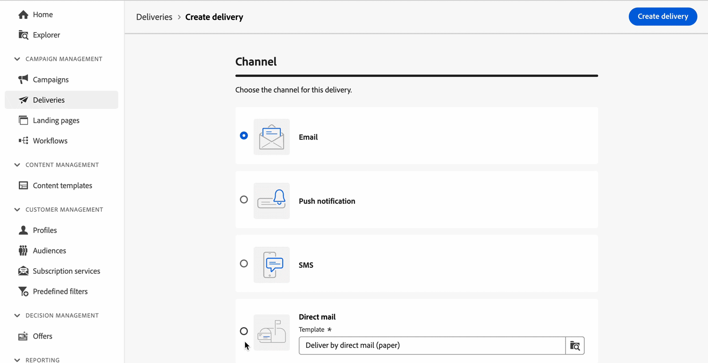

# Aanvullende informatie  {#latest-release}

>[!CONTEXTUALHELP]
>id="acw_homepage_learning_card2"
>title="Nieuwe functies"
>abstract="De gebruikersinterfaceversies van het Web van Adobe Campaign werken op een ononderbroken leveringsmodel dat voor een scalable, gefaseerde benadering van eigenschapplaatsing toestaat. Opmerkingen bij de release worden meerdere keren per maand bijgewerkt. **Release van maart is nu live**, waaronder Direct mail kanaal, de nieuwe activiteit van de het gegevensbronwerkschema van de Verandering, en andere verbeteringen."

<!--Last update: **March 19, 2024**-->

De gebruikersinterfaceversies van het Web van Adobe Campaign werken op een ononderbroken leveringsmodel dat voor een scalable, gefaseerde benadering van eigenschapplaatsing toestaat. Deze releaseopmerkingen worden daarom meerdere keren per maand bijgewerkt. Controleer ze regelmatig.

>[!AVAILABILITY]
>
>Deze versie is beschikbaar voor alle gebruikers die beginnen [Campagne (console) v8.6-release](https://experienceleague.adobe.com/docs/campaign/campaign-v8/releases/release-notes.html). Meer informatie over de release en upgrades van de Adobe Campaign-clientconsole in [Campagne v8 (console)-documentatie](https://experienceleague.adobe.com/docs/campaign/campaign-v8/releases/upgrades.html){target="_blank"}.

## Opmerkingen bij de release maart {#24-3-release}

>[!CONTEXTUALHELP]
>id="acw_homepage_welcome_rn1"
>title="Direct mail"
>abstract="Het Direct-mailkanaal is nu beschikbaar voor gebruik in workflows en op zichzelf staande leveringen. Gebruik het off-line kanaal van de Post om een extractiedossier tot stand te brengen, te personaliseren en te produceren, en het met uw directe postleveranciers te delen om post naar uw klanten te verzenden."
>additional-url="https://experienceleague.adobe.com/en/docs/campaign-web/v8/release-notes/release-notes" text="Zie opmerkingen bij releases"

>[!CONTEXTUALHELP]
>id="acw_homepage_welcome_rn2"
>title="Databron wijzigen"
>abstract="Gebruik de nieuwe gegevensbronwerkstroom van de Verandering richtend activiteit om de gegevensbron te veranderen die door de het werk lijst van uw werkschema wordt gebruikt. Deze activiteit verstrekt meer flexibiliteit door u toe te staan om gegevens over uw verschillende gegevensbestanden te beheren en prestaties te verbeteren."
>additional-url="https://experienceleague.adobe.com/en/docs/campaign-web/v8/release-notes/release-notes" text="Zie opmerkingen bij releases"

**Releasedatum**: 19-20 maart 2024

### Direct Mail Channel {#24-3-dm}

**Directe post** kanaal is nu beschikbaar voor gebruik in werkschema&#39;s en als standalone leveringen. Directe post is een off-line kanaal dat u toestaat om een extractiedossiers tot stand te brengen, te personaliseren en te produceren, en het met uw directe postleveranciers te delen om post naar uw klanten te verzenden. [Meer informatie](../direct-mail/gs-direct-mail.md)

### Nieuwe werkstroomactiviteit gegevensbron wijzigen {#24-3-change-data-source}

De **Gegevensbron wijzigen** Door doelactiviteit toe te wijzen, kunt u de gegevensbron wijzigen die wordt gebruikt door de werktabel van uw werkstroom. Deze activiteit verstrekt meer flexibiliteit door u toe te staan om gegevens over uw verschillende gegevensbestanden te beheren en prestaties te verbeteren. [Meer informatie](../workflows/activities/change-data-source.md)

### Verbetering van workflowactiviteit splitsen {#24-3-split}

U kunt nu de opdracht **Alle subsets in dezelfde tabel genereren** in de **Splitsen** workflowactiviteit om alle subsets te groeperen in één uitvoerovergang. [Meer informatie](../workflows/activities/split.md)

### Query-modelleraar {#24-3-query-modeler}

* Het querymodel is nu beschikbaar voor gebruik in de e-mailontwerper. Hiermee kunt u voorwaarden maken wanneer u voorwaardelijke inhoud maakt. [Meer informatie](../personalization/conditions.md)
* Vooraf gedefinieerde waarden zijn nu beschikbaar voor datumtekstkenmerken wanneer u een aangepaste voorwaarde maakt. [Meer informatie](../query/build-query.md)
* Operatoren kunnen niet meer worden toegevoegd aan een nieuwe overgang in het diagram. Ze kunnen alleen aan een bestaande overgang worden toegevoegd voordat u componenten filtert om deze samen te groeperen. [Meer informatie](../query/build-query.md)
