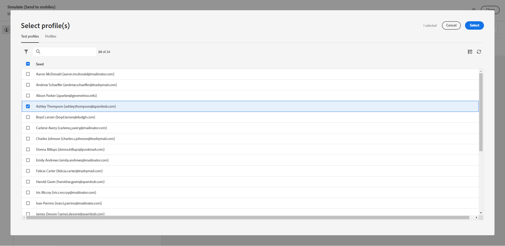

# Een SMS-verzending bekijken en verzenden {#send-sms-delivery}

>[!CONTEXTUALHELP]
>id="acw_deliveries_metrics_newquarantines"
>title="Nieuwe metrische quarantines"
>abstract="Het totale aantal adressen quarantined na een ontbroken levering (onbekend gebruiker, ongeldig domein) met betrekking tot het aantal te leveren berichten."

## Je SMS-aanbieding bekijken{#preview-sms}

Nadat u de inhoud van uw bericht hebt gedefinieerd, kunt u testprofielen gebruiken om een voorbeeld van de inhoud weer te geven en deze te testen. Als u gepersonaliseerde inhoud hebt opgenomen, kunt u onderzoeken hoe deze inhoud in het bericht wordt getoond door de gegevens van het testprofiel te gebruiken. Op deze manier kunt u ervoor zorgen dat het bericht op de gewenste manier wordt weergegeven en dat alle gepersonaliseerde gegevens correct worden weergegeven.

De belangrijkste stappen voor een voorvertoning van uw SMS-levering zijn als volgt. Meer details op hoe te voorproef zijn de leveringen beschikbaar in [ deze sectie ](../preview-test/preview-content.md).

1. Gebruik **[!UICONTROL Simulate content]** om een voorvertoning van uw gepersonaliseerde inhoud weer te geven vanaf de pagina met de inhoud van de levering.

   {zoomable="yes"}

1. Klik op **[!UICONTROL Add test profile(s)]** om een of meerdere testprofielen of profielen te selecteren.

   <!--
    Once your test profiles are selected, click **[!UICONTROL Select]**.
    {zoomable="yes"}
    -->

1. In het rechterdeelvenster vindt u een voorbeeld van de SMS-levering, waar gepersonaliseerde elementen dynamisch worden vervangen door gegevens uit het geselecteerde profiel.

   {zoomable="yes"}

Je kunt je SMS-bericht nu bekijken en naar je publiek sturen.

## Je SMS-levering testen {#test-sms}

Met **Adobe Campaign**, hebt u de capaciteit om een bericht te testen alvorens het naar het belangrijkste publiek te verzenden, dat een essentiële stap in het bevestigen van uw e-mailcampagne en het identificeren van potentiële kwesties is.

Het verzenden van proefdrukken is een belangrijke stap om de kwaliteit en doeltreffendheid van uw levering te verzekeren. De ontvangers van het proef kunnen diverse elementen zoals verbindingen, opt-out verbindingen en beelden herzien, evenals om het even welke fouten in het teruggeven, inhoud, verpersoonlijkingsmontages, en de configuratie van SMS identificeren. Dit proces helpt u uw SMS grondig evalueren en optimaliseren alvorens uw belangrijkste publiek te bereiken.

 Leer hoe te om proeven in [ deze sectie ](../preview-test/test-deliveries.md) te verzenden.

{zoomable="yes"}

## Verstuur je SMS-verzending {#send-sms}

1. Nadat u de SMS-inhoud hebt aangepast, klikt u op **[!UICONTROL Review & send]** op uw **[!UICONTROL Delivery]** -pagina.

   {zoomable="yes"}

1. Klik op **[!UICONTROL Prepare]** en controleer de voortgang en de beschikbare statistieken.

   Als er fouten optreden, raadpleegt u het menu Logs voor meer informatie over de fout.

1. Verzend de berichten door op **[!UICONTROL Send]** te klikken om verder te gaan met het laatste verzendproces.

   {zoomable="yes"}

   Als de SMS-levering gepland is, klikt u op de knop **[!UICONTROL Send as scheduled]** . Leer meer over levering het plannen in [ deze sectie ](../msg/gs-messages.md#schedule-the-delivery-sending).

1. Bevestig de verzendactie door op de knop **[!UICONTROL Send]** te klikken.

Zodra uw levering wordt verzonden, kunt u uw gegevens van KPIs (Zeer belangrijke Indicator van Prestaties) van uw leveringspagina en gegevens van het **[!UICONTROL Logs]** menu volgen.

U kunt nu beginnen de impact van uw bericht te meten met ingebouwde rapporten. [Meer informatie](../reporting/sms-report.md)
