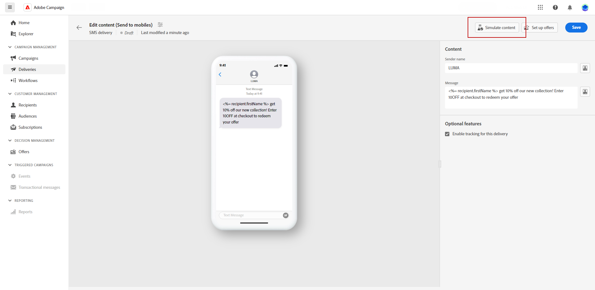

# Een SMS-verzending bekijken en verzenden {#send-sms-delivery}

>[!CONTEXTUALHELP]
>id="acw_deliveries_metrics_newquarantines"
>title="Nieuwe metrische quarantines"
>abstract="Het totale aantal adressen quarantined na een ontbroken levering (onbekend gebruiker, ongeldig domein) met betrekking tot het aantal te leveren berichten."

## Je SMS-aanbieding bekijken {#preview-sms}

Nadat u de inhoud van uw bericht hebt gedefinieerd, kunt u testprofielen gebruiken om een voorbeeld van de inhoud weer te geven en deze te testen. Als gepersonaliseerde inhoud wordt opgenomen, onderzoek hoe deze inhoud in het bericht door de gegevens van het testprofiel te gebruiken verschijnt. Dit verzekert de berichtvertoningen zoals bedoeld en dat de gepersonaliseerde informatie correct wordt voorgesteld.

De belangrijkste stappen voor een voorvertoning van uw SMS-levering zijn als volgt. Meer details op hoe te voorproef zijn de leveringen beschikbaar in [ deze sectie ](../preview-test/preview-content.md).

1. Gebruik **[!UICONTROL Simulate content]** om een voorvertoning van uw gepersonaliseerde inhoud weer te geven vanaf de pagina met de inhoud van de levering.

   {zoomable="yes"}

1. Klik op **[!UICONTROL Add test profile(s)]** om een of meerdere testprofielen of profielen te selecteren.

   <!--
    Once your test profiles are selected, click **[!UICONTROL Select]**.
    {zoomable="yes"}
    -->

1. In de juiste ruit, bekijk een voorproef van de levering van SMS, waar de gepersonaliseerde elementen dynamisch met gegevens van het geselecteerde profiel worden vervangen.

   {zoomable="yes"}

Bekijk en verzend je SMS-bericht naar je publiek.

## Je SMS-levering testen {#test-sms}

Met **Adobe Campaign**, test een bericht alvorens het naar het belangrijkste publiek te verzenden. Deze stap valideert uw e-mailcampagne en identificeert mogelijke problemen.

Het verzenden van proefdrukken is van cruciaal belang voor de kwaliteit en doeltreffendheid van uw levering. De ontvangers van het proef herzien diverse elementen zoals verbindingen, opt-out verbindingen, en beelden, en identificeren om het even welke fouten in het teruggeven, inhoud, verpersoonlijkingsmontages, en de configuratie van SMS. Dit proces evalueert en optimaliseert grondig uw SMS alvorens uw belangrijkste publiek te bereiken.

 leren hoe te om proeven in [ deze sectie ](../preview-test/test-deliveries.md) te verzenden.

{zoomable="yes"}

## Verstuur je SMS-verzending {#send-sms}

1. Nadat u de SMS-inhoud hebt aangepast, klikt u op **[!UICONTROL Review & send]** op uw **[!UICONTROL Delivery]** -pagina.

   {zoomable="yes"}

1. Klik op **[!UICONTROL Prepare]** en controleer de voortgang en de beschikbare statistieken.

   Als er fouten optreden, raadpleegt u het menu Logs voor meer informatie over de fout.

1. Verzend de berichten door op **[!UICONTROL Send]** te klikken om door te gaan met het laatste verzendproces.

   {zoomable="yes"}

   Als de SMS-levering gepland is, klikt u op de knop **[!UICONTROL Send as scheduled]** . Leer meer over levering het plannen in [ deze sectie ](../msg/gs-messages.md#schedule-the-delivery-sending).

1. Bevestig de verzendactie door op de knop **[!UICONTROL Send]** te klikken.

Zodra uw levering wordt verzonden, volg uw gegevens van KPIs (Zeer belangrijke Indicator van Prestaties) van uw leveringspagina en gegevens van het **[!UICONTROL Logs]** menu.

Begin het effect van uw bericht met ingebouwde rapporten te meten. [Meer informatie](../reporting/sms-report.md)