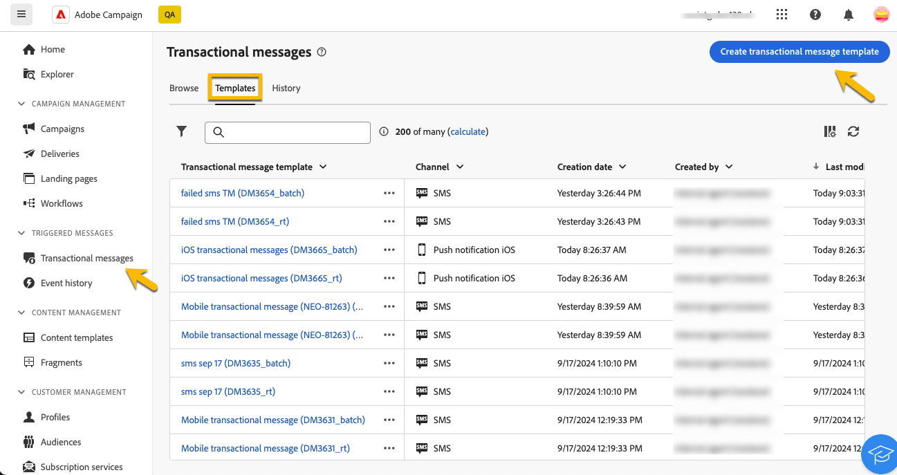

# Transactieberichten maken

In transactioneel overseinen, brengt een gebeurtenis het verzenden van een gepersonaliseerd bericht teweeg. Om dit toe te laten, creeer een berichtmalplaatje voor elk gebeurtenistype. Deze sjablonen bevatten alle benodigde informatie voor het aanpassen van het transactiebericht.

## Een sjabloon voor een transactiebericht maken {#transactional-template}

In het Gebruikersinterface van het Web van de Campagne, is de eerste stap in transactie overseinenconfiguratie de verwezenlijking van het malplaatje of de directe verwezenlijking van het bericht. Dit verschilt van [ de configuratie van transactionele berichten op de cliëntconsole ](https://experienceleague.adobe.com/nl/docs/campaign/campaign-v8/send/real-time/transactional).

Een transactiemalplaatje van het bericht kan worden gebruikt om voorproef de leveringsinhoud die door het profiel wordt ontvangen alvorens het het definitieve publiek bereikt. Bijvoorbeeld, kan een beheerder opstelling en de malplaatjes vormen, die hen voor gebruik door marketing gebruikers klaar maken.

Voer de onderstaande stappen uit om een transactiemalplaatje te maken:

* Ga in de sectie **[!UICONTROL Triggered messages]** naar **[!UICONTROL Transactional messages]** . Op het tabblad **[!UICONTROL Templates]** ziet u alle leveringssjablonen voor transactiemeldingen. Klik op de knop **[!UICONTROL Create transactional message template]** om de sjabloon te maken.

  {zoomable="yes"}

* Kies het kanaal van de sjabloon in de nieuwe weergegeven pagina. Selecteer in dit voorbeeld het kanaal **[!UICONTROL Email]** . U kunt ook vanuit een andere berichtsjabloon werken en deze selecteren in de lijst met sjablonen.

  {zoomable="yes"}

  Klik nogmaals op de knop **[!UICONTROL Create transactional message]** om het maken van de sjabloon op het geselecteerde kanaal te valideren.

* Heb toegang tot de configuratie van uw transactiemeldsjabloon.

  {zoomable="yes"}

### Eigenschappen van Transactieberichten {#transactional-properties}

>[!CONTEXTUALHELP]
>id="acw_transacmessages_properties"
>title="Eigenschappen voor Transactieberichten"
>abstract="Vul dit formulier in om de eigenschappen van het transactiebericht te configureren."

>[!CONTEXTUALHELP]
>id="acw_transacmessages_email_properties"
>title="E-maileigenschappen voor Transactieberichten"
>abstract="Vul dit formulier in om de e-maileigenschappen voor transactieberichten te configureren."

>[!CONTEXTUALHELP]
>id="acw_transacmessages_sms_properties"
>title="Eigenschappen van SMS-berichten"
>abstract="Vul dit formulier in om de SMS-eigenschappen voor transactieberichten te configureren."

>[!CONTEXTUALHELP]
>id="acw_transacmessages_push_properties"
>title="Transactieberichten Push-eigenschappen"
>abstract="Vul dit formulier in om de eigenschappen voor Push voor transactieberichten te configureren."

De sectie **[!UICONTROL Properties]** van een transactiemelding helpt u bij het instellen van:

* De **[!UICONTROL Label]** . Dit is de naam die wordt weergegeven in de lijst met transactieberichten. Duidelijk maken voor onderzoek en toekomstig gebruik.
* De **[!UICONTROL Internal name]**, een unieke naam die uw bericht onderscheidt van andere gemaakte berichten.
* De **[!UICONTROL Folder]** , waar de transactiemalplaatje van het bericht wordt gecreeerd.
* De lus **[!UICONTROL Execution folder]** , waarbij het bericht wordt opgeslagen na de uitvoering.
* De **[!UICONTROL Delivery code]** . Dit is een code die helpt het bericht voor rapportage te herkennen, indien nodig.
* De **[!UICONTROL Description]** .
* **[!UICONTROL Nature]**, die de aard van uw levering is, zoals vermeld in de opsomming *deliveryNature*. [ leer meer over opsommingen ](https://experienceleague.adobe.com/nl/docs/campaign/campaign-v8/config/configuration/ui-settings#enumerations).

{zoomable="yes"}

### Mobiele app {#mobile-app}

>[!CONTEXTUALHELP]
>id="acw_transacmessages_mobileapp"
>title="Transactieberichten voor mobiele apps"
>abstract="In deze sectie kunt u de toepassing selecteren waar u uw bericht wilt duwen."

Selecteer in deze sectie de toepassing waarop u uw bericht wilt plaatsen.

Als u op het zoekpictogram klikt, opent u de lijst met mobiele toepassingen in uw Adobe Campaign-exemplaar.

{zoomable="yes"}

### Contextvoorbeeld {#context-sample}

>[!CONTEXTUALHELP]
>id="acw_transacmessages_context"
>title="Transactionele berichtcontext"
>abstract="In het contextvoorbeeld kunt u een testgebeurtenis maken om een voorvertoning weer te geven van het transactiebericht dat met de profielpersonalisatie is ontvangen."

>[!CONTEXTUALHELP]
>id="acw_transacmessages_addcontext"
>title="Transactionele berichtcontext"
>abstract="In het contextvoorbeeld kunt u een testgebeurtenis maken om een voorvertoning weer te geven van het transactiebericht dat met de profielpersonalisatie is ontvangen."

In het contextvoorbeeld kunt u een testgebeurtenis maken om een voorvertoning weer te geven van het transactiebericht dat met de profielpersonalisatie is ontvangen.

Deze stap is optioneel. U kunt de sjabloon zonder het contextvoorbeeld gebruiken, maar het nadeel is dat u geen voorvertoning van de gepersonaliseerde inhoud kunt weergeven.

In het voorbeeld om het wachtwoord in te stellen, verzendt de gebeurtenis de voornaam, achternaam, en een gepersonaliseerde verbinding van de gebruiker om hun wachtwoord terug te stellen. De context kan worden gevormd zoals hieronder getoond.

De inhoud van de context is afhankelijk van de personalisatie die u nodig hebt.

{zoomable="yes"}

### Inhoud van transactiemalplaatje {#transactional-content}

>[!CONTEXTUALHELP]
>id="acw_transacmessages_content"
>title="Transactionele berichteninhoud"
>abstract="Leer hoe u de inhoud van het transactiebericht maakt."

>[!CONTEXTUALHELP]
>id="acw_transacmessages_personalization"
>title="Transactionele berichtenaanpassing"
>abstract="Leer hoe u de inhoud van het transactiebericht kunt aanpassen."

>[!CONTEXTUALHELP]
>id="acw_personalization_editor_event_context"
>title="Gebeurteniscontext"
>abstract="Dit menu bevat variabelen van de triggergebeurtenis die u kunt gebruiken om de inhoud van het transactiemelding aan te passen."

Het werken aan de inhoud van een transactiemelding is gelijkaardig aan de inhoudsverwezenlijking van een levering. Klik op **[!UICONTROL Open email designer]** of **[!UICONTROL Edit email body]** en selecteer een sjablooninhoud of importeer uw HTML-code.

{zoomable="yes"}

Als u personalisatie aan de inhoud wilt toevoegen, klikt u op de sectie waaraan u de inhoud wilt toevoegen en kiest u het pictogram **[!UICONTROL Add Personalization]** .

{zoomable="yes"}

Open het venster **[!UICONTROL Edit personalisation]** . Klik op het pictogram **[!UICONTROL Event context]** om variabelen van de triggergebeurtenis toe te voegen. Navigeer de context u voor uw malplaatje ([ meer over de context ](#context-sample)) bepaalde, en klik op de **[!UICONTROL +]** knoop om de vereiste variabele op te nemen.

In de onderstaande afbeelding ziet u hoe u personalisatie voor de voornaam kunt toevoegen.

{zoomable="yes"}

In dit voorbeeld voegt u de voornaam, achternaam en de koppeling naar de knop **[!UICONTROL Reset your password]** aan.

{zoomable="yes"}

### Een voorbeeld van een sjabloon bekijken

In dit stadium van malplaatjeverwezenlijking, voorproef de malplaatjeinhoud en controleer de verpersoonlijking.

Om dit te doen, vul in de [ contextsteekproef ](#context-sample), en klik op de **[!UICONTROL Simulate content]** knoop.

{zoomable="yes"}

## Een transactiebericht maken {#transactional-message}

U kunt een transactiemelding direct tot stand brengen of door een transactiemalplaatje van het berichtbericht te gebruiken. [ Leer hoe te om een transactionele berichtmalplaatje ](#transactional-template) tot stand te brengen.

Voer de onderstaande stappen uit om een transactiebericht te maken:

* Ga in de sectie **[!UICONTROL Triggered messages]** naar **[!UICONTROL Transactional messages]** . Op het tabblad **[!UICONTROL Browse]** kunt u alle gemaakte transactiemeldingen zien. Klik op de knop **[!UICONTROL Create transactional message]** om het bericht te maken.

  {zoomable="yes"}

* Kies in de nieuwe weergegeven pagina het kanaal van het bericht en selecteer de sjabloon waarmee u wilt werken. In dit voorbeeld, kies [ het malplaatje vroeger ](#transactional-template) werd gecreeerd.

  {zoomable="yes"}

  Klik nogmaals op de knop **[!UICONTROL Create transactional message]** om te controleren of uw bericht op het geselecteerde kanaal is gemaakt.

* Heb toegang tot de configuratie van uw transactiebericht. Uw bericht erft de configuratie van het malplaatje. Deze pagina is bijna identiek aan de configuratiepagina van het transactiemalplaatje, behalve het omvat ook de configuratie van het gebeurtenistype.

  {zoomable="yes"}

  Vul de configuratie van uw bericht zoals voor een malplaatje in:
   * [Eigenschappen van Transactieberichten](#transactional-properties)
   * [Contextvoorbeeld](#context-sample)
   * [ inhoud van het Bericht ](#transactional-content)
en [ vorm het gebeurtenistype ](#event-type) zoals hieronder gedetailleerd.

* Na [ het bevestigen van uw transactiebericht ](validate-transactional.md), klik op de **[!UICONTROL Review and publish]** knoop om uw bericht tot stand te brengen en te publiceren. De triggers kunnen nu de verzending van uw transactiemelding stimuleren.

### Informatie over het gebeurtenistype {#event-type}

>[!CONTEXTUALHELP]
>id="acw_transacmessages_event"
>title="Transactionele berichtengebeurtenis"
>abstract="De configuratie van het gebeurtenistype koppelt het bericht aan de trekkergebeurtenis."

De configuratie van het gebeurtenistype koppelt het bericht aan de trekkergebeurtenis.

In het Gebruikersinterface van het Web van de Campagne, selecteer een reeds gecreeerd gebeurtenistype of creeer direct uw gebeurtenistype in deze configuratiepagina.

{zoomable="yes"}

>[!CAUTION]
>
>Als u een gebeurtenistype selecteert dat momenteel door een ander transactiemelding wordt gebruikt, zal het beide berichten teweegbrengen. Voor beste praktijken, **verbind ÉÉN gebeurtenistype met slechts ÉÉN transactioneel bericht.**

## Aanbiedingen toevoegen aan je transactieberichten {#transactional-offers}

U kunt aanbiedingen in uw transactiemeldingen omvatten, toestaand u om relevante voorstellen aan uw eind voor te leggen - gebruikers, zelfs wanneer het bericht gebeurtenis-teweeggebracht is.

Deze functie is toegankelijk tijdens de bewerkingsfase van de inhoud van uw transactiebericht. Klik op de knop **[!UICONTROL Set up offers]** om deze te configureren.

Het installatieproces is identiek aan het configureren van aanbiedingen voor standaardleveringen. [ Leer hoe te om aanbiedingen aan uw bericht ](../msg/offers.md) toe te voegen.

{zoomable="yes"}