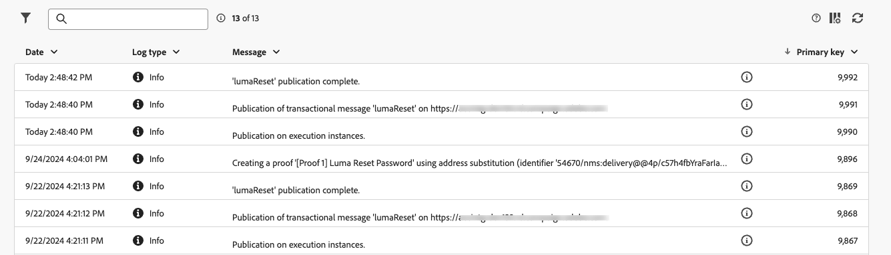

# Transactieberichten controleren

Na het publiceren en het verzenden van uw transactiemelding, kunt u rapportering en logboeken over het hebben.

## Transactionele berichtenlogboeken {#transactional-logs}

Nadat uw bericht is gepubliceerd, kunt u de uitvoering ervan controleren door op de knop **[!UICONTROL Logs]** te klikken.

{zoomable="yes"}

Zo hebt u toegang tot gedetailleerde logboeken over de publicatie van het bericht op het tabblad **[!UICONTROL logs]** .

{zoomable="yes"}

Daarnaast kunt u op het bijbehorende tabblad de lijst weergeven met **[!UICONTROL Proofs]** die samen met de bijbehorende logbestanden is verzonden.

## Historie van transactieberichten {#transactional-history}

In de sectie **[!UICONTROL Triggered messages]** kunt u details weergeven over alle transactiemeldingen die zijn uitgevoerd. Navigeer naar **[!UICONTROL Transactional messages]** om dit te openen. Op het tabblad **[!UICONTROL History]** kunt u de lijst met uitgevoerde transactieberichten zien, samen met hun status en aanvullende informatie.

{zoomable="yes"}

Doe daar een onderzoek om uw boodschap te vinden en erop te klikken.
U kunt de details hier bekijken.

{zoomable="yes"}

## Gebeurtenisgeschiedenis {#event-history}

>[!CONTEXTUALHELP]
>id="acw_transacmessages_eventhistory"
>title="Transactionele berichtengebeurtenisgeschiedenis"
>abstract="U kunt een mening over de gebeurtenissen hebben die uw transactiebericht teweegbrengen."

>[!CONTEXTUALHELP]
>id="acw_transacmessages_eventhistory_preview"
>title="Voorvertoning van de historie van de Transactionele berichtengebeurtenis"
>abstract="U kunt een mening over de gebeurtenissen hebben die uw transactiebericht teweegbrengen."

U kunt ook een weergave hebben van de gebeurtenissen die uw transactiemelding activeren.
Ga naar **[!UICONTROL Event history]** sectie om ze te zien.

U kunt ze zien met de naam van het gebeurtenistype.

{zoomable="yes"}

U ziet hieronder meer details door op de **[!UICONTROL Event]** ID te klikken:

* De contactgegevens
* Alles over de procesdatums

U kunt zelfs een voorvertoning weergeven van het bericht dat met de knop **[!UICONTROL Preview]** is verzonden en de ontvangen gegevens zien die het bericht activeren met de knop **[!UICONTROL View data]** .

{zoomable="yes"}

Met de knop **[!UICONTROL More]** kunt u de gebeurtenisgeschiedenis verwijderen.
