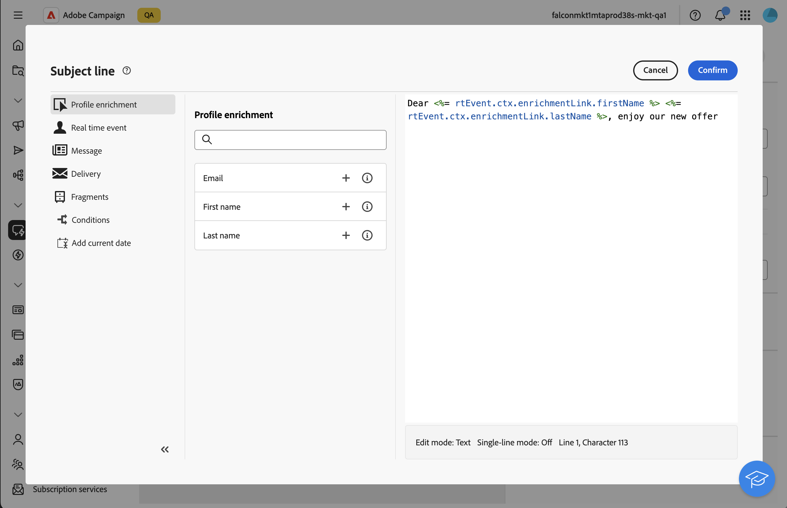

# Transactieberichten verrijken met profielgegevens{#profile-enrichment}

>[!CONTEXTUALHELP]
>id="acw_homepage_welcome_rn2"
>title="Profielverrijking"
>abstract="U kunt transactionele berichten nu personaliseren door de gegevensbestandgebieden van de Campagne aan inhoud te verbinden. Selecteer doeltoewijzingen, verrijkingskolommen en afstemmingssleutels voor nauwkeurige realtime personalisatie."
>additional-url="https://experienceleague.adobe.com/docs/campaign-web/v8/release-notes/release-notes.html" text="Zie opmerkingen bij releases"

Met deze functie kunt u transactieberichten personaliseren door Adobe Campaign-databasevelden aan berichtinhoud te koppelen. U kunt doeltoewijzingen, verrijkingskolommen, en een verzoeningssleutel selecteren om nauwkeurige, real-time verpersoonlijking te verzekeren terwijl het handhaven van prestatiesdrempels.

* Transactieberichten die zijn gebaseerd op gebeurtenissen, gebruiken gegevens die zich in de gebeurtenis zelf bevinden.
* Transactieberichten op basis van profielen gebruiken gegevens in de Adobe Campaign-database.

Ga als volgt te werk om profielverrijking in te stellen:

1. Creeer het transactionele bericht, [&#x200B; lees meer &#x200B;](#create-enrichment)
1. Bepaal het gebeurtenistype, [&#x200B; lees meer &#x200B;](#event-enrichment)
1. Opstelling de verrijkingsmontages, [&#x200B; lees meer &#x200B;](#settings-enrichment)
1. Bepaal de inhoud, [&#x200B; lees meer &#x200B;](#content-enrichment)
1. Valideren en verzenden, [&#x200B; lees meer &#x200B;](#send-enrichment)

>[!NOTE]
>
>De upgrade van uw server naar 8.8.2 of hoger is vereist.
>
>Deze functie is momenteel alleen beschikbaar voor e-mails, SMS- en pushberichten.

## Het transactiebericht maken{#create-enrichment}

Eerst, moet u een nieuw transactiebericht tot stand brengen.

1. Ga in de sectie **[!UICONTROL Triggered messages]** naar **[!UICONTROL Transactional messages]** en maak een nieuw transactiebericht.

   {zoomable="yes"}

1. Kies een sjabloon en definieer de eigenschappen. Raadpleeg [deze pagina](create-transactional.md#transactional-message) voor meer informatie.

## Het gebeurtenistype definiëren{#event-enrichment}

Vervolgens moet u de gebeurtenis definiëren als op profiel gebaseerd om de gegevens in de Adobe Campaign-database als doel in te stellen.

1. In het **type van Gebeurtenis** sectie, uitgezochte **Uitgezochte gebeurtenistype**, dan kies als u een bestaand gebeurtenistype wilt gebruiken of uw creëren.

   >[!NOTE]
   >
   >U kunt geen gebeurtenistype kiezen dat al in een andere transactiemalplaatje wordt gebruikt.

   {zoomable="yes"}

1. Voer de informatie over het gebeurtenistype in:

   * Selecteer een bestaand gebeurtenistype in de lijst.
   * Voor een nieuwe, voeg een etiket en een naam toe.

1. Dan, kies **RT van het Profiel** in het **type van Gebeurtenis** drop-down.

   {zoomable="yes"}

## De verrijkingsinstellingen instellen{#settings-enrichment}

Nu, voegen wij gebieden aan de gebeurtenis toe die u zal toestaan om het transactionele bericht te personaliseren.

1. In de **sectie van Gegevens**, klik **montages van de Verrijking**.

   {zoomable="yes"}

   >[!NOTE]
   >
   >Deze knop is alleen beschikbaar wanneer u een op een profiel gebaseerde gebeurtenis definieert.

1. In de **Extra attributen** sectie, klik **voegt attributen** toe en selecteert de gebieden nodig.

   {zoomable="yes"}

1. Definieer welke eigenschap wordt gebruikt als de afstemmingssleutel.

1. Kies wat er moet gebeuren als de toets niet beschikbaar is in de payload.

   * Bericht wordt verzonden zonder personalisatie
   * Bericht is niet verzonden

## De inhoud definiëren{#content-enrichment}

Vervolgens moet u de inhoud van het transactiebericht definiëren.

1. In de **sectie van de Inhoud**, klik **geef inhoud** knoop uit en bepaal uw berichtinhoud. Verwijs naar deze [&#x200B; pagina &#x200B;](create-transactional.md#transactional-content).

   {zoomable="yes"}

1. Wanneer het gebruiken van verpersoonlijking, op de onderwerpregel bijvoorbeeld, gebruik het **verrijking van het Profiel** menu om de op profiel-gebaseerde eerder bepaalde gebieden toe te voegen.

   {zoomable="yes"}

## Valideren en verzenden{#send-enrichment}

Tot slot moet u de levering bevestigen en verzenden.

1. Valideer de levering door de inhoud te simuleren en proefdrukken te verzenden. Verwijs naar deze [&#x200B; pagina &#x200B;](validate-transactional.md).

1. Klik op de knop **[!UICONTROL Review and publish]** om het bericht te maken en te publiceren. De triggers kunnen nu het verzenden van uw transactiebericht starten.

<!--
When creating the event configuration, select the Profile event targeting dimension (see Creating an event).

Add fields to the event, in order to be able to personalize the transactional message (see Defining the event attributes). You must add at least one field to create an enrichment. You do not need to create other fields such as First name and Last name as you will be able to use personalization fields from the Adobe Campaign database.

Create an enrichment in order to link the event to the Profile resource (see Enriching the event) and select this enrichment as the Targeting enrichment.

IMPORTANT
This step is mandatory for profile-based events.
Preview and publish the event (see Previewing and publishing the event).

When previewing the event, the REST API does not contain an attribute specifying the email address, mobile phone, or push notification specific attributes, as it will be retrieved from the Profile resource.

Once the event has been published, a transactional message linked to the new event is automatically created. In order for the event to trigger sending a transactional message, you must modify and publish the message that was just created…

Integrate the event into your website (see Integrate the event triggering).
-->
