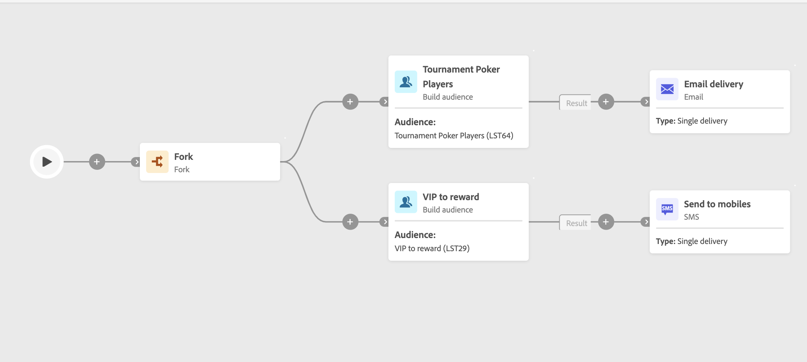

# publiek opbouwen {#build-audience}

>[!CONTEXTUALHELP]
>id="acw_orchestration_build_audience"
>title="Activiteit voor publiek opbouwen"
>abstract="**bouwt publieksactiviteit** toestaat u om het publiek te bepalen dat het werkschema zal ingaan. Wanneer het verzenden van berichten in de context van een werkschema, wordt het berichtpubliek niet bepaald in de kanaalactiviteit, maar in **bouwt publiek** activiteit."

**bouwt publieksactiviteit** is a **richtend** activiteit. Met deze activiteit kunt u het publiek definiëren dat de workflow zal betreden. Wanneer het verzenden van berichten in de context van een werkschema, wordt het berichtpubliek niet bepaald in de kanaalactiviteit, maar in **bouwt publiek** activiteit.

Om de publieksbevolking te bepalen, kunt u:

* Selecteer een bestaand publiek dat als een lijst in de cliëntconsole wordt gecreeerd.
* Selecteer een Adobe Experience Platform-publiek.
* Bouw een nieuw publiek met de vraagmodeler door het filtreren criteria te bepalen en te combineren.

>[!NOTE]
>
>Publiek dat van een dossier wordt geladen kan niet worden gericht gebruikend een het publieksactiviteit van de Bouwstijl. Om dit te doen, moet u het dossier van de Lading van de a **gebruiken** activiteit die door a **wordt gevolgd Verzoening** activiteit. [Meer informatie](../../audience/about-recipients.md)

<!--
The **Build audience** activity can be placed at the beginning of the workflow or after any other activity. Any activity can be placed after the **Build audience**.
-->

## Vorm de het publieksactiviteit van de Bouwstijl {#build-audience-configuration}

>[!CONTEXTUALHELP]
>id="acw_orchestration_build_audience_audienceselector"
>title="Doelgroep"
>abstract="Selecteer uw publiek, de zelfde manier u een publiek gebruikt wanneer het ontwerpen van een nieuwe levering."

Volg deze stappen om **te vormen bouwen publiek** activiteit:

1. Voeg a **toe bouwt publiek** activiteit.
1. Definieer een label.
1. Bepaal het publiekstype: **creeer uw eigen** of **leest publiek**.
1. Configureer uw publiek door de stappen uit te voeren die in de onderstaande tabbladen worden beschreven.

>[!BEGINTABS]

>[!TAB  creeer uw eigen (vraag) ]

Voer de volgende stappen uit om uw eigen query te maken:

1. Selecteer **creeer uw (vraag)**.
1. Kies de **het richten afmeting**. Met de doeldimensie kunt u de doelgroep voor de bewerking definiëren, zoals ontvangers, begunstigden van contracten, exploitanten of abonnees. Standaard is het doel geselecteerd bij de ontvangers. [ leer meer over het richten van dimensies ](../../audience/targeting-dimensions.md#targeting)
1. Kies de **Filtrerende afmeting** door het pictogram naast de het richten afmeting te klikken. De het filtreren dimensie staat u toe om filters op de gerichte bevolking toe te passen door verwante criteria van verwijzingen te voorzien zonder de belangrijkste het richten dimensie te veranderen. [ leer meer over het richten van dimensies ](../../audience/targeting-dimensions.md#filtering)
1. Klik **verdergaan**.
1. Gebruik de vraagmodeler om uw vraag te bepalen, de zelfde manier u creeert een publiek wanneer het ontwerpen van een nieuwe e-mail. [ Leer hoe te met de vraagmodelaar ](../../query/query-modeler-overview.md) te werken

>[!TAB Doelgroep lezen]

Voer de volgende stappen uit om een bestaand publiek te selecteren:

1. Selecteer **Gelezen publiek**.
1. Klik **verdergaan**.
1. Selecteer uw publiek, de zelfde manier u een publiek gebruikt wanneer het ontwerpen van een nieuwe levering. Verwijs naar deze [ sectie ](../../audience/add-audience.md).

>[!ENDTABS]

## Voorbeelden {#build-audience-examples}

Hier is een voorbeeld van een werkschema met twee **bouwt publiek** activiteiten. De eerste is gericht op het publiek van pokerspelers, gevolgd door een e-mailbezorging. De tweede is gericht op het VIP-publiek, gevolgd door een SMS-levering.

