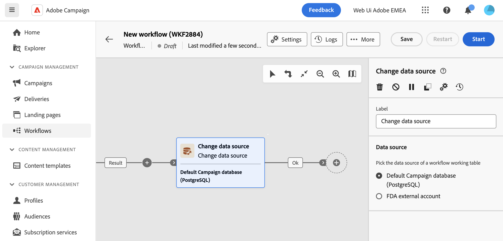

# Databron wijzigen {#change-data-source}

>[!CONTEXTUALHELP]
>id="acw_orchestration_change_data_source"
>title="Databron wijzigen"
>abstract="De **Gegevensbron wijzigen** Met deze activiteit kunt u een andere gegevensbron selecteren voor de werktabel van uw workflow."

De **Gegevensbron wijzigen** activiteit is **doelgerichtheid** activiteit. Met deze activiteit kunt u de gegevensbron wijzigen die wordt gebruikt door de werkstroomlijst. Dit biedt meer flexibiliteit door u toe te staan om gegevens over uw verschillende gegevensbestanden te beheren en prestaties te verbeteren.

In workflows worden gegevens die van de ene activiteit naar de andere worden vervoerd via overgangen, tijdelijk opgeslagen **Werktabel**. Standaard worden werktabellen gemaakt in dezelfde database als de bron van de verwerkte gegevens. Als u bijvoorbeeld een query uitvoert op de tabel &quot;Profielen&quot; die is opgeslagen in de Cloud-database, wordt een tabel voor werken gemaakt in dezelfde Cloud-database.

In sommige gevallen zijn gegevens niet beschikbaar in de huidige database of zijn ze niet efficiënt genoeg om eenheidsbewerkingen uit te voeren. Het is daarom mogelijk dat u de workflow moet forceren om een andere database te gebruiken om dergelijke bewerkingen uit te voeren door een **[!UICONTROL Change data source]** activiteit.

Gedetailleerde informatie over de campagnearchitectuur is beschikbaar in [Campagne v8-documentatie (clientconsole)](https://experienceleague.adobe.com/docs/campaign/campaign-v8/config/architecture/architecture.html)

>[!IMPORTANT]
>
>Houd er rekening mee dat de **[!UICONTROL Change Dimension]** en **[!UICONTROL Change Data source]** activiteiten mogen niet in één rij worden toegevoegd. Als u beide activiteiten opeenvolgend moet gebruiken, zorg ervoor u omvat **[!UICONTROOL Verrijking]** tussen hen. Dit zorgt voor een correcte uitvoering en voorkomt mogelijke conflicten of fouten.

<!--

Let's say you want to send to your  VIP customers a unique offer code that they can redeem on your online store. To do this, you need to:

1. Query VIP customers on the "Profiles" table located on the Cloud database,
1. Retrieve an offer code for each targeted profile through API calls,
1. Update each profile with the assigned offer code,
1. Send an email to the profiles with their offer code.

In this situation, it is recommended to execute the offer code assignment operation on the local database, which is better suited for unitary operations. To do this, you need to add a **[!UICONTROL Change data source]** activity before the operation in order to execute it on the Campaign local database.

Before executing the operation, the working table is copied to the local database so that the operation can run there. Once done, the system detects that the profiles that we want to update are on another location. The data is therefore automatically copied back to the Cloud database where the "Profiles" table is located.
-->

## Vorm de de gegevensbronactiviteit van de Verandering {#configure}

Voer de volgende stappen uit om de **Dimensie wijzigen** activiteit:

1. Voeg een **Gegevensbron wijzigen** activiteit aan uw werkschema.

1. Definieer de gegevensbron waar u de werktabel wilt verplaatsen:

   * **[!UICONTROL Default Campaign database (PostgreSQL)]**: Gebruik de lokale standaarddatabase van Campagne.
   * **[!UICONTROL FDA external account]**: Gebruik externe Cloud-databases die zijn verbonden met Adobe Campaign via de Federated Data Access-functie.

     >[!AVAILABILITY]
     >
     >De configuratie van de campagne en de verbinding aan externe systemen worden beperkt tot geavanceerde gebruikers en slechts beschikbaar bij de cliëntconsole. [Meer informatie](https://experienceleague.adobe.com/docs/campaign/campaign-v8/connect/fda.html){target="_blank"}

1. Configureer uw workflow om de gewenste bewerkingen uit te voeren met de nieuwe gegevensbron.

<!--
## Example {#example}

The workflow belows illustrates the use case detailed earlier, i.e. sending VIP customers offer codes that they can redeem on our online store.

-->
