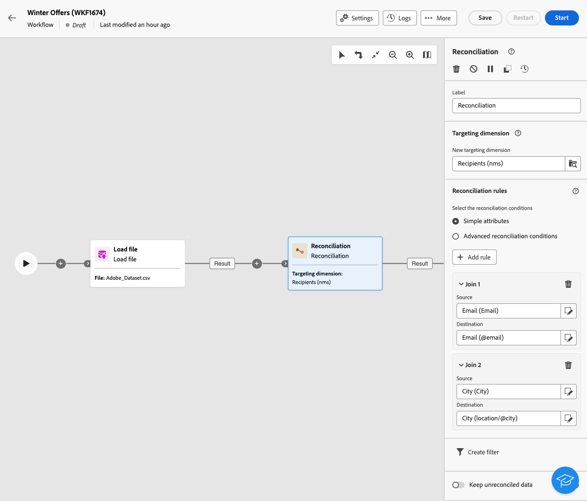

# Activiteiten op het gebied van e-mail, sms, pushberichten, direct mail {#channel}

Met Adobe Campaign Web kunt u marketingcampagnes automatiseren en uitvoeren via e-mail, SMS, direct mail en pushkanalen. U kunt kanaalactiviteiten combineren tot het werkstroomcanvas om kanaalworkflows te maken die acties activeren op basis van gedrag en gegevens van klanten.

Maak bijvoorbeeld een welkomstcampagne voor e-mail met een reeks berichten via verschillende kanalen, zoals e-mail, SMS, push en direct mail. U kunt ook een e-mail verzenden nadat een klant een aankoop heeft voltooid of een gepersonaliseerd verjaardagsbericht via SMS naar een klant verzendt.

Door kanaalactiviteiten te gebruiken, creeer uitvoerige en gepersonaliseerde campagnes die klanten over veelvoudige touchpoints en aandrijvingsomzettingen in dienst nemen.

>[!NOTE]
>
>U kunt ook een eenmalige levering maken buiten de context van een campagneworkflow. Meer informatie vindt u in de volgende secties:
>* [ creeer standalone e-maillevering ](../../email/create-email.md)
>* [ creeer standalone levering van SMS ](../../sms/create-sms.md)
>* [ creeer standalone duw levering ](../../push/create-push.md)
>* [ creeer standalone directe postlevering ](../../direct-mail/create-direct-mail.md)

## Vereisten {#channel-activity-prereq}

Begin met het ontwikkelen van uw workflow met de relevante activiteiten:

* Definieer het publiek voordat u een kanaalactiviteit invoegt. Het publiek is het belangrijkste doel van uw levering: de profielen die de berichten ontvangen. Wanneer het verzenden van berichten in de context van een campagnewerkschema, wordt het berichtpubliek niet bepaald in de kanaalactiviteit maar binnen een specifieke activiteit, zoals:

   * A **bouwt publiek** activiteit. [Meer informatie](build-audience.md).

     

   * A **het dossier van de Lading** activiteit die door a **wordt gevolgd verzoening** activiteit. [Meer informatie](load-file.md).

     

* Om een terugkomende levering te verzenden, begin uw werkschema met a **Planner** activiteit. Gebruik a **Planner** activiteit voor één-ontsproten enige leveringen om de contactdatum voor die levering te plaatsen. Deze contactdatum kan ook worden ingesteld in de leveringsinstellingen. Zie [deze sectie](scheduler.md).

## De kanaalactiviteit configureren {#create-a-delivery-in-a-workflow}

>[!CONTEXTUALHELP]
>id="acw_orchestration_email"
>title="E-mailactiviteit"
>abstract="De e-mailactiviteit vergemakkelijkt het verzenden van e-mail binnen uw werkstroom, die voor zowel eenmalige als terugkomende berichten toestaat. Het automatiseert het verzenden van e-mails naar een doel dat binnen dezelfde workflow is berekend. U kunt kanaalactiviteiten combineren tot het werkstroomcanvas om kanaalworkflows te maken die acties activeren op basis van gedrag en gegevens van klanten."

>[!CONTEXTUALHELP]
>id="acw_orchestration_sms"
>title="SMS-activiteit"
>abstract="De activiteit van SMS vergemakkelijkt het verzenden van SMS binnen uw werkschema, die voor zowel eenmalige als terugkomende berichten toestaat. Het automatiseert het proces om SMS naar een doel te verzenden dat binnen de zelfde werkschema wordt berekend. U kunt kanaalactiviteiten combineren tot het werkstroomcanvas om kanaalworkflows te maken die acties activeren op basis van gedrag en gegevens van klanten."

>[!CONTEXTUALHELP]
>id="acw_orchestration_push_ios"
>title="IOS-activiteit in duwen"
>abstract="De Push iOS-activiteit stroomlijnt het proces voor het verzenden van iOS Push-berichten als onderdeel van uw workflow. Het maakt het mogelijk om zowel eenmalige als terugkerende berichten te verzenden, waardoor het verzenden van iOS Push-berichten naar een vooraf gedefinieerd doel binnen dezelfde workflow wordt geautomatiseerd. U kunt kanaalactiviteiten combineren tot het werkstroomcanvas om kanaalworkflows te maken die acties activeren op basis van gedrag en gegevens van klanten."

>[!CONTEXTUALHELP]
>id="acw_orchestration_push_android"
>title="Android-activiteit in duwen"
>abstract="De Push Android-activiteit stroomlijnt het proces voor het verzenden van Android Push-berichten als onderdeel van uw workflow. Het maakt het mogelijk om zowel eenmalige als terugkerende berichten te verzenden, waardoor het verzenden van Android Push-berichten naar een vooraf gedefinieerd doel binnen dezelfde workflow wordt geautomatiseerd. U kunt kanaalactiviteiten combineren tot het werkstroomcanvas om kanaalworkflows te maken die acties activeren op basis van gedrag en gegevens van klanten."

>[!CONTEXTUALHELP]
>id="acw_orchestration_directmail"
>title="Directe post"
>abstract="De activiteit Direct-mail vergemakkelijkt direct mail verzenden binnen uw werkschema, die voor zowel eenmalige als terugkomende berichten toestaat. Het automatiseert het proces om het extractiedossier te produceren dat door directe postleveranciers wordt vereist. U kunt kanaalactiviteiten combineren tot het werkstroomcanvas om kanaalworkflows te maken die acties activeren op basis van gedrag en gegevens van klanten."

Volg onderstaande stappen om een levering in te stellen in de context van een workflow:

1. Voeg een kanaalactiviteit toe: **[!UICONTROL Email]**, **[!UICONTROL SMS]**, **[!UICONTROL Push notification (Android)]**, **[!UICONTROL Push notification (iOS)]** of **[!UICONTROL Direct mail]** .

1. Selecteer het **Type van levering**: enige of terugkomende.

   * A **Enige levering** is één-schot levering slechts één keer, zoals een zwarte Vrijdag e-mail wordt verzonden.
   * A **Terugkomende levering** wordt verzonden veelvoudige tijden die op zijn uitvoeringsfrequentie worden gebaseerd die in a [ wordt bepaald planneractiviteit ](scheduler.md). Telkens wanneer de werkstroom wordt uitgevoerd, wordt het publiek opnieuw berekend en wordt de levering verzonden naar het bijgewerkte publiek met de bijgewerkte inhoud. Dit kan een wekelijkse nieuwsbrief of een terugkerende verjaardagsmail zijn.

1. Selecteer een levering **Malplaatje**. Sjablonen zijn vooraf geconfigureerde leveringsinstellingen die specifiek zijn voor een kanaal. Voor elk kanaal is een ingebouwde sjabloon beschikbaar die standaard vooraf is ingevuld. [Meer informatie](../../msg/delivery-template.md)

   

   Selecteer de sjabloon in het linkerdeelvenster van de kanaalactiviteitenconfiguratie. Als het eerder geselecteerde publiek niet compatibel is met het kanaal, kunt u geen sjabloon selecteren. Om dit op te lossen, werk **het publiek van de Bouwstijl** activiteit bij om een publiek met de correcte doelafbeelding te selecteren. Leer meer over doelafbeeldingen in [ deze sectie ](../../audience/targeting-dimensions.md).

1. Klik **creeer levering**. Definieer de berichtinstellingen en de inhoud op dezelfde manier als u een zelfstandige levering maakt. Test en simuleer de inhoud. [Meer informatie](../../msg/gs-messages.md)

1. Ga terug naar uw workflow. Om uw werkschema voort te zetten, knevel **een uitgaande overgang** optie om een overgang na de kanaalactiviteit toe te voegen.

1. Klik **Begin** om uw werkschema te lanceren.

   Door gebrek, leidt het beginnen van een werkschema tot het stadium van de berichtvoorbereiding zonder onmiddellijk het bericht te verzenden.

1. Open uw kanaalactiviteit om het verzenden van de **Overzicht te bevestigen &amp;** knoop te verzenden.

1. Van uw leveringsdashboard, verzendt de klik ****.

## Voorbeelden {#cross-channel-workflow-sample}

Hier volgt een voorbeeld van een workflow tussen kanalen met segmentatie en twee leveringen. De workflow is gericht op alle klanten die in Parijs wonen en geïnteresseerd zijn in koffiezetapparaten. Onder deze populatie wordt een e-mail verzonden naar gewone klanten en wordt een SMS verzonden naar VIP-klanten.

U kunt ook een terugkerende workflow maken om elke eerste dag van de maand om 21.00 uur een gepersonaliseerd sms te verzenden naar alle klanten in Parijs.

<!--
description, which use case you can perform (common other activities that you can link before or after the activity)

how to add and configure the activity

example of a configured activity within a workflow
The Email delivery activity allows you to configure the sending of an email in a workflow. 
-->

<!-- Scheduled emails available?

This can be a single send email and sent just once, or it can be a recurring email.
* Single send emails are standard emails, sent once.
* Recurring emails allow you to send the same email multiple times to different targets over a defined period. You can aggregate the deliveries per period in order to get reports that correspond to your needs.

When linked to a scheduler, you can define recurring emails.
Email recipients are defined upstream of the activity in the same workflow, via an Audience targeting activity.

-->

<!--The message preparation is triggered according to the workflow execution parameters. From the message dashboard, you can select whether to request or not a manual confirmation to send the message (required by default). You can start the workflow manually or place a scheduler activity in the workflow to automate execution.-->