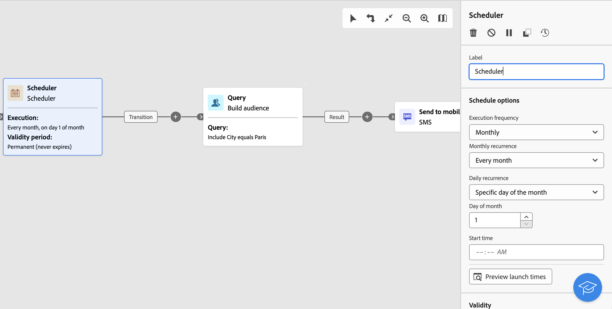

# E-mail-, sms- en pushactiviteiten {#channel}

Met Adobe Campaign Web kunt u marketingcampagnes automatiseren en uitvoeren via e-mail-, sms- en pushkanalen. U kunt kanaalactiviteiten in het werkstroomcanvas combineren om kanaalworkflows te maken die acties op basis van gedrag en gegevens van de klant kunnen activeren.

U kunt bijvoorbeeld een welkomstcampagne voor e-mail maken met een reeks berichten via verschillende kanalen, zoals e-mail, SMS en push. U kunt ook een vervolgbericht verzenden nadat een klant een aankoop heeft voltooid, of een gepersonaliseerd verjaardagsbericht naar een klant verzenden via SMS.

Door kanaalactiviteiten te gebruiken, kunt u uitvoerige en gepersonaliseerde campagnes tot stand brengen die klanten over veelvoudige touchpoints en aandrijvingsomzettingen in dienst nemen.

>[!NOTE]
>
>U kunt ook een eenmalige levering maken, buiten de context van een campagneworkflow. Meer informatie vindt u in de volgende secties:
>* [Zelfstandige e-maillevering maken](../../email/create-email.md)
>* [Zelfstandige SMS-levering maken](../../sms/create-sms.md)
>* [Zelfstandige pushlevering maken](../../push/create-push.md)

## Uw workflow samenstellen {#build-your-workflow}

Begin met het ontwikkelen van uw workflow met de relevante activiteiten:

* Voordat u een kanaalactiviteit invoegt, moet u het publiek definiëren. Het publiek is het belangrijkste doel van uw levering: de profielen die de berichten ontvangen. Wanneer het verzenden van berichten in de context van een campagnewerkschema, wordt het berichtpubliek niet bepaald in de kanaalactiviteit, maar binnen een specifieke activiteit, zoals:

   * A **publiek opbouwen** activiteit. [Meer informatie](build-audience.md).

     

   * A **Bestand laden** activiteit gevolgd door een **Verzoening** activiteit. [Meer informatie](load-file.md).

     

* Als u een terugkerende levering wilt verzenden, start u de workflow met een **Planner** activiteit. U kunt ook een **Planner** activiteit voor één-ontsproten enige leveringen om de contactdatum voor die levering te plaatsen. Deze contactdatum kan ook worden ingesteld in de leveringsinstellingen. Zie [deze sectie](scheduler.md).

## De kanaalactiviteit configureren {#create-a-delivery-in-a-workflow}

>[!CONTEXTUALHELP]
>id="acw_orchestration_email"
>title="E-mailactiviteit"
>abstract="De e-mailactiviteit vergemakkelijkt het verzenden van e-mail binnen uw werkstroom, die voor zowel eenmalige als terugkomende berichten toestaat. Hiermee wordt het verzenden van e-mails naar een doel dat binnen dezelfde workflow is berekend, geautomatiseerd. U kunt kanaalactiviteiten in het werkstroomcanvas combineren om kanaalworkflows te maken die acties op basis van gedrag en gegevens van de klant kunnen activeren."

>[!CONTEXTUALHELP]
>id="acw_orchestration_sms"
>title="SMS-activiteit"
>abstract="De activiteit van SMS vergemakkelijkt het verzenden van SMS binnen uw werkschema, die voor zowel eenmalige als terugkomende berichten toestaat. Het dient om het proces te automatiseren om SMS naar een doel te verzenden dat binnen de zelfde werkschema wordt berekend. U kunt kanaalactiviteiten in het werkstroomcanvas combineren om kanaalworkflows te maken die acties op basis van gedrag en gegevens van de klant kunnen activeren."

>[!CONTEXTUALHELP]
>id="acw_orchestration_push_ios"
>title="IOS-activiteit in duwen"
>abstract="De Push iOS-activiteit stroomlijnt het proces voor het verzenden van iOS Push-berichten als onderdeel van uw workflow. Hierdoor kunnen eenmalige en terugkerende berichten worden verzonden, waardoor de verzendende iOS Push-berichten naar een vooraf gedefinieerd doel binnen dezelfde workflow worden geautomatiseerd. U kunt kanaalactiviteiten in het werkstroomcanvas combineren om kanaalworkflows te maken die acties op basis van gedrag en gegevens van de klant kunnen activeren."

>[!CONTEXTUALHELP]
>id="acw_orchestration_push_android"
>title="Android-activiteit duwen"
>abstract="De pushAndroid-activiteit stroomlijnt het proces voor het verzenden van Android-pushmeldingen als onderdeel van uw workflow. Hierdoor kunnen zowel eenmalige als terugkerende berichten worden verzonden, waardoor de verzendende Android Push-berichten naar een vooraf gedefinieerd doel binnen dezelfde workflow worden geautomatiseerd. U kunt kanaalactiviteiten in het werkstroomcanvas combineren om kanaalworkflows te maken die acties op basis van gedrag en gegevens van de klant kunnen activeren."

Volg onderstaande stappen om een levering in te stellen in de context van een workflow:

1. Kanaalactiviteit toevoegen: **[!UICONTROL Email]**, **[!UICONTROL SMS]**, **[!UICONTROL Push notification (Android)]** of **[!UICONTROL Push notification (iOS)]**.

1. Selecteer de **Soort levering**: enkelvoudig of herhaald.

   * A **Eén levering** is een levering van één opname, die slechts één keer wordt verzonden, bijvoorbeeld een e-mail van de Zwarte Vrijdag.
   * A **Terugkerende levering** wordt meerdere keren verzonden op basis van de uitvoeringsfrequentie die in een [planningsactiviteit](scheduler.md). Elke keer dat de workflow wordt uitgevoerd, wordt het publiek opnieuw berekend en wordt de levering verzonden naar het bijgewerkte publiek, met de bijgewerkte inhoud. Dit kan bijvoorbeeld een wekelijkse nieuwsbrief of een terugkerende verjaardagsmail zijn.

1. Selecteer een levering **Sjabloon**. Sjablonen zijn vooraf geconfigureerde leveringsinstellingen die specifiek zijn voor een kanaal. Een ingebouwde sjabloon is beschikbaar voor elk kanaal en wordt standaard vooraf ingevuld. [Meer informatie](../../msg/delivery-template.md)

   

   U kunt het malplaatje van de configuratie van de kanaalactiviteit linkerruit selecteren. Als het eerder geselecteerde publiek niet compatibel is met het kanaal, kunt u geen sjabloon selecteren. Als u dit wilt oplossen, werkt u de **publiek opbouwen** activiteit om een publiek met de correcte doelafbeelding te selecteren. Meer informatie over doeltoewijzingen in [deze sectie](../../audience/targeting-dimensions.md)

1. Klikken **Levering maken**. Vervolgens kunt u de berichtinstellingen en inhoud op dezelfde manier definiëren als wanneer u een zelfstandige levering maakt. U kunt de inhoud ook testen en simuleren. [Meer informatie](../../msg/gs-messages.md)

1. Ga terug naar uw workflow. Als u uw workflow wilt voortzetten, schakelt u het **Een uitgaande overgang genereren** om een overgang toe te voegen na de kanaalactiviteit.

1. Klikken **Start** om uw workflow te starten.

   Door gebrek, leidt het beginnen van een werkschema tot het stadium van de berichtvoorbereiding, zonder onmiddellijk het bericht te verzenden.

1. Open uw kanaalactiviteit om het verzenden van te bevestigen **Controleren en verzenden** knop.

1. Van uw leveringsdashboard, klik **Verzenden**.

## Voorbeelden {#cross-channel-workflow-sample}

Hier volgt een voorbeeld van een workflow tussen kanalen met een segmentatie en twee leveringen. De workflow is gericht op alle klanten die in Parijs wonen en die geïnteresseerd zijn in koffiezetapparaten. Onder deze populatie wordt een e-mail verzonden naar de gewone klanten en een SMS-bericht verzonden naar de VIP.

<!--
description, which use case you can perform (common other activities that you can link before of after the activity)

how to add and configure the activity

example of a configured activity within a workflow
The Email delivery activity allows you to configure the sending an email in a workflow. 

-->

U kunt ook een terugkerende workflow maken om elke eerste dag van de maand om 21.00 uur een gepersonaliseerd sms te verzenden naar alle klanten in Parijs.

<!-- Scheduled emails available?

This can be a single send email and sent just once, or it can be a recurring email.
* Single send emails are standard emails, sent once.
* Recurring emails allow you to send the same email multiple times to different targets over a defined period. You can aggregate the deliveries per period in order to get reports that correspond to your needs.

When linked to a scheduler, you can define recurring emails.
Email recipients are defined upstream of the activity in the same workflow, via an Audience targeting activity.

-->

<!--The message preparation is triggered according to the workflow execution parameters. From the message dashboard, you can select whether to request or not a manual confirmation to send the message (required by default). You can start the workflow manually or place a scheduler activity in the workflow to automate execution.-->
