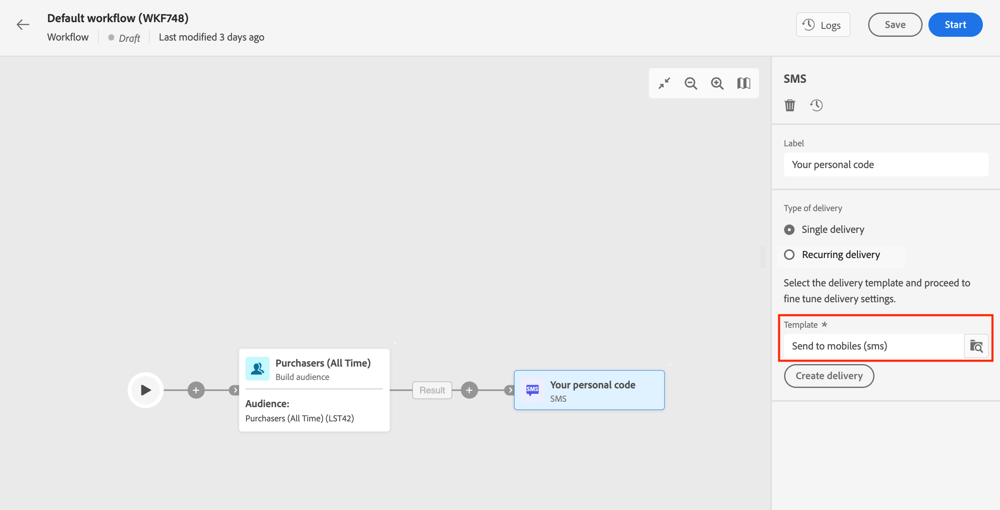

# E-mail-, sms- en pushactiviteiten {#channel}

Met Adobe Campaign Web kunt u marketingcampagnes automatiseren en uitvoeren via e-mail-, sms- en pushkanalen. U kunt kanaalactiviteiten in het werkstroomcanvas combineren om kanaalworkflows te maken die acties op basis van gedrag en gegevens van de klant kunnen activeren.

U kunt bijvoorbeeld een welkomstcampagne voor e-mail maken met een reeks berichten via verschillende kanalen, zoals e-mail, SMS en push. U kunt ook een vervolgbericht verzenden nadat een klant een aankoop heeft voltooid, of een gepersonaliseerd verjaardagsbericht naar een klant verzenden via SMS.

Door kanaalactiviteiten te gebruiken, kunt u uitvoerige en gepersonaliseerde campagnes tot stand brengen die klanten over veelvoudige touchpoints en aandrijvingsomzettingen in dienst nemen.

>[!NOTE]
>
>U kunt ook een eenmalige levering maken, buiten de context van een campagneworkflow. Meer informatie vindt u in de volgende secties:
>* [Zelfstandige e-maillevering maken](../../email/create-email.md
>* [Zelfstandige SMS-levering maken](../../sms/create-sms.md)
>* [Zelfstandige pushlevering maken](../../push/create-push.md)
>

## Een levering maken in een campagneworkflow{#create-a-delivery-in-a-workflow}

Volg onderstaande stappen om een e-mail, een SMS-bericht of een pushbericht te maken in de context van een campagneworkflow:

1. Controleer of u een **publiek opbouwen** activiteit. Het publiek is het belangrijkste doel van uw levering: de ontvangers die de berichten ontvangen. Wanneer het verzenden van berichten in de context van een campagnewerkschema, wordt het berichtpubliek niet bepaald in de kanaalactiviteit, maar in **publiek opbouwen** activiteit. Zie [deze sectie](build-audience.md).

   

1. Selecteer een leveringsactiviteit: **[!UICONTROL Email]**, **[!UICONTROL SMS]**, **[!UICONTROL Push notification (Android)]** of **[!UICONTROL Push notification (iOS)]**.

1. Selecteer een levering **Sjabloon**. Sjablonen zijn vooraf geconfigureerde leveringsinstellingen die specifiek zijn voor een kanaal. Een ingebouwde sjabloon is beschikbaar voor elk kanaal en wordt standaard vooraf ingevuld. [Meer informatie](../../msg/delivery-template.md)

   

   U kunt een andere sjabloon selecteren in het linkerdeelvenster van de configuratie van de kanaalactiviteit. Als het eerder geselecteerde publiek niet compatibel is met het kanaal, kunt u geen sjabloon selecteren. Als u dit wilt oplossen, werkt u de **publiek opbouwen** activiteit om een publiek met de correcte doelafbeelding te selecteren. Meer informatie over doeltoewijzingen in [Adobe Campaign v8-documentatie (clientconsole)](https://experienceleague.adobe.com/docs/campaign/campaign-v8/audience/add-profiles/target-mappings.html){target="_blank"}.

1. Klikken **Levering maken**. Definieer de berichtinstellingen en de inhoud op dezelfde manier als u een zelfstandige levering maakt. U kunt de inhoud ook plannen en simuleren. [Meer informatie](../../msg/gs-messages.md).

1. Ga terug naar uw workflow. Kies of u de workflow wilt voortzetten **Een uitgaande overgang genereren** als u een overgang wilt toevoegen na de kanaalactiviteit.

1. Klikken **Start** om uw workflow te starten.

   Door gebrek, leidt het beginnen van een werkschema tot het stadium van de berichtvoorbereiding, zonder onmiddellijk het bericht te verzenden.

1. Open uw leveringsactiviteit om het verzenden van te bevestigen **Controleren en verzenden** knop.

1. Van uw leveringsdashboard, klik **Verzenden**.

## Voorbeeld{#cross-channel-workflow-sample}

Hier volgt een voorbeeld van een workflow tussen kanalen met een segmentatie en twee leveringen. De workflow is gericht op alle klanten die in Parijs wonen en die geïnteresseerd zijn in koffiezetapparaten. Onder deze populatie wordt een e-mail verzonden naar de gewone klanten en een SMS-bericht verzonden naar de VIP.

<!--
description, which use case you can perform (common other activities that you can link before of after the activity)

how to add and configure the activity

example of a configured activity within a workflow
The Email delivery activity allows you to configure the sending an email in a workflow. 

-->

<!-- Scheduled emails available?

This can be a single send email and sent just once, or it can be a recurring email.
* Single send emails are standard emails, sent once.
* Recurring emails allow you to send the same email multiple times to different targets over a defined period. You can aggregate the deliveries per period in order to get reports that correspond to your needs.

When linked to a scheduler, you can define recurring emails.
Email recipients are defined upstream of the activity in the same workflow, via an Audience targeting activity.

-->

<!--The message preparation is triggered according to the workflow execution parameters. From the message dashboard, you can select whether to request or not a manual confirmation to send the message (required by default). You can start the workflow manually or place a scheduler activity in the workflow to automate execution.-->
