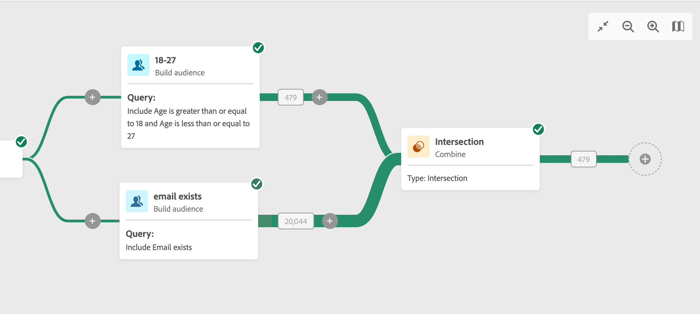
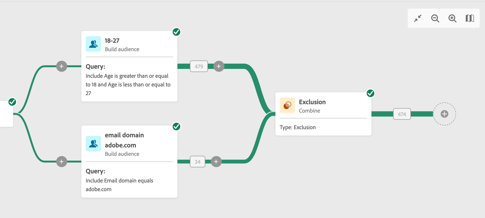

# Combineren {#combine}

>[!CONTEXTUALHELP]
>id="acw_orchestration_combine"
>title="Combineer activiteit"
>abstract="**combineert** activiteit staat u toe om segmentatie op uw binnenkomende bevolking uit te voeren. U kunt meerdere populaties combineren, een deel ervan uitsluiten of gegevens alleen algemeen gebruiken voor meerdere doelen."

**combineer** activiteit is a **richtend** activiteit. Deze activiteit staat u toe om segmentatie op uw binnenkomende bevolking uit te voeren. U kunt meerdere populaties combineren, een deel ervan uitsluiten of gegevens alleen algemeen gebruiken voor meerdere doelen. Hier volgen de beschikbare segmentatietypen:

<!--
The **Combine** activity can be placed after any other activity, but not at the beginning of the workflow. Any activity can be placed after the **Combine**.
-->

* De **Unie** hergroepeert het resultaat van veelvoudige activiteiten in één enkel doel.
* **Intersection** houdt slechts de elementen gemeenschappelijk voor de verschillende binnenkomende populaties in de activiteit.
* De **Uitsluiting** sluit elementen van één bevolking volgens bepaalde criteria uit.

## De combinatieactiviteit configureren {#combine-configuration}

>[!CONTEXTUALHELP]
>id="acw_orchestration_intersection_merging_options"
>title="Samenvoegopties voor doorsnede"
>abstract="Het snijpunt houdt alleen de elementen die gemeenschappelijk zijn voor de verschillende binnenkomende populaties in de activiteit. Controleer in de sectie Sets to join alle vorige activiteiten waaraan u wilt deelnemen."

>[!CONTEXTUALHELP]
>id="acw_orchestration_exclusion_merging_options"
>title="Samenvoegopties voor uitsluiting"
>abstract="De uitsluiting sluit elementen uit van één populatie op basis van bepaalde criteria. Controleer in de sectie Sets to join alle vorige activiteiten waaraan u wilt deelnemen."

>[!CONTEXTUALHELP]
>id="acw_orchestration_combine_options"
>title="Selecteer het segmentatietype"
>abstract="Selecteer hoe u het publiek wilt combineren. De **Unie** hergroepeert het resultaat van veelvoudige activiteiten in één enkel doel. **Intersection** houdt slechts de elementen gemeenschappelijk voor de verschillende binnenkomende populaties in de activiteit. De **Uitsluiting** sluit elementen van één bevolking volgens bepaalde criteria uit."

Volg deze gemeenschappelijke stappen om de **te vormen combineren** activiteit:

1. Voeg veelvoudige activiteiten, zoals **toe bouwt publiek** activiteiten, om minstens twee verschillende uitvoertakken te vormen.
1. Voeg a **&#x200B;**&#x200B;activiteit aan om het even welke vorige takken combineren.
1. Selecteer het segmentatietype: [ unie ](#union), [ intersection ](#intersection), of [ uitsluiting ](#exclusion).
1. Klik **verdergaan**.
1. In de **Reeksen om zich bij** sectie aan te sluiten, controleer alle vorige activiteiten u wenst om zich aan te sluiten.

## Samenvoegen {#combine-union}

>[!CONTEXTUALHELP]
>id="acw_orchestration_combine_reconciliation"
>title="Afstemmingsopties"
>abstract="Selecteer het **Type van Verzoening** om te bepalen hoe te om duplicaten te behandelen. Door gebrek, wordt de **optie van Sleutels** geactiveerd, betekenend dat de activiteit slechts één element houdt wanneer de elementen van de verschillende binnenkomende overgangen de zelfde sleutel hebben. Gebruik de **selectie van A kolommen** optie om de lijst van kolommen te bepalen waarop de gegevensverzoening wordt toegepast."

In **combineer** activiteit, vorm a **Unie** door het **Verzoeningstype** te selecteren om te bepalen hoe de duplicaten worden behandeld:

* **Sleutels slechts**: Dit is de standaardwijze. De activiteit houdt slechts één element wanneer de elementen van de verschillende binnenkomende overgangen de zelfde sleutel hebben. Deze optie kan alleen worden gebruikt als de binnenkomende populaties homogeen zijn.
* **een selectie van kolommen**: Selecteer deze optie om de lijst van kolommen te bepalen waarop de gegevensverzoening wordt toegepast. Selecteer eerst de primaire set (de brongegevens) en daarna de kolommen die u voor de samenvoeging wilt gebruiken.

## Doorsnede {#combine-intersection}

>[!CONTEXTUALHELP]
>id="acw_orchestration_intersection_reconciliation_options"
>title="Afstemmingsopties voor doorsnede"
>abstract="Selecteer het **Type van Verzoening** om te bepalen hoe te om duplicaten te behandelen. Door gebrek, wordt de **optie van Sleutels** geactiveerd, betekenend dat de activiteit slechts één element houdt wanneer de elementen van de verschillende binnenkomende overgangen de zelfde sleutel hebben. Gebruik de **selectie van A kolommen** optie om de lijst van kolommen te bepalen waarop de gegevensverzoening wordt toegepast."

In **combineer** activiteit, vorm een **Intersection** door deze extra stappen te volgen:

1. Selecteer het **Type van Verzoening** om te bepalen hoe de duplicaten worden behandeld. Zie [ Unie ](#union) sectie.
1. Controleer **aanvult** optie als u wenst om de resterende bevolking te verwerken. Het complement omvat de samenvoeging van de resultaten van alle binnenkomende activiteiten min de doorsnede. Een extra uitgaande overgang wordt dan toegevoegd aan de activiteit.

## Uitsluiting {#combine-exclusion}

>[!CONTEXTUALHELP]
>id="acw_orchestration_exclusion_options"
>title="Uitsluitingsregels"
>abstract="Bewerk indien nodig binnenkomende tabellen. Als u een doel wilt uitsluiten van een andere dimensie, keert u dit doel terug naar dezelfde doeldimensie als het hoofddoel. Klik toevoegen een regel in de sectie van de Regels van de Uitsluiting en specificeer de voorwaarden van de afmetingsverandering. Afstemming van gegevens vindt plaats via een attribuut of een join-functie."

>[!CONTEXTUALHELP]
>id="acw_orchestration_combine_sets"
>title="Te combineren sets selecteren"
>abstract="In de **Reeksen om zich bij** sectie aan te sluiten, selecteer de **Primaire reeks** van de binnenkomende overgangen. Dit is de set waaruit elementen worden uitgesloten. De andere sets komen overeen met de elementen voordat deze worden uitgesloten van de primaire set."

>[!CONTEXTUALHELP]
>id="acw_orchestration_combine_exclusion"
>title="Uitsluitingsregels"
>abstract="Bewerk indien nodig binnenkomende tabellen. Als u een doel wilt uitsluiten van een andere dimensie, keert u dit doel terug naar dezelfde doeldimensie als het hoofddoel. Klik toevoegen een regel in de sectie van de Regels van de Uitsluiting en specificeer de voorwaarden van de afmetingsverandering. Afstemming van gegevens vindt plaats via een attribuut of een join-functie."

>[!CONTEXTUALHELP]
>id="acw_orchestration_combine_complement"
>title="Combineren genereert een complement"
>abstract="Schakel de optie Aanvulling genereren in of uit om de resterende populatie in een extra overgang te verwerken."

In **combineer** activiteit, vorm een **Uitsluiting** door deze extra stappen te volgen:

1. In de **Reeksen om zich bij** sectie aan te sluiten, selecteer de **Primaire reeks** van de binnenkomende overgangen. Dit is de set waaruit elementen worden uitgesloten. De andere sets komen overeen met de elementen voordat deze worden uitgesloten van de primaire set.
1. Bewerk indien nodig binnenkomende tabellen. Als u een doel wilt uitsluiten van een andere dimensie, keert u dit doel terug naar dezelfde doeldimensie als het hoofddoel. Klik **toevoegen een regel** in de **sectie van de Regels van de Uitsluiting** en specificeer de voorwaarden van de afmetingsverandering. Afstemming van gegevens vindt plaats via een attribuut of een join-functie.
1. Controleer **aanvult** optie als u wenst om de resterende bevolking te verwerken. Zie de [ sectie van de Intersectie ](#intersection).

## Voorbeelden {#combine-examples}

In het volgende voorbeeld, combineert a **&#x200B;**&#x200B;activiteit a **Unie** om alle profielen van de twee vragen terug te winnen: personen tussen 18 en 27 jaar oud en personen tussen 34 en 40 jaar oud.

Het volgende voorbeeld toont **Intersection** tussen twee vraagactiviteiten. Hiermee worden profielen opgehaald die tussen de 18 en 27 jaar oud zijn en waarvan het e-mailadres is opgegeven.

Het volgende **voorbeeld van de Uitsluiting** toont twee vragen die aan filterprofielen worden gevormd die tussen 18 en 27 jaar oud zijn en een Adobe e-maildomein hebben. De profielen met een Adobe-e-maildomein worden niet opgenomen in de eerste set.

