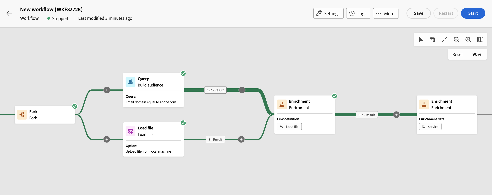

# Verrijking {#enrichment}

>[!CONTEXTUALHELP]
>id="acw_orchestration_enrichment"
>title="Verrijkingsactiviteit"
>abstract="De **Verrijking** Met deze activiteit kunt u de doelgegevens verbeteren met aanvullende informatie uit de database. Het wordt vaak gebruikt in een werkschema na segmenteringsactiviteiten."

>[!CONTEXTUALHELP]
>id="acw_orchestration_enrichment_data"
>title="Verrijkingsactiviteit"
>abstract="Zodra de verrijkingsgegevens aan het werkschema zijn toegevoegd, kan het in de activiteiten worden gebruikt die na de activiteit van de Verrijking worden toegevoegd om klanten in verschillende groepen te segmenteren die op hun gedrag, voorkeur, en behoeften worden gebaseerd, of om gepersonaliseerde marketing berichten en campagnes te creëren die eerder aan uw doelpubliek zullen resoneren."

>[!CONTEXTUALHELP]
>id="acw_orchestration_enrichment_reconciliation"
>title="Verrijkingsverzoening"
>abstract="verzoening met verrijking"

>[!CONTEXTUALHELP]
>id="acw_orchestration_enrichment_simplejoin"
>title="Koppelingsdefinitie"
>abstract="Eenvoudige samenvoeging"

>[!CONTEXTUALHELP]
>id="acw_targetdata_personalization_enrichmentdata"
>title="Verrijkingsgegevens"
>abstract="Selecteer de gegevens die u wilt gebruiken om uw workflow te verrijken. U kunt twee soorten verrijkingsgegevens selecteren: één enkel verrijkingsattribuut van de doelafmeting, of een inzamelingsverbinding, die een verbinding met een 1-N kardinaliteit tussen lijsten is."

De **Verrijking** activiteit is **Targeting** activiteit. Hiermee kunt u de doelgegevens verbeteren met aanvullende informatie uit de database. Het wordt vaak gebruikt in een werkschema na segmenteringsactiviteiten.

Verrijkingsgegevens kunnen worden verkregen:

* **Van dezelfde werktabel** als doelversie in uw workflow:

  *Stel een groep klanten in en voeg het veld Geboortedatum toe aan de huidige tabel*.

* **Van een andere werktabel**:

  *Selecteer een groep klanten en voeg de velden Bedrag en Type product uit de tabel Aankoop toe*.

Zodra de verrijkingsgegevens aan de workflow zijn toegevoegd, kunnen deze worden gebruikt in de activiteiten die na de **Verrijking** activiteit om klanten in verschillende groepen te segmenteren die op hun gedrag, voorkeur, en behoeften worden gebaseerd, of gepersonaliseerde marketing berichten en campagnes te creëren die eerder aan uw doelpubliek zullen resoneren.

U kunt bijvoorbeeld informatie over aankopen van klanten toevoegen aan de werkstroomwerktabel en deze gegevens gebruiken om de e-mails aan te passen aan de laatste aankoop of het bedrag dat aan deze aankopen is besteed.

## Een verrijkingsactiviteit toevoegen {#enrichment-configuration}

Voer de volgende stappen uit om de **Verrijking** activiteit:

1. Voeg activiteiten toe zoals **publiek opbouwen** en **Combineren** activiteiten.
1. Een **Verrijking** activiteit.
1. Als er meerdere overgangen zijn geconfigureerd in uw workflow, kunt u de opdracht **[!UICONTROL Primary set]** veld om te bepalen welke overgang moet worden gebruikt als primaire set om te verrijken met gegevens.

## Verrijkingsgegevens toevoegen {#enrichment-add}

1. Klikken **Verrijkingsgegevens toevoegen** en selecteert u het kenmerk dat u wilt gebruiken om de gegevens te verrijken.

   U kunt twee soorten verrijkingsgegevens selecteren: één enkel verrijkingsattribuut van de doelafmeting, of een inzamelingsverbinding. Elk van deze typen wordt in de volgende voorbeelden beschreven:
   * [Enkel verrijkingskenmerk](#single-attribute)
   * [Verzamelaar](#collection-link)

   >[!NOTE]
   >
   >De **De knop Expressie bewerken** in het selectiescherm voor kenmerken kunt u geavanceerde expressies maken om het kenmerk te selecteren. [Leer hoe u met de expressieeditor werkt](../../query/expression-editor.md)

   

## Koppelingen maken tussen tabellen {#create-links}

>[!CONTEXTUALHELP]
>id="acw_homepage_welcome_rn3"
>title="Koppelingen tussen tabellen"
>abstract="U kunt nu een koppeling maken tussen de gegevens van de werktabel en de Adobe Campaign-database in de activiteit van de verrijkingsworkflow."
>additional-url="https://experienceleague.adobe.com/docs/campaign-web/v8/release-notes/release-notes.html" text="Zie opmerkingen bij releases"

De **[!UICONTROL Link definition]** kunt u een koppeling maken tussen de gegevens van de werktabel en de Adobe Campaign-database. Als u bijvoorbeeld gegevens laadt uit een bestand dat het rekeningnummer, land en e-mail van ontvangers bevat, moet u een koppeling naar de landentabel maken om deze gegevens in hun profielen bij te werken.

Er zijn verschillende typen koppelingen beschikbaar:

* **[!UICONTROL 1 cardinality simple link]**: Elke record uit de primaire set kan worden gekoppeld aan één record uit de gekoppelde gegevens.
* **[!UICONTROL 0 or 1 cardinality simple link]**: Elke record uit de primaire set kan worden gekoppeld aan 0 of 1 record uit de gekoppelde gegevens, maar niet aan meer dan één record.
* **[!UICONTROL N cardinality collection link]**: Elke record uit de primaire set kan worden gekoppeld aan 0, 1 of meer (N) records uit de gekoppelde gegevens.

Ga als volgt te werk om een koppeling te maken:

1. In de **[!UICONTROL Link definition]** klikt u op de **[!UICONTROL Add link]** knop.

   

1. In de **Relatietype** kiest u het type koppeling dat u wilt maken.

1. Identificeer het doel u de primaire reeks aan wilt verbinden:

   * Als u een bestaande tabel in de database wilt koppelen, kiest u **[!UICONTROL Database schema]** en selecteer de gewenste tabel in het menu **[!UICONTROL Target schema]** veld.
   * Als u wilt koppelen aan gegevens uit de invoerovergang, kiest u **Tijdelijk schema** en selecteer de overgang waarvan u de gegevens wilt gebruiken.

1. Definieer de afstemmingscriteria die overeenkomen met gegevens uit de primaire set met het gekoppelde schema. Er zijn twee soorten verbindingen beschikbaar:

   * **Eenvoudige samenvoeging**: Selecteer een specifiek kenmerk dat overeenkomt met de gegevens in de twee schema&#39;s. Klikken **Verbinden toevoegen** en selecteert u de **Bron** en **Doel** kenmerken die als afstemmingscriteria moeten worden gebruikt.
   * **Geavanceerde verbinding**: Maak een verbinding met behulp van geavanceerde voorwaarden. Klikken **Verbinden toevoegen** en klik op de knop **Voorwaarde maken** om de vraagmodeler te openen.

Een voorbeeld van een workflow met koppelingen is beschikbaar in het dialoogvenster [Voorbeelden](#link-example) sectie.

## Voorbeelden {#example}

### Enkel verrijkingskenmerk {#single-attribute}

Hier voegen we slechts één verrijkingskenmerk toe, bijvoorbeeld de geboortedatum. Voer de volgende stappen uit:

1. Klik in het dialoogvenster **Kenmerk** veld.
1. Selecteer een eenvoudig veld in de doeldimensie, de geboortedatum in ons voorbeeld.
1. Klikken **Bevestigen**.

### Verzamelingskoppeling {#collection-link}

In dit complexere gebruiksgeval, zullen wij een inzamelingsverbinding selecteren die een verbinding met een 1-N kardinaliteit tussen lijsten is. Laten we de drie laatste aankopen ophalen die minder dan 100 dollar bedragen. Hiervoor moet u definiëren:

* een verrijkingskenmerk: de **Totaal bedrag** field
* het aantal op te halen lijnen: 3
* een filter: items uitfilteren die groter zijn dan 100$
* een sortering: afstammende sortering op de **Datum van bestelling** veld.

#### Het kenmerk toevoegen {#add-attribute}

Hier selecteert u de verzamelingskoppeling die u als verrijkingsgegevens wilt gebruiken.

1. Klik in het dialoogvenster **Kenmerk** veld.
1. Klikken **Geavanceerde kenmerken weergeven**.
1. Selecteer de **Totaal bedrag** veld van de **Aankopen** tabel.

#### De verzamelingsinstellingen definiëren{#collection-settings}

Definieer vervolgens hoe de gegevens worden verzameld en hoeveel records moeten worden opgehaald.

1. Selecteren **Gegevens verzamelen** in de **Selecteer hoe de gegevens worden verzameld** vervolgkeuzelijst.
1. Type &quot;3&quot; in het dialoogvenster **Op te halen regels (te maken kolommen)** veld.

Als u bijvoorbeeld het gemiddelde aantal aankopen voor een klant wilt ophalen, selecteert u **Geaggregeerde gegevens** en selecteert u **Gemiddeld** in de **Samengevoegde functie** vervolgkeuzelijst.

#### Filters definiëren{#collection-filters}

Hier, bepalen wij de maximumwaarde voor de verrijkingsattributen. We filteren items die groter zijn dan 100$. [Leer hoe te met vraagmodeler te werken](../../query/query-modeler-overview.md)

1. Klikken **Filters bewerken**.
1. Voeg de twee volgende filters toe: **Totaal bedrag** bestaat EN **Totaal bedrag** is kleiner dan 100. De eerste filtert NULL-waarden op dezelfde manier als de hoogste waarde.
1. Klikken **Bevestigen**.

#### De sortering definiëren{#collection-sorting}

We moeten nu sorteren om de drie bestanden op te halen **nieuwste** aankopen.

1. Activeer **Sorteren inschakelen** -optie.
1. Klik in het dialoogvenster **Kenmerk** veld.
1. Selecteer de **Datum van bestelling** veld.
1. Klikken **Bevestigen**.
1. Selecteren **Aflopend** van de **Sorteren** vervolgkeuzelijst.

### Verrijking met gekoppelde gegevens {#link-example}

In het onderstaande voorbeeld ziet u een workflow die is geconfigureerd om een koppeling tussen twee overgangen te maken. De eerste overgangen richten profielgegevens gebruikend een activiteit van de Vraag, terwijl de tweede overgang aankoopgegevens omvat die in een dossier worden opgeslagen dat door een activiteit van het Dossier van de Lading wordt geladen.

* De eerste **Verrijking** activiteit verbindt onze primaire reeks (gegevens van **Query** activiteit) met het schema van **Bestand laden** activiteit. Hierdoor kunnen we elk profiel waarop de query betrekking heeft, afstemmen op de corresponderende aankoopgegevens.
* Een seconde **Verrijking** activiteit wordt toegevoegd om gegevens van de werkschematabel met de aankoopgegevens te verrijken die uit **Bestand laden** activiteit. Op deze manier kunnen we die gegevens in verdere activiteiten gebruiken, bijvoorbeeld om berichten die aan klanten worden verzonden met informatie over hun aankoop te personaliseren.

  

<!--

Add other fields
use it in delivery

cardinality between the tables (1-N)
1. select attribute to use as enrichment data

    display advanced fields option
    i button

    note: attributes from the target dimension

1. Select how the data is collected
1. number of records to retrieve if want to retrieve a collection of multiple records
1. Apply filters and build rule

    select an existing filter
    save the filter for reuse
    view results of the filter visually or in code view

1. sort records using an attribute

leverage enrichment data in campaign

where we can use the enrichment data: personalize email, other use cases?

## Example

-->
