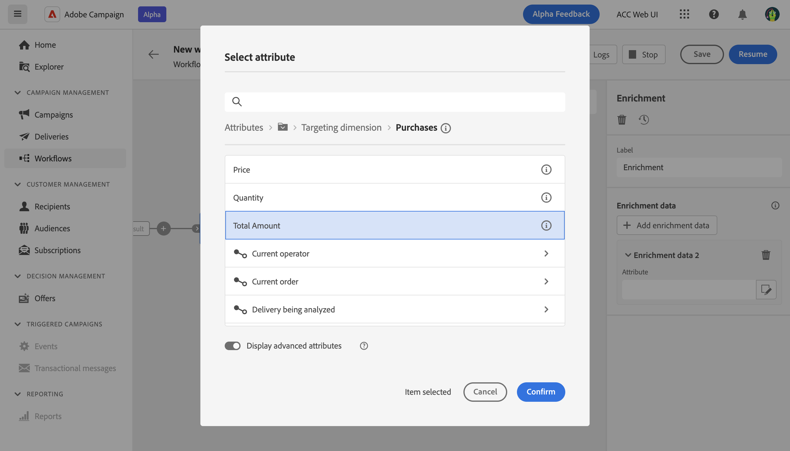

# Verrijking {#enrichment}

>[!CONTEXTUALHELP]
>id="acw_orchestration_enrichment_data"
>title="Verrijkingsactiviteit"
>abstract="Met de verrijkingsactiviteit kunt u de doelgegevens verbeteren met aanvullende informatie uit de database. Het wordt vaak gebruikt in een werkstroom na het richten van activiteiten. Zodra de verrijkingsgegevens aan het werkschema zijn toegevoegd, kan het in de activiteiten worden gebruikt die na de activiteit van de Verrijking worden toegevoegd om klanten in verschillende groepen te segmenteren die op hun gedrag, voorkeur, en behoeften worden gebaseerd, of om gepersonaliseerde marketing berichten en campagnes te creëren die eerder aan uw doelpubliek zullen resoneren."

De **Verrijking** activiteit is **Targeting** activiteit. Hiermee kunt u de doelgegevens verbeteren met aanvullende informatie uit de database. Het wordt vaak gebruikt in een werkschema na segmenteringsactiviteiten.

Verrijkingsgegevens kunnen worden verkregen:

* **Van dezelfde werktabel** als doelversie in uw workflow:

  *Stel een groep klanten in en voeg het veld Geboortedatum toe aan de huidige tabel*

* **Van een andere werktabel**:

  *Selecteer een groep klanten en voeg de velden Bedrag en Type product uit de tabel Aankoop toe*.

Zodra de verrijkingsgegevens aan de workflow zijn toegevoegd, kunnen deze worden gebruikt in de activiteiten die na de **Verrijking** activiteit om klanten in verschillende groepen te segmenteren die op hun gedrag, voorkeur, en behoeften worden gebaseerd, of gepersonaliseerde marketing berichten en campagnes te creëren die eerder aan uw doelpubliek zullen resoneren.

U kunt bijvoorbeeld informatie over aankopen van klanten toevoegen aan de werkstroomwerktabel en deze gegevens gebruiken om de e-mails aan te passen aan de laatste aankoop of het bedrag dat aan deze aankopen is besteed.

## Algemene configuratie {#general}

Voer de volgende stappen uit om de **Verrijking** activiteit:

1. Voeg activiteiten toe zoals **publiek opbouwen** en **Combineren** activiteiten.
1. Een **Verrijking** activiteit.
1. Klikken **Verrijkingsgegevens toevoegen**.

U kunt twee typen verrijkingsgegevens selecteren: een [enkel verrijkingsattribuut](#single-attribute) van de doeldimensie, of [verzamelingskoppeling](#collection-link).

## Enkel verrijkingskenmerk {#single-attribute}

Hier voegen we slechts één verrijkingskenmerk toe, bijvoorbeeld de geboortedatum. Voer de volgende stappen uit:

1. Klik in het dialoogvenster **Kenmerk** veld.
1. Selecteer een eenvoudig veld in de doeldimensie, de geboortedatum in ons voorbeeld.
1. Klikken **Bevestigen**.

## Verzamelingskoppeling {#collection-link}

In dit complexere gebruiksgeval, zullen wij een inzamelingsverbinding selecteren die een verbinding met een 1-N kardinaliteit tussen lijsten is. Laten we de drie laatste aankopen ophalen die minder dan 100 dollar bedragen. Hiervoor moet u definiëren:

* een verrijkingskenmerk: de **Totaal bedrag** field
* het aantal op te halen lijnen: 3
* een filter: items uitfilteren die groter zijn dan 100$
* een sortering: afstammende sortering op de **Datum van bestelling** veld.

### Het kenmerk toevoegen

Hier selecteert u de verzamelingskoppeling die u als verrijkingsgegevens wilt gebruiken.

1. Klik in het dialoogvenster **Kenmerk** veld.
1. Klikken **Geavanceerde kenmerken weergeven**.
1. Selecteer de **Totaal bedrag** veld van de **Aankopen** tabel.

### De verzamelingsinstellingen definiëren

Definieer vervolgens hoe de gegevens worden verzameld en hoeveel records moeten worden opgehaald.

1. Selecteren **Gegevens verzamelen** in de **Selecteer hoe de gegevens worden verzameld** vervolgkeuzelijst.
1. Type &quot;3&quot; in het dialoogvenster **Op te halen regels (te maken kolommen)** veld.

Als u bijvoorbeeld het gemiddelde aantal aankopen voor een klant wilt ophalen, selecteert u **Geaggregeerde gegevens** en selecteert u **Gemiddeld** in de **Samengevoegde functie** vervolgkeuzelijst.

### Filters definiëren

Hier, bepalen wij de maximumwaarde voor de verrijkingsattributen. We filteren items die groter zijn dan 100$.

1. Klikken **Filters bewerken**.
1. Voeg de twee volgende filters toe: **Totaal bedrag** bestaat EN **Totaal bedrag** is kleiner dan 100. De eerste filtert NULL-waarden op dezelfde manier als de hoogste waarde.
1. Klikken **Bevestigen**.

### De sortering definiëren

We moeten nu sorteren om de drie bestanden op te halen **nieuwste** aankopen.

1. Activeer **Sorteren inschakelen** -optie.
1. Klik in het dialoogvenster **Kenmerk** veld.
1. Selecteer de **Datum van bestelling** veld.
1. Klikken **Bevestigen**.
1. Selecteren **Aflopend** van de **Sorteren** vervolgkeuzelijst.

<!--

Add other fields
use it in delivery

cardinality between the tables (1-N)
1. select attribute to use as enrichment data

    display advanced fields option
    i button

    note: attributes from the target dimension

1. Select how the data is collected
1. number of records to retrieve if want to retrieve a collection of multiple records
1. Apply filters and build rule

    select an existing filter
    save the filter for reuse
    view results of the filter visually or in code view

1. sort records using an attribute

leverage enrichment data in campaign

where we can use the enrichment data: personalize email, other use cases?

## Example

-->