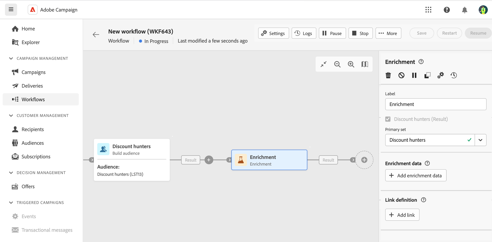
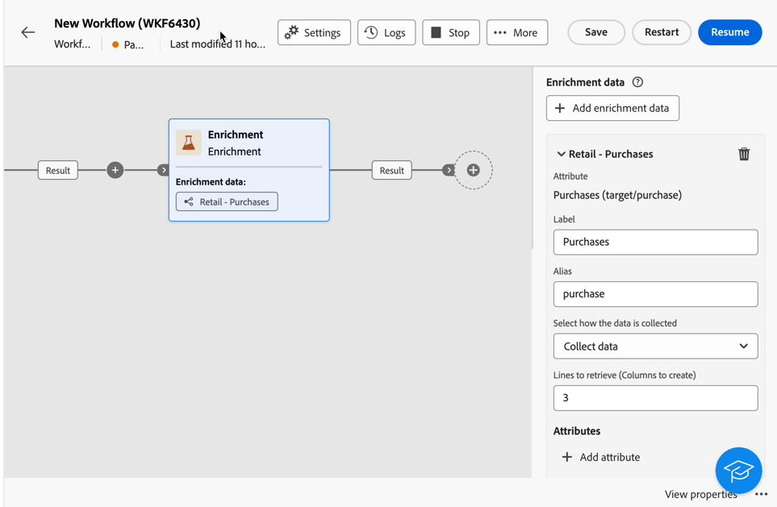
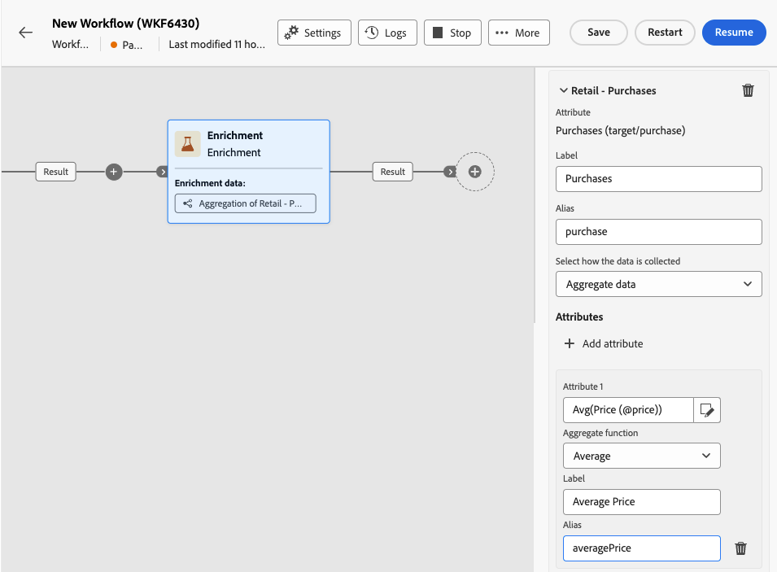
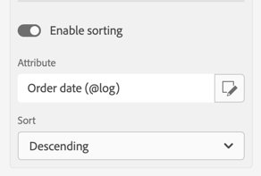

# Verrijking {#enrichment}

>[!CONTEXTUALHELP]
>id="acw_orchestration_enrichment"
>title="Verrijkingsactiviteit"
>abstract="De **activiteit Verrijking** stelt je in staat de doelgegevens te verbeteren met extra informatie uit de database. Het wordt vaak gebruikt in een werkschema na segmenteringsactiviteiten."

De **Verrijking** activiteit is a **richtend** activiteit. Het verbetert de gerichte gegevens met extra informatie van het gegevensbestand. Het wordt vaak gebruikt in een werkschema na segmenteringsactiviteiten.

Verrijkingsgegevens kunnen afkomstig zijn van:

* **de zelfde het werklijst** zoals die in uw werkschema wordt gericht:
   * Richt een groep klanten en voeg het gebied van de &quot;Datum van de Geboorteplaats&quot;aan de huidige het werklijst toe.

* **Een andere het werklijst**:
   * Selecteer een groep klanten en voeg de velden Bedrag en Type product toe uit de tabel Aanschaffen.

Zodra de verrijkingsgegevens aan het werkschema worden toegevoegd, kan het in verdere activiteiten worden gebruikt om klanten in verschillende groepen te segmenteren die op hun gedrag, voorkeur, en behoeften worden gebaseerd. Het kan ook worden gebruikt om gepersonaliseerde marketing berichten en campagnes tot stand te brengen die met uw doelpubliek resoneren.

U kunt bijvoorbeeld informatie met betrekking tot de aankopen van klanten toevoegen aan de workflowtabel en deze gegevens gebruiken om de e-mails aan te passen met de meest recente aankoop of het bedrag dat aan deze aankopen is besteed.

## Voeg een Verrijkingsactiviteit toe {#enrichment-configuration}

Volg deze stappen om de **Verrijkingsactiviteit** te configureren:

1. Voeg activiteiten zoals **toe bouwt publiek** en **combineer** activiteiten.
1. Voeg een **Verrijking** activiteit toe.
1. Als er meerdere overgangen zijn geconfigureerd in uw workflow, gebruikt u het veld **[!UICONTROL Primary set]** om te definiëren welke overgang moet worden gebruikt als de primaire set voor verrijking.

## Verrijkingsgegevens toevoegen {#enrichment-add}

>[!CONTEXTUALHELP]
>id="acw_targetdata_personalization_enrichmentdata"
>title="Verrijkingsgegevens"
>abstract="Selecteer de gegevens die u wilt gebruiken om uw workflow te verrijken. U kunt twee soorten verrijkingsgegevens selecteren: één enkel verrijkingsattribuut van de doelafmeting, of een inzamelingsverbinding, die een verbinding met een 1-N kardinaliteit tussen lijsten is."

>[!CONTEXTUALHELP]
>id="acw_orchestration_enrichment_data"
>title="Verrijkingsactiviteit"
>abstract="Zodra de verrijkingsgegevens aan het werkschema worden toegevoegd, kan het in verdere activiteiten worden gebruikt om klanten in verschillende groepen te segmenteren die op hun gedrag, voorkeur, en behoeften worden gebaseerd, of om gepersonaliseerde marketing berichten en campagnes tot stand te brengen die met uw doelpubliek resoneren."

<!-- /NEO-92684 -->

>[!CONTEXTUALHELP]
>id="acw_orchestration_enrichment_settings"
>title="Verrijkingsinstellingen"
>abstract="Verrijkingsinstellingen: dimensie als doel instellen, aanvullende kenmerken en opties."

1. Klik **toevoegen verrijkingsgegevens** en selecteer de attributen om voor verrijking te gebruiken. [ Leer hoe te om attributen te selecteren en hen toe te voegen aan favorieten ](../../get-started/attributes.md).

   U kunt twee soorten verrijkingsgegevens selecteren: één enkel verrijkingsattribuut van de doelafmeting of een inzamelingsverbinding. Elk type wordt in de volgende voorbeelden beschreven:
   * [Enkel verrijkingskenmerk](#single-attribute)
   * [Verzamelingskoppeling](#collection-link)

   >[!NOTE]
   >
   >De **geeft uitdrukkingsknoop** in het scherm van de attributenselectie uit staat u toe om geavanceerde uitdrukkingen te bouwen om de attributen te selecteren. [ Leer hoe te met de uitdrukkingsredacteur ](../../query/expression-editor.md) te werken.

   

## Koppelingen maken tussen tabellen {#create-links}

>[!CONTEXTUALHELP]
>id="acw_orchestration_enrichment_simplejoin"
>title="Koppelingsdefinitie"
>abstract="Maak een koppeling tussen de werktabelgegevens en de Adobe Campaign-database. Als u bijvoorbeeld gegevens laadt uit een bestand dat het rekeningnummer, land en e-mail van ontvangers bevat, moet u een koppeling naar de landentabel maken om deze gegevens in hun profielen bij te werken."

Met de sectie **[!UICONTROL Link definition]** kunt u een koppeling maken tussen de gegevens van de werktabel en de Adobe Campaign-database. Als u bijvoorbeeld gegevens laadt uit een bestand dat het rekeningnummer, land en e-mail van ontvangers bevat, moet u een koppeling naar de landentabel maken om deze gegevens in hun profielen bij te werken.

Er zijn verschillende typen koppelingen beschikbaar:

* **[!UICONTROL 1 cardinality simple link]**: Elke record uit de primaire set is gekoppeld aan één record uit de gekoppelde gegevens.
* **[!UICONTROL 0 or 1 cardinality simple link]**: Elke record uit de primaire set wordt gekoppeld aan 0 of 1 record uit de gekoppelde gegevens, maar niet aan meer dan één record.
* **[!UICONTROL N cardinality collection link]**: Elke record uit de primaire set is gekoppeld aan 0, 1 of meer (N) records uit de gekoppelde gegevens.

Om een link te maken, volgt u deze stappen:

1. Klik in de **[!UICONTROL Link definition]** sectie op de **[!UICONTROL Add link]** knop.

   

1. Kies in de **keuzemenu Relatietype** het type link dat je wilt maken.

1. Identificeer het doelwit waarmee je de primaire set wilt koppelen:

   * Als u een bestaande tabel in de database wilt koppelen, kiest u **[!UICONTROL Database schema]** en selecteert u de gewenste tabel in het veld **[!UICONTROL Target schema]** .
   * Om met gegevens van de inputovergang te verbinden, verkies **Tijdelijk schema** en selecteer de overgang waarvan gegevens u wilt gebruiken.

1. Definieer de afstemmingscriteria die overeenkomen met gegevens uit de primaire set met het gekoppelde schema. Er zijn twee soorten verbindingen beschikbaar:

   * **Eenvoudig sluit zich aan**: Selecteer een specifiek attribuut om gegevens van de twee schema&#39;s aan te passen. Klik **toevoegen toetreedt** en selecteert **Source** en **de attributen van de Bestemming** om als verzoeningscriteria te gebruiken.
   * **Geavanceerd sluit zich aan**: Creeer zich bij gebruikend geavanceerde voorwaarden. Klik **toevoegen toetreedt** en klik **creëren voorwaarde** knoop om de vraagmodelaar te openen.

Een werkschemavoorbeeld dat verbindingen gebruikt is beschikbaar in de [ sectie van Voorbeelden ](#link-example).

## Gegevensafstemming {#reconciliation}

>[!CONTEXTUALHELP]
>id="acw_orchestration_enrichment_reconciliation"
>title="Afstemming"
>abstract="De **verrijking** activiteit kan worden gebruikt om gegevens van het het gegevensbestandschema van de Campagne met gegevens van een ander schema, of met gegevens te verzoenen die uit een tijdelijk schema zoals gegevens komen die gebruikend een het dossieractiviteit van de Lading worden geupload. Dit type koppeling definieert een koppeling naar een unieke record. Adobe Campaign maakt een koppeling naar een doeltabel door er een externe sleutel aan toe te voegen voor het opslaan van een verwijzing naar de unieke record."

De **Verrijkingsactiviteit** kan worden gebruikt om gegevens uit het Campagne-databaseschema te verzoenen met gegevens uit een ander schema, of met gegevens afkomstig van een tijdelijk schema, zoals data die is geüpload met een Load-bestandsactiviteit. Dit type link definieert een afstemming naar een uniek record. Adobe Campaign maakt een link aan naar een doeltabel door er een vreemde sleutel aan toe te voegen om een referentie naar het unieke record op te slaan.

Je kunt bijvoorbeeld deze optie gebruiken om het land van een profiel, dat is opgegeven in een geüpload bestand, te verzoenen met een van de landen die beschikbaar zijn in de speciale tabel van de campagnedatabase.

Volg de stappen om een **Verrijkingsactiviteit** te configureren met een afstemmingslink:

1. Klik op de **knop Link toevoegen** in het **gedeelte Verzoening** .
1. Identificeer de gegevens u een verzoeningsverbinding met wilt tot stand brengen.

   * Om een verzoeningsverbinding met gegevens van het gegevensbestand van de Campagne tot stand te brengen, selecteer **schema van het Gegevensbestand** en kies het schema waar het doel wordt opgeslagen.
   * Om een verzoeningsverbinding met gegevens tot stand te brengen die uit de inputovergang komen, selecteer **Tijdelijk schema** en kies de werkschemaovergang waar het doelgegeven wordt opgeslagen.

1. De **gebieden van het Etiket** en **Naam** worden automatisch bevolkt gebaseerd op het geselecteerde doelschema. U kunt de waarden desgewenst wijzigen.

1. In de **sectie van de Criteria van de Afstemming**, specificeer hoe u gegevens van de bron en bestemmingstabellen wilt combineren:

   * **Eenvoudig sluit zich aan**: Verwerk een specifiek gebied van de bronlijst met een ander gebied in de bestemmingslijst. Om dit te doen, klik **voeg toe** knoop en specificeer **Source** en **Doopings** gebieden toe om voor de verzoening te gebruiken.

     >[!NOTE]
     >
     >U kunt één of meerdere **Eenvoudige gebruiken toetreedt** criteria, in welk geval zij allen moeten worden geverifieerd zodat de gegevens samen kunnen worden verbonden.

   * **Geavanceerde treedt** toe: Gebruik de vraagmodeler om de verzoeningscriteria te vormen. Om dit te doen, klik **creeer voorwaarde** knoop dan uw verzoeningscriteria door uw eigen regel te bouwen gebruikend EN EN OF verrichtingen.

Het onderstaande voorbeeld toont een workflow die is geconfigureerd om een link te creëren tussen de ontvangertabel van de Adobe Campaign-database en een tijdelijke tabel die een **Load-bestandactiviteit** genereert. In dit voorbeeld verklikt de Verrijkingsactiviteit beide tabellen met het e-mailadres als afstemmingscriteria.

## Voeg aanbiedingen toe {#add-offers}

>[!CONTEXTUALHELP]
>id="acw_orchestration_enrichment_offer_proposition"
>title="Voorstel"
>abstract="Met de verrijkingsactiviteit kunt u aanbiedingen toevoegen voor elk profiel."

Met de activiteit **[!UICONTROL Enrichment]** kunt u aanbiedingen toevoegen voor elk profiel.

Voer hiertoe de stappen uit om een **[!UICONTROL Enrichment]** -activiteit met een aanbieding te configureren:

1. Klik in de **[!UICONTROL Enrichment]** -activiteit in de **[!UICONTROL Offer proposition]** -sectie op de **[!UICONTROL Add offer]** -knop

   

1. U kunt uit twee opties kiezen:

   * **[!UICONTROL Search for the best offer in category]** : controleer deze optie en geef de parameters op voor de aanroep van de aanbiedingsengine (ruimte, categorie of thema(&#39;s), contactdatum, aantal aanbiedingen dat u wilt behouden). De motor berekent de beste aanbieding(en) die op basis van deze parameters moet worden toegevoegd. We raden u aan de categorie of het themaveld in te vullen in plaats van beide.

     

   * **[!UICONTROL A predefined offer]** : controleer deze optie en specificeer een aanbiedingsruimte, een specifieke aanbieding, en een contactdatum om de aanbieding direct te vormen die u, zonder de aanbiedingsmotor te roepen wilt toevoegen.

     

1. Klik op **[!UICONTROL Confirm]** nadat u uw voorstel hebt geselecteerd.

Je kunt het voorstel nu gebruiken in de leveringsactiviteiten.

### De aanbiedingen van verrijkingsactiviteiten gebruiken

Volg onderstaande stappen als u in een workflow de aanbiedingen wilt gebruiken die u van een verrijkingsactiviteit in uw levering krijgt:

1. Open de leveringsactiviteit en ga in de inhoudsuitgave. Klik op de knop **[!UICONTROL Offers settings]** en selecteer in de vervolgkeuzelijst de **[!UICONTROL Offers space]** die overeenkomt met uw aanbieding.
Als u alleen de aanbiedingen van de verrijkingsactiviteit wilt weergeven, stelt u het aantal **[!UICONTROL Propositions]** in op 0 en slaat u de wijzigingen op.

   

1. Als de ontwerper van de e-mail een personalisatie met aanbiedingen toevoegt, klikt u op het pictogram **[!UICONTROL Propositions]** en geeft deze de aangeboden aanbiedingen weer die u van de **[!UICONTROL Enrichment]** -activiteit krijgt. Open het voorstel dat u wilt kiezen door erop te klikken.

   

   Ga naar **[!UICONTROL Rendering functions]** en kies **[!UICONTROL HTML rendering]** of **[!UICONTROL Text rendering]** naar wens.

   

>[!NOTE]
>
>Als u ervoor kiest om meer dan één aanbieding in de **[!UICONTROL Enrichment]** activiteit bij de **[!UICONTROL Number of offers to keep]** optie te hebben, worden alle aanbiedingen getoond wanneer het klikken op het **[!UICONTROL Propositions]** pictogram.

## Voorbeelden {#example}

### Enkel verrijkingskenmerk {#single-attribute}

Hier voegen we slechts één verrijkingskenmerk toe, bijvoorbeeld de geboortedatum. Voer de volgende stappen uit:

1. Klik binnen het **gebied van Attributen**.
1. Selecteer een eenvoudig veld in de doeldimensie, de geboortedatum in ons voorbeeld.
1. Klik **bevestigen**.

### Verzamelingskoppeling {#collection-link}

In dit complexere gebruiksgeval, zullen wij een inzamelingsverbinding selecteren die een verbinding met een 1-N kardinaliteit tussen lijsten is. Laten we de drie laatste aankopen ophalen die minder dan 100 dollar bedragen. Hiervoor moet u definiëren:

* een verrijkingsattribuut: het **Prijs** gebied
* het aantal op te halen lijnen: 3
* een filter: items uitfilteren die groter zijn dan 100$
* a sorterend: dalend sorterend op het **datum** gebied van de Orde.

#### Het kenmerk toevoegen {#add-attribute}

Hier selecteert u de verzamelingskoppeling die u als verrijkingsgegevens wilt gebruiken.

1. Klik binnen het **gebied van Attributen**.
1. Klik **Geavanceerde attributen van de Vertoning**.
1. Selecteer het **gebied van de Prijs** {van de **Aankopen** lijst.

<!--  -->

#### De verzamelingsinstellingen definiëren{#collection-settings}

Definieer vervolgens hoe de gegevens worden verzameld en hoeveel records moeten worden opgehaald.

1. Selecteer **verzamelen gegevens** in **Uitgezocht hoe het gegeven** drop-down wordt verzameld.
1. Het type &quot;3&quot;op de **Lijnen om terug te winnen (Kolommen om te creëren)** gebied.

Als u, bijvoorbeeld, de gemiddelde hoeveelheid aankopen voor een klant wilt krijgen, **Geaggregeerde gegevens** in plaats daarvan selecteren, en **Gemiddelde** in de **Geaggregeerde functie** drop-down selecteren.

Gebruik het **Etiket** en **alias** gebieden van uw attribuut om het begrijpelijker te maken zoals hieronder getoond.

#### Filters definiëren{#collection-filters}

Hier definiëren we de maximale waarde voor het verrijkingsattribuut. We filteren items eruit die meer dan 100$ kosten. [Leer hoe je met de query modeler werkt](../../query/query-modeler-overview.md)

1. Klik op **Filters** aanmaken.
1. Voeg de volgende twee filters toe: **Prijs** bestaat EN **Prijs** is minder dan 100. De eerste filtert NULL-waarden omdat deze als de grootste waarde verschijnen.
1. Klik **bevestigen**.

#### De sortering definiëren{#collection-sorting}

Wij moeten nu het sorteren toepassen om de drie **recentste** aankopen terug te winnen.

1. Activeer **het sorteren** optie toelaten.
1. Klik binnen het **gebied van Attributen**.
1. Selecteer het **gebied van de datum van de Orde 0} {.**
1. Klik **bevestigen**.
1. Selecteer **Aflopend** van de **drop-down Soort**.

### Verrijking met gekoppelde gegevens {#link-example}

In het onderstaande voorbeeld ziet u een workflow die is geconfigureerd om een koppeling tussen twee overgangen te maken. De eerste overgang richt zich op profielgegevens met een **Query-activiteit** , terwijl de tweede overgang aankoopgegevens omvat die zijn opgeslagen in een bestand dat via een Load-bestandactiviteit wordt geladen.

* De eerste **Verrijkingsactiviteit** koppelt de primaire set (gegevens van de **Query-activiteit** ) aan het schema van de **Load-bestandactiviteit** . Dit stelt ons in staat om elk profiel dat door de zoekopdracht wordt getarget te koppelen aan de bijbehorende aankoopgegevens.

  

* Een tweede **Verrijking** activiteit wordt toegevoegd om gegevens van de werkschemalijst met de koopgegevens te verrijken die uit de **komen dossier van de Lading** activiteit. Op deze manier kunnen we die gegevens in verdere activiteiten gebruiken, bijvoorbeeld om berichten die aan klanten worden verzonden met informatie over hun aankoop te personaliseren.

  

