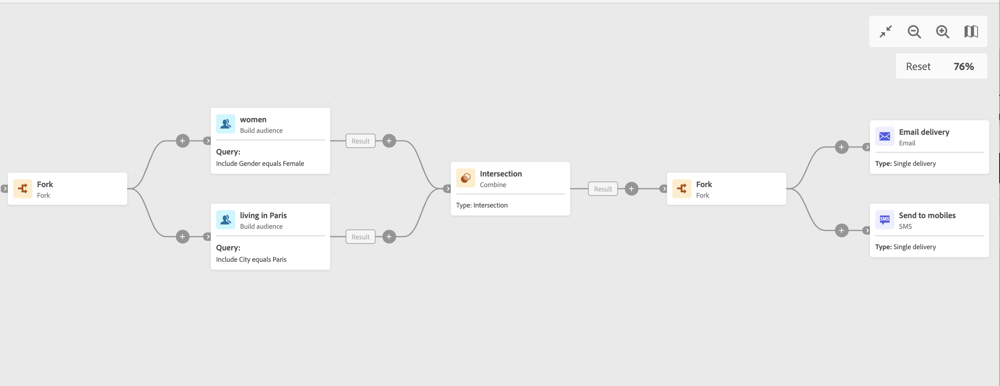

# Vertakking {#fork}

>[!CONTEXTUALHELP]
>id="acw_orchestration_fork"
>title="Vorkactiviteit"
>abstract="De **activiteit 0&rbrace; van het Vonk &lbrace;staat u toe om uitgaande overgangen tot stand te brengen om verscheidene activiteiten tezelfdertijd te beginnen.**"

>[!CONTEXTUALHELP]
>id="acw_orchestration_fork_transitions"
>title="Overgangen naar vorkactiviteit"
>abstract="Door gebrek, worden twee overgangen gecreeerd met de activiteit van het a **Fork**. Klik **toevoegen overgangsknoop** om een extra uitgaande overgang te bepalen, en zijn etiket in te gaan."

De **activiteit 0&rbrace; van het Fork &lbrace;is de controle** activiteit van de a **Stroom.** Het laat u toe om uitgaande overgangen tot stand te brengen om verscheidene activiteiten gelijktijdig te beginnen.

## De vorkactiviteit configureren {#fork-configuration}

Volg deze stappen om de **1&rbrace; activiteit van het Fork &lbrace;te vormen:**

1. Voeg a **activiteit 0&rbrace; van het Fork &lbrace;aan uw werkschema toe.**
1. Klik **toevoegen overgang** om een nieuwe uitgaande overgang toe te voegen. Standaard zijn twee overgangen gedefinieerd.
1. Voeg een label toe aan elke overgang.

## Voorbeeld {#fork-example}

In het volgende voorbeeld, worden twee **activiteiten van 0&rbrace; Fork gebruikt:**

* Één vóór de twee vragen, om hen gelijktijdig uit te voeren.
* Eén na de doorsnede om tegelijkertijd een e-mail en een sms naar de doelgroep te sturen.

