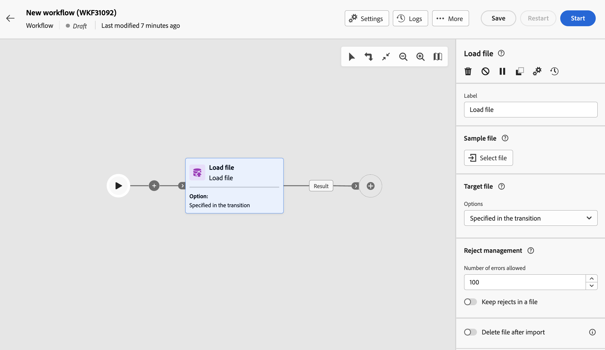

# Bestand laden {#load-file}

>[!CONTEXTUALHELP]
>id="acw_orchestration_loadfile"
>title="Bestandsactiviteit laden"
>abstract="De **dossier van de Lading** activiteit is a **het beheer van Gegevens** activiteit. Gebruik deze activiteit om met gegevens te werken die in een extern dossier worden opgeslagen. Profielen en gegevens worden niet toegevoegd aan de database, maar alle velden in het invoerbestand zijn beschikbaar voor personalisatie, voor het bijwerken van profielen of een andere tabel."

>[!CONTEXTUALHELP]
>id="acw_orchestration_loadfile_outboundtransition"
>title="Uitgaande overgang van beheer afwijzen"
>abstract="Uitgaande overgang van beheer afwijzen"

>[!CONTEXTUALHELP]
>id="acw_orchestration_loadfile_outboundtransition_reject"
>title="Uitgaande overgang van beheer afwijzen voor afwijzing"
>abstract="Uitgaande overgang van beheer afwijzen voor afwijzing"

De **dossier van de Lading** activiteit is a **het beheer van Gegevens** activiteit. Gebruik deze activiteit om met profielen en gegevens te werken die in een extern dossier worden opgeslagen. De profielen en de gegevens worden niet toegevoegd aan het gegevensbestand, maar alle gebieden in het inputdossier zijn beschikbaar voor [ verpersoonlijking ](../../personalization/gs-personalization.md), of om profielen, of een andere lijst bij te werken.

>[!NOTE]
>Ondersteunde bestandsindelingen zijn: tekst (TXT) en door komma&#39;s gescheiden waarden (CSV). Met de webgebruikersinterfaceconsole kunt u bestanden tot maximaal 50 MB laden. In de clientconsole geldt een limiet van 150 MB voor het laden van gegevens. [Meer informatie](https://experienceleague.adobe.com/docs/campaign-web/v8/wf/design-workflows/load-file.html){target="_blank"}

Deze activiteit kan met a [ Verzoening ](reconciliation.md) activiteit worden gebruikt om niet geïdentificeerde gegevens met bestaande middelen te verbinden. Bijvoorbeeld, kan de **dossier van de Lading** activiteit vóór a **de activiteit van de Verzoening** worden geplaatst als u niet-standaardgegevens in het gegevensbestand invoert.

## De activiteit van het bestand laden configureren {#load-configuration}

De **dossier van de Lading** activiteitenconfiguratie impliceert twee stappen. Definieer eerst de verwachte bestandsstructuur door een voorbeeldbestand te uploaden. Als dit is gebeurd, geeft u de oorsprong op van het bestand waarvan de gegevens worden geïmporteerd. Voer de onderstaande stappen uit om de activiteit te configureren.

### Voorbeeldbestand configureren {#sample}

>[!CONTEXTUALHELP]
>id="acw_orchestration_loadfile_samplefile"
>title="Voorbeeldbestand"
>abstract="Selecteer de verwachte bestandsstructuur door een voorbeeldbestand te uploaden."

>[!CONTEXTUALHELP]
>id="acw_orchestration_loadfile_formatting"
>title="Opmaak voor het laden van bestandsactiviteit"
>abstract="In de **Formatterende** sectie, specificeer hoe het dossier wordt geformatteerd om ervoor te zorgen dat het gegeven correct wordt ingevoerd."

>[!CONTEXTUALHELP]
>id="acw_orchestration_loadfile_valueremapping"
>title="Waarde opnieuw toewijzen voor activiteit van bestand laden"
>abstract="Gebruik deze optie om specifieke waarden van de geladen bestanden toe te wijzen aan nieuwe waarden. Als de kolom bijvoorbeeld de waarden &#39;Waar&#39;/&#39;Onwaar&#39; bevat, kunt u een toewijzing toevoegen om die waarden automatisch te vervangen door &#39;0&#39;/&#39;1&#39; tekens."

Voer de volgende stappen uit om het voorbeeldbestand te configureren dat wordt gebruikt om de verwachte bestandsstructuur te definiëren:

1. Voeg het dossier van de a **Lading** activiteit in uw werkschema toe.

1. Selecteer het voorbeeldbestand dat u wilt gebruiken om de verwachte bestandsstructuur te definiëren. Om dit te doen, klik het **Uitgezochte dossier** knoop in de **[!UICONTROL Sample file]** sectie en selecteer het lokale te gebruiken dossier.

   >[!NOTE]
   >
   >De data van het voorbeeldbestand worden gebruikt voor het configureren van de activiteit, maar worden niet geïmporteerd. Gebruik een voorbeeldbestand dat weinig gegevens bevat. Het dossierformaat moet met dit [ steekproefdossier ](../../audience/file-audience.md#sample-file) worden gericht.

1. Er wordt een voorbeeld van het voorbeeldbestand weergegeven met maximaal 30 regels.

1. Geef in de vervolgkeuzelijst **[!UICONTROL File type]** op of het bestand kolommen met scheidingstekens of kolommen met een vaste breedte gebruikt.

   

1. Voor afgebakende kolomdossiertypes, gebruik de **sectie van Kolommen** om de eigenschappen van elke kolom te vormen.

   +++Beschikbare opties voor bestandskolommen

   * **[!UICONTROL Label]**: label dat moet worden weergegeven voor de kolom.
   * **[!UICONTROL Data type]**: type gegevens in de kolom.
   * **[!UICONTROL Width]** (gegevenstype tekenreeks): maximum aantal tekens dat in de kolom moet worden weergegeven.
   * **[!UICONTROL Data Transformation]** (gegevenstype tekenreeks): pas transformatie toe op de waarden in de kolom.
   * **[!UICONTROL White space management]** (gegevenstype tekenreeks): geef op hoe de spaties in de kolom moeten worden beheerd.
   * **[!UICONTROL Separators]** (gegevenstypen datum, tijd, geheel getal en getal): geef de tekens op die u als scheidingstekens wilt gebruiken.
   * **[!UICONTROL Allow NULLs]**: geef op hoe u lege waarden in de kolom wilt beheren. De optie Adobe Campaign default geeft een fout weer als er een lege waarde aanwezig is.
   * **[!UICONTROL Error processing]** (gegevenstype tekenreeks): geef het gedrag op bij fouten in een van de regels.
   * **[!UICONTROL Value remapping]**: met deze optie kunt u specifieke waarden toewijzen aan nieuwe waarden. Als de kolom bijvoorbeeld waarden &quot;Waar&quot;/&quot;Onwaar&quot; bevat, kunt u een toewijzing toevoegen om die waarden automatisch te vervangen door &quot;0&quot;/&quot;1&quot;-tekens.

   +++

1. In de **Formatterende** sectie, specificeer hoe het dossier wordt geformatteerd om ervoor te zorgen dat het gegeven correct wordt ingevoerd.

### Doelbestand definiëren om te uploaden {#target}

>[!CONTEXTUALHELP]
>id="acw_orchestration_loadfile_targetfile"
>title="Doelbestand voor laden van bestandsactiviteit"
>abstract="Geef in de sectie **[!UICONTROL Target file]** op hoe het bestand moet worden opgehaald dat op de server moet worden geüpload."

>[!CONTEXTUALHELP]
>id="acw_orchestration_loadfile_nameofthefile"
>title="Naam van het bestand"
>abstract="Geef de naam op van het veld dat u wilt uploaden op de server. Klik op het pictogram **[!UICONTROL Open personalization dialog]** om de expressie-editor, inclusief gebeurtenisvariabelen, te gebruiken om de bestandsnaam te berekenen."

>[!CONTEXTUALHELP]
>id="acw_orchestration_loadfile_targetdb"
>title="Doeldatabase"
>abstract="Als u een **[!UICONTROL Load file]** -activiteit opent die al is ingesteld in de clientconsole, is een extra **[!UICONTROL Target database]** -sectie beschikbaar als u de activiteit hebt geconfigureerd om het bestand te uploaden naar een externe database."

>[!CONTEXTUALHELP]
>id="acw_orchestration_loadfile_command"
>title="Bestand laden, opdracht"
>abstract="Het toestaan van willekeurig bevel voor voorverwerking is een veiligheidszorg. Schakel beveiligingsoptie XtkSecurity_Disable_Preproc uit om het gebruik van een vooraf gedefinieerde lijst met opdrachten te forceren."

>[!CAUTION]
>
>Voordat u het doelbestand laadt, moet u controleren of het bestand voldoet aan de indeling van het voorbeeldbestand. Eventuele verschillen in bestandsindeling, kolomstructuur of aantal kolommen kunnen leiden tot fouten tijdens de uitvoering van de workflow.

Voer de volgende stappen uit om het te uploaden doelbestand te definiëren:

1. Geef in de sectie **[!UICONTROL Target file]** de actie op die moet worden uitgevoerd wanneer het bestand wordt opgehaald dat op de server moet worden geüpload.

   * **[!UICONTROL Upload file from local machine]**: Selecteer het bestand dat u wilt uploaden van uw computer.

   * **[!UICONTROL Specified in the transition]**: Upload het bestand dat is opgegeven in de volgende inkomende overgang van een eerdere activiteit, zoals **[!UICONTROL Transfer file]** .

   * **[!UICONTROL Pre-process the file]**: upload het bestand dat u in de vorige overgang hebt opgegeven en pas er een voorbewerkingsopdracht op toe, zoals **[!UICONTROL Decompression]** of **[!UICONTROL Decrypt]** .

   * **[!UICONTROL Calculated]**: upload het bestand waarvan de naam is opgegeven in het veld **[!UICONTROL File name]** . Klik op het pictogram **[!UICONTROL Open personalization dialog]** om de expressie-editor, inclusief gebeurtenisvariabelen, te gebruiken om de bestandsnaam te berekenen.

   

   >[!NOTE]
   >
   >Als u een **[!UICONTROL Load file]** -activiteit opent die al is ingesteld in de clientconsole, wordt een extra **[!UICONTROL Target database]** -sectie weergegeven als u de activiteit hebt geconfigureerd om het bestand te uploaden naar een externe database. Hiermee kunt u opgeven of u het bestand wilt uploaden naar de campagneserver of naar de externe database.

### Aanvullende opties {#options}

>[!CONTEXTUALHELP]
>id="acw_orchestration_loadfile_rejectmgt"
>title="Afwijzen van beheer voor het laden van bestandsactiviteiten"
>abstract="In de **het beheer van de Weigering** sectie, specificeer hoe de activiteit zich in het geval van fouten zou moeten gedragen. U kunt het maximale aantal toegestane fouten definiëren en de optie **[!UICONTROL Keep rejects in a file]** inschakelen om een bestand met de fouten die tijdens het importeren zijn opgetreden, op de server te downloaden."

>[!CONTEXTUALHELP]
>id="acw_orchestration_loadfile_delete"
>title="Bestand verwijderen na importeren"
>abstract="Wissel het **dossier van de Schrapping na de invoer** om het originele dossier van de server te schrappen nadat het dossier wordt ingevoerd."

1. In de **het beheer van de Weigering** sectie, specificeer hoe de activiteit zich in het geval van fouten zou moeten gedragen:

   * Geef in het veld **[!UICONTROL Number of errors allowed]** het maximumaantal fouten op dat is toegestaan bij het verwerken van het te laden bestand. Als de waarde bijvoorbeeld is ingesteld op &quot;20&quot;, mislukt de uitvoering van de workflow als er meer dan 20 fouten optreden bij het laden van het bestand.

   * Als u de fouten wilt behouden die optraden bij het laden van het bestand, schakelt u de optie **[!UICONTROL Keep rejects in a file]** in en geeft u de gewenste naam voor het bestand op in het veld **[!UICONTROL Rejection File]** .

     Na het activeren van deze optie wordt een extra uitvoerovergang met de naam &quot;Complement&quot; toegevoegd na de activiteit. Eventuele fouten die tijdens het importeren optreden, worden opgeslagen in het opgegeven bestand op de server.

1. Als u het geüploade bestand van de server wilt verwijderen nadat de workflow is uitgevoerd, schakelt u de optie **[!UICONTROL Delete file after import]** in of uit.

   

1. Klik **bevestigen** zodra de montages correct zijn.

## Voorbeeld {#load-example}

Een steekproef van een extern dossier dat met de **Verzoening** activiteit wordt gebruikt is beschikbaar in [ deze sectie ](reconciliation.md#reconciliation-example).
