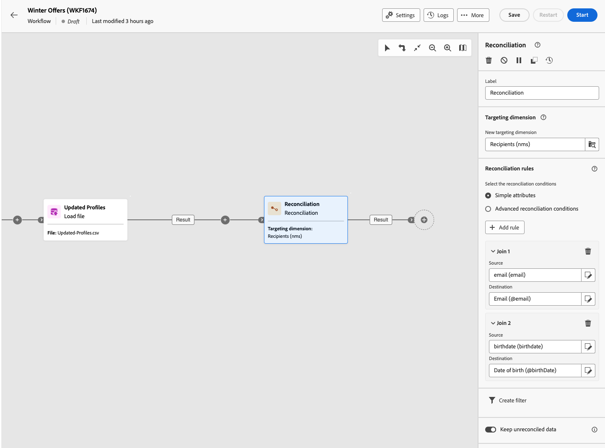

# Afstemming {#reconciliation}

>[!CONTEXTUALHELP]
>id="acw_orchestration_reconciliation"
>title="Afstemmingsactiviteit"
>abstract="De **Verzoening** activiteit is **Targeting** activiteit die u toestaat om het verband tussen de gegevens in het gegevensbestand van Adobe Campaign en de gegevens in een het werklijst te bepalen, bijvoorbeeld gegevens die van een extern dossier worden geladen. Bijvoorbeeld de **Verzoening** activiteit kan na een **Haakje laden** activiteit om niet-standaardgegevens in het gegevensbestand in te voeren. In dit geval worden de **Verzoening** Met deze activiteit kunt u de koppeling definiëren tussen de gegevens in de Adobe Campaign-database en de gegevens in de externe tabel."

>[!CONTEXTUALHELP]
>id="acw_orchestration_reconciliation_field"
>title="Selectieveld Afstemmen"
>abstract="Selectieveld Afstemmen"

>[!CONTEXTUALHELP]
>id="acw_orchestration_reconciliation_condition"
>title="Afstemming maken, voorwaarde"
>abstract="Afstemming maken, voorwaarde"

>[!CONTEXTUALHELP]
>id="acw_orchestration_reconciliation_complement"
>title="Afstemming genereren"
>abstract="Afstemming genereren"

De **Verzoening** activiteit is **Targeting** activiteit die u toestaat om het verband tussen de gegevens in het gegevensbestand van Adobe Campaign en de gegevens in een het werklijst te bepalen, bijvoorbeeld gegevens die van een extern dossier worden geladen.

Bijvoorbeeld de **Verzoening** activiteit kan na een **Haakje laden** activiteit om niet-standaardgegevens in het gegevensbestand in te voeren. In dit geval worden de **Verzoening** Met deze activiteit kunt u de koppeling definiëren tussen de gegevens in de Adobe Campaign-database en de gegevens in de werktabel.

## Best practices {#reconciliation-best-practices}

Terwijl de **Verrijking** activiteit staat u toe om extra gegevens te bepalen in uw werkschema te verwerken (u kunt gebruiken **Verrijking** activiteit om gegevens te combineren die uit veelvoudige reeksen komen, of om verbindingen met een tijdelijke middel tot stand te brengen), **Verzoening** Met activiteit kunt u niet-geïdentificeerde gegevens koppelen aan bestaande bronnen.

>[!NOTE]
>De afstemmingsoperatie houdt in dat de gegevens van de gekoppelde afmetingen al in de database staan.  Als u bijvoorbeeld een aankoopbestand importeert waarin wordt aangegeven welk product is gekocht, op welk moment, door welke klant, enzovoort, moeten het product en de klant al in de database aanwezig zijn.

## De afstemmingsactiviteit configureren {#reconciliation-configuration}

>[!CONTEXTUALHELP]
>id="acw_orchestration_reconciliation_targeting"
>title="Doeldimensie"
>abstract="Selecteer de nieuwe doeldimensie. Met een dimensie kunt u de doelgroep definiëren: ontvangers, abonnees van apps, operators, abonnees, enzovoort. Standaard is de huidige doeldimensie geselecteerd."

>[!CONTEXTUALHELP]
>id="acw_orchestration_reconciliation_rules"
>title="Afstemmingsregels"
>abstract="Selecteer het (de) afstemmingsveld(en) die u wilt gebruiken voor deduplicatie. U kunt een of meer verzoeningscriteria gebruiken."

>[!CONTEXTUALHELP]
>id="acw_orchestration_reconciliation_targeting_selection"
>title="Doeldimensie selecteren"
>abstract="Selecteer het richten afmeting voor uw binnenkomende gegevens met elkaar in overeenstemming te brengen."
>additional-url="https://experienceleague.adobe.com/docs/campaign-web/v8/audiences/gs-audiences-recipients.html#targeting-dimensions" text="Doelafmetingen"

>[!CONTEXTUALHELP]
>id="acw_orchestration_keep_unreconciled_data"
>title="Niet-compatibele gegevens behouden"
>abstract="Door gebrek, worden de niet in overeenstemming gebrachte gegevens gehouden in de uitgaande overgang en beschikbaar in de werklijst voor toekomstig gebruik. Als u niet-compatibele gegevens wilt verwijderen, desactiveert u het dialoogvenster **Niet-compatibele gegevens behouden** -optie."

>[!CONTEXTUALHELP]
>id="acw_orchestration_reconciliation_attribute"
>title="Afstemmingskenmerk"
>abstract="Selecteer het kenmerk dat u wilt gebruiken om gegevens op elkaar af te stemmen en klik op Bevestigen."

Voer de volgende stappen uit om de **Verzoening** activiteit:

1. Sleep een **Verzoening** in uw workflow. Deze activiteit moet worden toegevoegd na een overgang met een populatie waarvan de doeldimensie niet rechtstreeks uit Adobe Campaign afkomstig is.

1. Selecteer de nieuwe doeldimensie. Met een dimensie kunt u de doelgroep definiëren: ontvangers, abonnees van apps, operators, abonnees, enzovoort. [Meer informatie over doelgerichte dimensies](../../audience/about-recipients.md#targeting-dimensions).

1. Selecteer de velden die u wilt gebruiken voor de afstemming. U kunt een of meer verzoeningscriteria gebruiken.

   1. Als u kenmerken wilt gebruiken om gegevens op elkaar af te stemmen, selecteert u de optie **Eenvoudige kenmerken** -optie. De **Bron** In dit veld worden de velden weergegeven die beschikbaar zijn in de invoerovergang en die moeten worden afgestemd. De **Doel** komt overeen met de velden van de geselecteerde doeldimensie. De gegevens worden in overeenstemming gebracht wanneer bron en bestemming gelijk zijn. Selecteer bijvoorbeeld de **E-mail** velden voor het dupliceren van profielen op basis van hun e-mailadres.

      Klik op de knop **Regel toevoegen** knop. Als er meerdere samenvoegvoorwaarden zijn opgegeven, moeten deze ALLES worden gecontroleerd zodat de gegevens aan elkaar kunnen worden gekoppeld.

      

   1. Als u andere kenmerken wilt gebruiken om gegevens met elkaar te verzoenen, selecteert u de optie **Geavanceerde afstemmingsvoorwaarden** -optie. U kunt dan uw eigen verzoeningsvoorwaarde tot stand brengen gebruikend de vraagmodeler. Leer hoe te om vraagmodeler in te gebruiken [deze sectie](../../query/query-modeler-overview.md).

1. U kunt gegevens filteren om te verzoenen met de **Filter maken** knop. Hiermee kunt u een aangepaste voorwaarde maken met de opdracht [querymodel](../../query/query-modeler-overview.md).

Door gebrek, worden de niet in overeenstemming gebrachte gegevens gehouden in de uitgaande overgang en beschikbaar in de werkbare lijst voor toekomstig gebruik. Als u niet-compatibele gegevens wilt verwijderen, desactiveert u het dialoogvenster **Niet-compatibele gegevens behouden** -optie.

## Voorbeeld {#reconciliation-example}

In het volgende voorbeeld ziet u een workflow die een doelgroep van profielen rechtstreeks maakt op basis van een geïmporteerd bestand dat nieuwe klanten bevat. De workflow bestaat uit de volgende activiteiten:

De workflow is als volgt ontworpen:


Het wordt gebouwd met de volgende activiteiten:

* Met een activiteit [Bestand laden](load-file.md) uploadt u een bestand met profieldata die uit een extern hulpprogramma zijn geëxtraheerd.

  Bijvoorbeeld:

  ```
  lastname;firstname;email;birthdate;
  JACKMAN;Megan;megan.jackman@testmail.com;07/08/1975;
  PHILLIPS;Edward;phillips@testmail.com;09/03/1986;
  WEAVER;Justin;justin_w@testmail.com;11/15/1990;
  MARTIN;Babe;babeth_martin@testmail.net;11/25/1964;
  REESE;Richard;rreese@testmail.com;02/08/1987;
  ```

* A **Verzoening** activiteit die de binnenkomende gegevens als profielen identificeert, door **email** en **Geboortedatum** velden als verzoeningscriteria.

  

* A [Adviezen opslaan](save-audience.md) om een nieuw publiek te maken op basis van deze updates. U kunt ook de opdracht **Adviezen opslaan** activiteit van een **Einde** activiteit als geen specifiek publiek moet worden gecreeerd of worden bijgewerkt. Ontvangersprofielen worden in elk geval bijgewerkt wanneer u de workflow uitvoert.


## Compatibiliteit {#reconciliation-compat}

De **Verzoening** activiteit bestaat niet in de console van de Cliënt. Alles **Verbeteringen** activiteiten die zijn gemaakt in de clientconsole met de verzoeningsopties ingeschakeld, worden weergegeven als **Verzoening** activiteiten in de UI van het Web van de Campagne.
