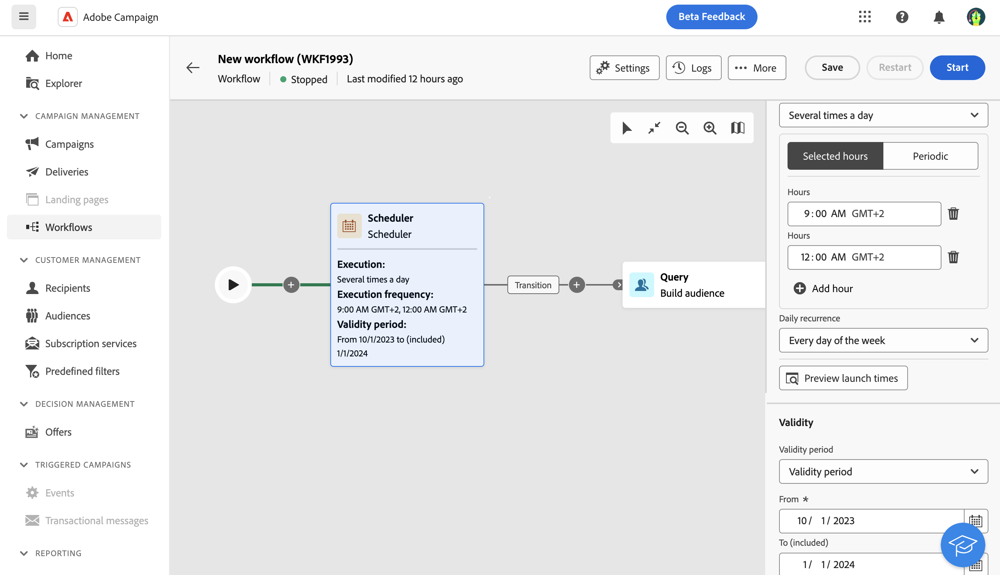

# Planner {#scheduler}

>[!CONTEXTUALHELP]
>id="acw_orchestration_scheduler"
>title="Planningsactiviteit"
>abstract="De **Planner** Met deze activiteit kunt u plannen wanneer de workflow wordt gestart. Deze activiteit moet worden beschouwd als een geplande start. Deze kan alleen worden gebruikt als de eerste activiteit van de workflow."

De **Planner** activiteit is **Stroomregeling** activiteit. Hiermee kunt u plannen wanneer de workflow wordt gestart. Deze activiteit moet worden beschouwd als een geplande start. Deze kan alleen worden gebruikt als de eerste activiteit van de workflow.

## Best practices{#scheduler-best-practices}

* Plan geen workflow die meer dan om de 15 minuten wordt uitgevoerd, aangezien dit de algehele systeemprestaties kan belemmeren en blokken in de database kan maken.
* Als u één-schot levering in uw werkschema wilt verzenden, kunt u een planneractiviteit toevoegen en het plaatsen om in werking te stellen **Eenmaal**. U kunt ook de **Schema** in de leveringsinstellingen.
* Als u een terugkerende levering in uw werkstroom wilt verzenden, moet u een **Planner** en stelt de uitvoeringsfrequentie in. De terugkomende leveringsactiviteit staat u niet toe om een programma te bepalen.

## De planningsactiviteit configureren {#scheduler-configuration}

>[!CONTEXTUALHELP]
>id="acw_orchestration_schedule_validity"
>title="Geldigheid van planner"
>abstract="U kunt een geldigheidsperiode voor de planner bepalen. Deze kan permanent zijn (standaard) of geldig zijn tot een bepaalde datum."

>[!CONTEXTUALHELP]
>id="acw_orchestration_schedule_options"
>title="Planningsopties"
>abstract="Bepaal de frequentie van de planner. Het kan op een specifiek moment, één keer of verscheidene keren per dag, week of maand worden uitgevoerd."

Voer de volgende stappen uit om de **Planner** activiteit:

1. Voeg een **Planner** activiteit aan uw werkschema.

1. Vorm **Uitvoerfrequentie**:

   * **Eenmaal**: de workflow wordt één keer uitgevoerd.

   * **Dagelijks**: de workflow wordt op een bepaald tijdstip, eenmaal per dag, uitgevoerd.

   * **Meerdere keren per dag:** de workflow wordt regelmatig verscheidene keren per dag uitgevoerd . U kunt uitvoeringen instellen op specifieke tijdstippen of periodiek.

   * **Wekelijks**: de workflow wordt op een bepaald moment, één keer of meerdere keren per week uitgevoerd.

   * **Maandelijks**: de workflow wordt uitgevoerd op een bepaald moment, één keer of meerdere keren per maand. U kunt aangeven in welke maanden u de workflow wilt uitvoeren. U kunt uitvoeringen ook instellen op bepaalde weekdagen van de maand, zoals de tweede dinsdag van de maand.

1. Definieer de details van de uitvoering op basis van de geselecteerde frequentie. De detailvelden variëren, afhankelijk van de gebruikte frequentie (tijd, herhalingsfrequentie, opgegeven dagen, enz.).

1. Klikken **Voorvertoning van opstartij** om het schema van de volgende tien uitvoeringen van uw werkschema te controleren.

1. Bepaal de geldigheidsperiode van de planner:

   * **Permanent (nooit verlopen)**: de werkstroom wordt uitgevoerd volgens de opgegeven frequentie, zonder enige beperking van het tijdkader of het aantal herhalingen.

   * **Geldigheidsperiode**: de workflow wordt uitgevoerd volgens de opgegeven frequentie, tot een bepaalde datum. U moet begin- en einddatums opgeven.

>[!NOTE]
>
>Als u de workflow meteen wilt starten, klikt u op de knop **Taak in behandeling uitvoeren** in de hoogste actiebar van de planner. Deze knop is alleen beschikbaar wanneer u de workflow hebt gestart.

## Voorbeeld{#scheduler-example}

In het volgende voorbeeld, wordt de activiteit gevormd zodat het werkschema verscheidene keren per dag om 9 en 12 AM, elke dag van de week van 1 Oktober, 2023 tot 1 Januari, 2024 loopt.

