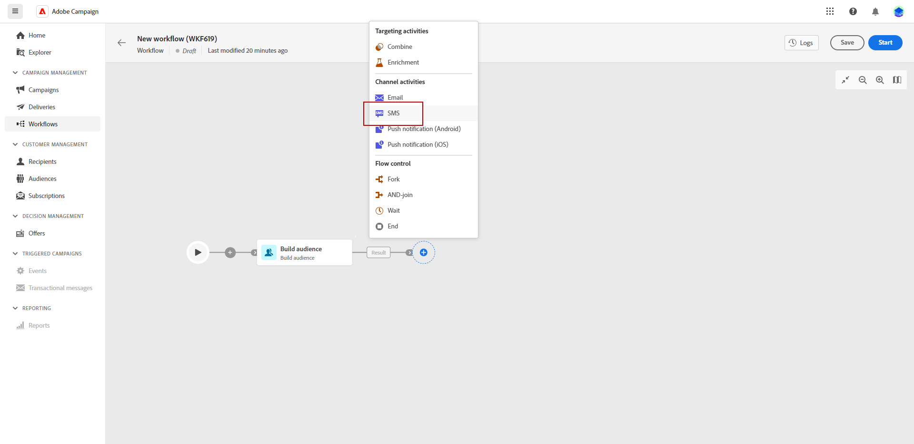

# Sms {#sms}

De **SMS** Deze activiteit biedt de functionaliteit om SMS-berichten binnen een workflow te verzenden. Het laat de automatisering van SMS toe die naar een specifiek doel verzendt binnen de zelfde werkschema wordt bepaald.

Om de ontvangers van SMS te bepalen, kunt u hen opstelling vóór de de leveringsactiviteit van SMS in het werkschema gebruikend de het publieksactiviteit van de Bouwstijl. Meer informatie.

1. Na het creëren van en het vormen van een nieuw werkschema, voeg een het publieksactiviteit van de Bouwstijl toe om een bestaand publiek te selecteren of de regelbouwer te gebruiken om uw eigen vraag te bepalen.

1. Voeg een het kanaalactiviteit van SMS in uw werkschema toe.

   
<!--
1. Select the Type of delivery:

    * Single delivery: Choose this option if you want the SMS to be sent only once. You have the flexibility to choose whether or not to include an outbound transition from this activity.

    * Recurring delivery: Choose this option if you want the SMS to be sent multiple times based on a defined frequency. The frequency can be configured using a Scheduler activity, allowing you to schedule the SMS to be sent at regular intervals.
-->

1. Selecteer uw activiteit. Selecteer in het bezorgmenu de sjablonen die u voor deze levering wilt gebruiken. Meer informatie over sjablonen

1. Klik op Levering maken om uw SMS-levering te configureren. Raadpleeg deze pagina voor meer informatie over SMS-verzending.

1. Wanneer uw levering klaar is om te worden verzonden, navigeert u terug naar uw workflow en klikt u op Start om uw workflow te starten.

1. Door gebrek, leidt het in werking stellen van een leveringswerkschema tot het stadium van de berichtvoorbereiding, zonder onmiddellijk het bericht te verzenden.

   Klik op Reviseren en verzenden in het geavanceerde menu van uw SMS-activiteiten om het verzenden te bevestigen.

1. Klik op Verzenden vanaf het dashboard voor SMS-verzending.
