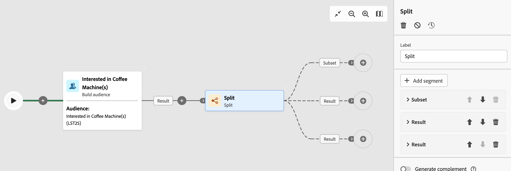

# Splitsen {#split}

>[!CONTEXTUALHELP]
>id="acw_orchestration_split"
>title="Gesplitste activiteit"
>abstract="De **Gesplitste** activiteit staat u toe om inkomende populaties in veelvoudige subsets te segmenteren die op verschillende selectiecriteria, zoals het filtreren regels of populatiegrootte worden gebaseerd."

De **Gesplitste** activiteit is a **richtend** activiteit die inkomende populaties in veelvoudige subsets segmenteert die op verschillende selectiecriteria, zoals het filtreren regels of bevolkingsgrootte worden gebaseerd.

## De activiteit Splitsen configureren {#split-configuration}

>[!CONTEXTUALHELP]
>id="acw_orchestration_split_segments"
>title="Segmenten voor splitsingsactiviteit"
>abstract="Voeg zoveel subsets toe als u wilt om de binnenkomende populatie te segmenteren. Wanneer de **Gesplitste** activiteit wordt uitgevoerd, wordt de bevolking gesegmenteerd over de verschillende ondergroepen in de orde zij aan de activiteit worden toegevoegd. Voordat u de workflow start, moet u de subsets in de gewenste volgorde ordenen met de pijlknoppen."

>[!CONTEXTUALHELP]
>id="acw_orchestration_split_filter"
>title="Activiteitsfilter splitsen"
>abstract="Als u een filtervoorwaarde op de subset wilt toepassen, klikt u op **[!UICONTROL Create filter]** en configureert u de gewenste filterregel met de querymodelfunctie. Neem bijvoorbeeld profielen op van de binnenkomende populatie waarvan het e-mailadres bestaat in de database."
>additional-url="https://experienceleague.adobe.com/en/docs/campaign-web/v8/query-database/query-modeler-overview" text="Werken met de querymodelfunctie"

>[!CONTEXTUALHELP]
>id="acw_orchestration_split_limit"
>title="Limiet voor gesplitste activiteit"
>abstract="Als u het aantal profielen wilt beperken dat door de subset wordt geselecteerd, schakelt u de optie **[!UICONTROL Enable limit]** in en geeft u het aantal of de percentages van de populatie op die u wilt opnemen."

>[!CONTEXTUALHELP]
>id="acw_orchestration_split_sorting"
>title="Splitsen op activiteit"
>abstract="Wanneer u een populatielimiet voor een subset instelt, kunt u de geselecteerde profielen op basis van een specifiek profielkenmerk in oplopende of aflopende volgorde rangschikken. Om dit te doen, knevel op **het sorteren** optie toe. U kunt bijvoorbeeld een subset beperken tot alleen de bovenste 50 profielen met het hoogste aankoopbedrag."

>[!CONTEXTUALHELP]
>id="acw_orchestration_split_complement"
>title="Splitsen genereert complement"
>abstract="Zodra u alle ondergroepen hebt gevormd, kunt u de resterende bevolking selecteren die om het even welke ondergroepen niet aanpast en hen in een extra uitgaande overgang omvat. Om dit te doen, op **van een knevel te voorzien produceert complement** optie."

>[!CONTEXTUALHELP]
>id="acw_orchestration_split_generatesubsets"
>title="Alle subsets in dezelfde tabel genereren"
>abstract="Schakel deze optie in en uit om alle subsets te groeperen in één uitvoerovergang."

>[!CONTEXTUALHELP]
>id="acw_orchestration_split_emptytransition"
>title="Lege overgang overslaan"
>abstract="Schakel de optie **[!UICONTROL Skip empty transition]** in en uit om de uitvoerovergang voor deze subset uit te schakelen als de binnenkomende populatie leeg is."

>[!CONTEXTUALHELP]
>id="acw_orchestration_split_enable_overlapping"
>title="Overlappende uitvoerpopulaties inschakelen"
>abstract="Met de optie **[!UICONTROL Enable overlapping of output populations]** kunt u populaties beheren die tot verschillende subsets behoren. Wanneer het vakje niet wordt gecontroleerd, zorgt de gespleten activiteit ervoor een ontvanger niet in verscheidene outputovergangen aanwezig kan zijn, zelfs als het aan de criteria van verscheidene subsets voldoet. Deze worden als doel ingesteld op het eerste tabblad met overeenkomende criteria. Als het selectievakje is ingeschakeld, kunnen de ontvangers in verschillende subsets worden gevonden als ze voldoen aan hun filtercriteria. Adobe Campaign raadt aan exclusieve criteria te hanteren."

Volg deze stappen om de **Gesplitste** activiteit te vormen:

1. Voeg a **Gesplitste** activiteit aan uw werkschema toe.

1. Het deelvenster voor activiteitenconfiguratie wordt geopend met een standaardsubset. Klik **toevoegen segment** knoop om zo vele ondergroepen toe te voegen zoals gewenst om de inkomende bevolking te segmenteren.

    tonen

   >[!IMPORTANT]
   >
   >Wanneer de **Gesplitste** activiteit wordt uitgevoerd, wordt de bevolking gesegmenteerd over de verschillende ondergroepen in de orde zij aan de activiteit worden toegevoegd. Als de eerste subset bijvoorbeeld 70% van de oorspronkelijke populatie herstelt, past de volgende toegevoegde subset zijn selectiecriteria alleen toe op de resterende 30%, enzovoort.
   >
   >Voordat u de workflow start, moet u ervoor zorgen dat u de subsets in de gewenste volgorde hebt geplaatst. Gebruik de pijlknoppen om de positie van een subset te wijzigen.

1. Nadat subsets zijn toegevoegd, toont de activiteit evenveel uitvoerovergangen als er subsets zijn. Wijzig het label van elke subset om deze gemakkelijk te identificeren in het werkstroomcanvas.

1. Vorm hoe elke ondergroep de inkomende bevolking filtert. Voer de volgende stappen uit:

   1. Open de subset om de eigenschappen ervan weer te geven.

   1. Als u een filtervoorwaarde op de subset wilt toepassen, klikt u op **[!UICONTROL Create filter]** en configureert u de gewenste filterregel met de querymodelfunctie. Neem bijvoorbeeld profielen op van de binnenkomende populatie waarvan het e-mailadres bestaat in de database. [&#x200B; Leer hoe te met de vraagmodelaar &#x200B;](../../query/query-modeler-overview.md) te werken.

   1. Als u het aantal profielen wilt beperken dat door de subset wordt geselecteerd, schakelt u de optie **[!UICONTROL Enable limit]** in en geeft u het aantal of de percentages van de populatie op die u wilt opnemen.

   1. Als u een overgang wilt uitschakelen als de binnenkomende populatie leeg is, schakelt u de optie **[!UICONTROL Skip empty transition]** in of uit. Als geen profiel overeenkomt met de subset, gaat de workflow niet naar de volgende activiteit.

       tonen

      >[!NOTE]
      >
      >Wanneer het plaatsen van een bevolkingsgrens voor een ondergroep, kunt u de geselecteerde profielen rangschikken die op een specifiek [&#x200B; profielattributen &#x200B;](../../get-started/attributes.md) worden gebaseerd, in het stijgen of dalende orde. Schakel hiertoe de optie **[!UICONTROL Enable sorting]** in. U kunt bijvoorbeeld een subset beperken tot alleen de bovenste 50 profielen met het hoogste aankoopbedrag.

1. Zodra u alle ondergroepen hebt gevormd, kunt u de resterende bevolking selecteren die om het even welke ondergroepen niet aanpast en hen in een extra uitgaande overgang omvat. Schakel hiertoe de optie **[!UICONTROL Generate complement]** in.

   

   >[!NOTE]
   >
   >Met de optie **[!UICONTROL Generate all subsets in the same table]** kunt u alle subsets groeperen in één uitvoerovergang.

1. Met de optie **[!UICONTROL Enable overlapping of output populations]** kunt u populaties beheren die tot verschillende subsets behoren:

   * Wanneer het vakje niet wordt gecontroleerd, zorgt de gespleten activiteit ervoor een ontvanger niet in verscheidene outputovergangen aanwezig kan zijn, zelfs als het aan de criteria van verscheidene subsets voldoet. Deze worden als doel ingesteld op het eerste tabblad met overeenkomende criteria.
   * Als het selectievakje is ingeschakeld, kunnen de ontvangers in verschillende subsets worden gevonden als ze voldoen aan hun filtercriteria. Adobe Campaign raadt aan exclusieve criteria te hanteren.

De activiteit wordt nu gevormd. Bij werkschemauitvoering, segmenteert de bevolking in de verschillende subsets in de orde zij aan de activiteit zijn toegevoegd.

## Voorbeeld {#split-example}

In het volgende voorbeeld segmenteert de **[!UICONTROL Split]** -activiteit een publiek in verschillende subsets op basis van het te gebruiken communicatiekanaal:

* **Subset 1 &quot;duw&quot;**: Deze ondergroep omvat alle profielen die de mobiele toepassing hebben geïnstalleerd.
* **Subset 2 &quot;sms&quot;**: De mobiele telefoongebruikers: Voor de resterende bevolking die niet in Subset 1 viel, past Subset 2 een het filtreren regel toe om profielen met mobiele telefoons in het gegevensbestand te selecteren.
* **Complementeer overgang**: Deze overgang vangt alle resterende profielen die Subset 1 of Subset 2 niet aanstemden. Het bevat met name profielen die de mobiele toepassing niet hebben geïnstalleerd en geen mobiele telefoon hebben, zoals gebruikers die de mobiele app niet hebben geïnstalleerd of die geen geregistreerd mobiel nummer hebben.

