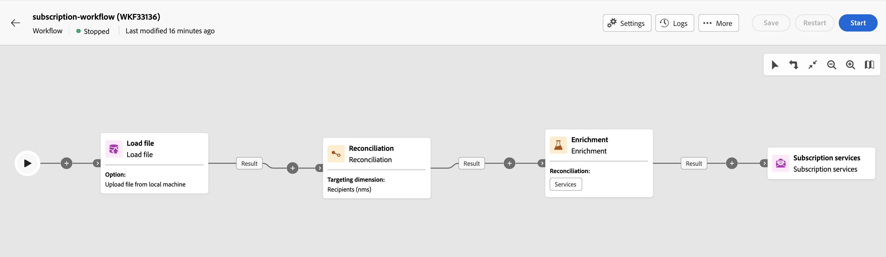

# Abonnementsdiensten {#subscription-services}

>[!CONTEXTUALHELP]
>id="acw_orchestration_subscription"
>title="Activiteit abonnementsdiensten"
>abstract="De de dienstenactiviteit van de Abonnementsdiensten staat veelvoudige profielen toe om aan of van de dienst in één enkele actie worden ingetekend."

>[!CONTEXTUALHELP]
>id="acw_orchestration_subscription_general"
>title="Algemene parameters voor de abonnementsservice"
>abstract="Kies de gewenste service en kies de actie die u wilt uitvoeren (abonnement of abonnement). Wisselen op **verzendt bevestigingsbericht** optie om de bevolking mee te delen dat zij van de geselecteerde dienst geabonneerd of geabonneerd zijn."

>[!CONTEXTUALHELP]
>id="acw_orchestration_subscription_outboundtransition"
>title="Een uitgaande overgang genereren"
>abstract="Wissel **om een uitgaande overgang** optie te produceren om een overgang na de activiteit toe te voegen."

>[!CONTEXTUALHELP]
>id="acw_orchestration_subscription_additionalinfo"
>title="Aanvullende informatie"
>abstract="Geef de gegevens en de oorsprong van het abonnement voor elke record op. U kunt deze sectie leeg laten, in welk geval er geen datum of oorsprong wordt ingesteld wanneer de workflow wordt uitgevoerd. Als de binnenkomende gegevens een kolom bevatten die de abonnementdatum van het profiel aan de dienst aangeeft, kunt u het op het **[!UICONTROL Date]** gebied selecteren. Definieer in het veld **[!UICONTROL Origin path]** de oorsprong van het abonnement. U kunt dit instellen op een van de velden van de binnenkomende data of op een constante waarde van uw keuze door de optie **[!UICONTROL Set a constant as origin]** in te schakelen."

De **activiteit van de diensten van het Abonnement van 0&rbrace; is a** het Beheer van Gegevens **activiteit.** Hiermee kunt u een abonnement op een informatieservice maken of verwijderen voor de populatie die is opgegeven in de overgang.

## Vorm de de dienstenactiviteit van het Abonnement {#subscription-services-configuration}

Volg deze stappen om de **activiteit te vormen van de diensten van het 0&rbrace; Abonnement &lbrace;:**

1. Voeg de diensten van het a **Abonnement** activiteit in uw werkschema toe. U kunt deze activiteit gebruiken na het richten van profielen of het invoeren van een dossier met geïdentificeerde gegevens.

1. Selecteer de service waarvoor u de abonnementen wilt beheren met een van de volgende opties:

   * **[!UICONTROL Select a specific service]**: selecteer handmatig een service met het veld **[!UICONTROL Service]** .

   * **[!UICONTROL From inbound transition]**: gebruik de service die is opgegeven in de binnenkomende overgang. U kunt bijvoorbeeld een bestand importeren dat de service opgeeft die voor elke regel moet worden beheerd. De service waarop de bewerking moet worden uitgevoerd, wordt vervolgens dynamisch geselecteerd voor elk profiel.

   

1. Selecteer de uit te voeren verrichting: **Abonneren** of **Unsubscribe**.

   Als de dienst in de binnenkomende overgang wordt bepaald, kies hoe te om deze verrichting terug te winnen:

   * **selecteer een specifiek verrichtingstype**: selecteer manueel de uit te voeren verrichting (**Abonneren** of **Unsubscribe**).

   * **selecteer een verrichtingstype van een weg van binnenkomende overgang**: Selecteer de kolom van de binnenkomende gegevens die de verrichting specificeert om voor elk verslag uit te voeren. U kunt bijvoorbeeld een bestand importeren dat de bewerking opgeeft die moet worden uitgevoerd voor elke regel in een kolom &quot;operation&quot;.

     U kunt hier alleen Booleaanse velden of velden met gehele getallen selecteren. Zorg ervoor dat de gegevens met de bewerking die moet worden uitgevoerd, overeenkomen met deze indeling. Als u bijvoorbeeld gegevens laadt uit een activiteit van het type Load file, controleert u of u de indeling van de kolom met de bewerking correct hebt ingesteld in de activiteit **[!UICONTROL Load file]** . Een voorbeeld wordt voorgesteld in [&#x200B; deze sectie &#x200B;](#uc2).

     >[!CAUTION]
     >
     >Door gebrek, als u deze optie selecteert, verwacht de **activiteit van de Abonnementendiensten** een verbindingsdefinitie aan de **Diensten (nms)** lijst opstelling in het werkschema te hebben. Om dit te doen, verzeker u een verzoeningsverbinding in een **activiteit van de Verrijking** vroeger in het werkschema hebt gevormd. Een voorbeeld dat toont hoe te om deze optie te gebruiken is beschikbaar [&#x200B; hier &#x200B;](#uc2).

   

1. Schakel de optie **[!UICONTROL Send a confirmation message]** in als u ontvangers wilt laten weten dat ze zijn geabonneerd op of geen abonnement hebben op de geselecteerde service. De inhoud van dit bericht wordt bepaald in een leveringsmalplaatje verbonden aan de informatiedienst.

1. Als u gegevens van een binnenkomende overgang gebruikt, wordt een **[!UICONTROL Additional information]** sectie weergegeven, waarmee u de gegevens en de oorsprong van het abonnement voor elke record kunt opgeven. U kunt deze sectie leeg laten, in welk geval er geen datum of oorsprong wordt ingesteld wanneer de workflow wordt uitgevoerd.

   * Als de binnenkomende gegevens een kolom bevatten die de abonnementdatum van het profiel aan de dienst aangeeft, kunt u het op het **[!UICONTROL Date]** gebied selecteren.

   * Definieer in het veld **[!UICONTROL Origin path]** de oorsprong van het abonnement. U kunt dit instellen op een van de velden van de binnenkomende data of op een constante waarde van uw keuze door de optie **[!UICONTROL Set a constant as origin]** in te schakelen.

   

1. Als u een uitgaande overgang na de activiteit wilt toevoegen, schakelt u de optie **[!UICONTROL Generate an outbound transition]** in of uit.

## Voorbeelden {#example}

### Een publiek abonneren op een specifieke service {#uc1}

Deze workflow hieronder laat zien hoe u een publiek kunt abonneren op een bestaande service.


* Een **[!UICONTROL Build audience]** -activiteit is gericht op een bestaand publiek.

* Met een **[!UICONTROL Subscription Services]** -activiteit kunt u de service selecteren waarop de profielen moeten worden geabonneerd.

### Meerdere lidmaatschapsstatussen bijwerken vanuit een bestand {#uc2}

In de onderstaande workflow ziet u hoe u een bestand met profielen kunt importeren en hoe u hun abonnement kunt bijwerken naar verschillende services die in het bestand zijn opgegeven.



* Een **[!UICONTROL Load file]** -activiteit laadt een CSV-bestand met de gegevens en definieert de structuur van de geïmporteerde kolommen. De kolommen &quot;service&quot; en &quot;operation&quot; geven de service aan die moet worden bijgewerkt en de bewerking die moet worden uitgevoerd (abonnement of abonnement).

  ```
  Lastname,firstname,city,birthdate,email,service,operation
  Smith,Hayden,Paris,23/05/1985,hayden.smith@example.com,yoga,sub
  Mars,Daniel,London,17/11/1999,danny.mars@example.com,running,sub
  Smith,Clara,Roma,08/02/1979,clara.smith@example.com,running,unsub
  Durance,Allison,San Francisco,15/12/2000,allison.durance@example.com,yoga,sub
  Durance,Alison,San Francisco,15/12/2000,allison.durance@example.com,running,unsub
  ```

  Zoals u misschien hebt opgemerkt, wordt de bewerking in het bestand opgegeven als &quot;sub&quot; of &quot;unsub&quot;. Het systeem verwacht dat een waarde **Boolean** of **Integer** de bewerking herkent die moet worden uitgevoerd: 0 voor uitschrijven en 1 voor inschrijven. Aan deze eis voldoen:
   * Het **type van Gegevens** voor de &quot;verrichting&quot;kolom wordt geplaatst aan geheel.
   * A **opnieuw toewijzen van de Waarde** moet worden uitgevoerd om &quot;sub&quot;en &quot;unsub&quot;waarden met &quot;1&quot;en &quot;0&quot;waarden aan te passen.

  

  Als in uw bestand al 0 en 1 worden gebruikt om de bewerking te identificeren, hoeft u deze waarden niet opnieuw toe te wijzen. Zorg slechts ervoor dat de kolom als a **Van Boole** of **Geheel getal** in de kolommen van het steekproefdossier wordt verwerkt.

* Een activiteit **[!UICONTROL Reconciliation]** identificeert de data van het bestand als deel van de profieldimensie van de Adobe Campaign-database. Het **e-mail** gebied van het dossier wordt aangepast aan het **e-mail** gebied van het profielmiddel.

  

* Een **[!UICONTROL Enrichment]** activiteit leidt tot een verzoeningsverbinding aan de lijst van de &quot;Diensten (nms)&quot;, met eenvoudige verbinding tussen de &quot;dienst&quot;kolom van het geuploade dossier en de de diensten &quot;interne naam&quot;gebied in het gegevensbestand.

  

* A **[!UICONTROL Subscription Services]** identificeert de services die moeten worden bijgewerkt als afkomstig van de overgang.

  Het **[!UICONTROL Operation type]** wordt geïdentificeerd als afkomstig van het veld **operation** van het bestand. U kunt hier alleen de velden Boolean of Integer selecteren. Als de kolom van het bestand dat de uit te voeren bewerking bevat, niet in de lijst wordt weergegeven, controleert u of u de kolomindeling correct hebt ingesteld in de **[!UICONTROL Load file]** -activiteit, zoals eerder in dit voorbeeld wordt uitgelegd.

  