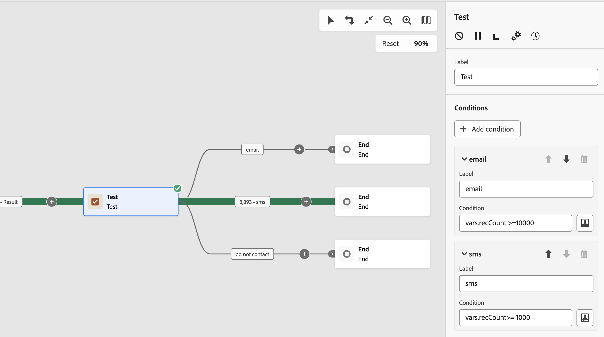

# Testen {#test}

De **Testen** activiteit is **Stroomregeling** activiteit. Hiermee kunt u overgangen inschakelen op basis van opgegeven voorwaarden.

## De testactiviteit configureren {#test-configuration}

Voer de volgende stappen uit om de **Testen** activiteit:

1. Voeg een **Testen** activiteit aan uw werkschema.

1. Standaard worden de **[!UICONTROL Test]** activiteit is een eenvoudige booleaanse test. Als aan de voorwaarde in de overgang &quot;Waar&quot; is voldaan, wordt deze overgang geactiveerd. Anders wordt een standaardovergang &quot;False&quot; geactiveerd.

1. Als u de voorwaarde voor een overgang wilt configureren, klikt u op de knop **[!UICONTROL Open personalization dialog]** pictogram. Gebruik de uitdrukkingsredacteur om de regels te bepalen die worden vereist om deze overgang te activeren. U kunt gebeurtenisvariabelen, voorwaarden en datum-/tijdfuncties ook gebruiken. [Leer hoe u met gebeurtenisvariabelen en de expressie-editor werkt](../event-variables.md)

   Bovendien kunt u de **[!UICONTROL Label]** veld om de naam van de overgang aan te passen op het werkstroomcanvas.

   

1. U kunt meerdere uitvoerovergangen toevoegen aan een **[!UICONTROL Test]** activiteit. Om dit te doen, klik **[!UICONTROL Add condition]** en configureert u het label en de bijbehorende voorwaarde voor elke overgang.

1. Tijdens de uitvoering van de workflow wordt elke voorwaarde opeenvolgend getest totdat aan een van deze voorwaarden is voldaan. Als aan geen van de voorwaarden wordt voldaan, gaat de workflow verder langs het pad van de **[!UICONTROL Default condition]**. Als geen standaardvoorwaarde wordt geactiveerd, stoppen de workflows op dit punt.

## Voorbeeld {#example}

In dit voorbeeld worden verschillende overgangen geactiveerd op basis van het aantal profielen waarvoor een **[!UICONTROL Build audience]** activiteit:
* Als er meer dan 10.000 profielen zijn bedoeld, wordt een e-mailbericht verzonden.
* Voor 1.000 tot 10.000 profielen, wordt SMS verzonden.
* Als de doelprofielen lager zijn dan 1.000, worden ze omgeleid naar een overgang &quot;neem geen contact op&quot;.

Om dit te doen, `vars.recCount` de gebeurtenisvariabele is gebruikt in de voorwaarden &quot; email &quot; en &quot; sms &quot; om het aantal doelprofielen te tellen en de juiste overgang te activeren .

