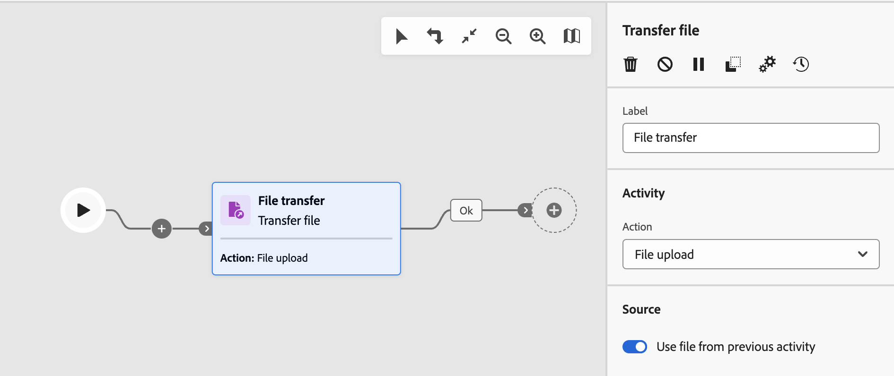

# Bestand overdragen {#transfer-file}

>[!CONTEXTUALHELP]
>id="acw_orchestration_transferfile"
>title="Bestand overdragen"
>abstract="De **activiteit van het Dossier van de Overdracht** staat u toe om dossiers, test voor dossieraanwezigheid, of lijstdossiers op een server te ontvangen of te verzenden. Het gebruikte protocol kan of server-aan-server protocol of het protocol van HTTP zijn."

>[!CONTEXTUALHELP]
>id="acw_orchestration_transferfile_options"
>title="Opties voor bestandsoverdracht"
>abstract="Opties voor bestandsoverdracht"

>[!CONTEXTUALHELP]
>id="acw_orchestration_transferfile_activity"
>title="Bestandsactiviteiten overdragen"
>abstract="Bestandsactiviteiten overdragen"

>[!CONTEXTUALHELP]
>id="acw_orchestration_transferfile_remoteserver"
>title="Externe server voor bestandsoverdracht"
>abstract="Geef de server op waarmee verbinding moet worden gemaakt."

>[!CONTEXTUALHELP]
>id="acw_orchestration_transferfile_source"
>title="Bestandsbron overdragen"
>abstract="Voer de gewenste bestandsnaam in."

De **activiteit Bestand** overdragen is een **activiteit voor gegevensbeheer** . Hiermee kunt u bestanden ontvangen of verzenden, testen op bestandsaanwezigheid of bestanden op een server weergeven. Het gebruikte protocol kan of server-aan-server protocol of het protocol van HTTP zijn.

>[!NOTE]
>
>Met het Gebruikersinterface van het Web van de Campagne, hebben wij twee activiteiten in één geconsolideerd door zowel **overdracht van het Dossier** samen te voegen en **download van het Web** mogelijkheden. Deze consolidatie heeft op geen enkele wijze invloed op de functionaliteit van de activiteit.

Volg de hieronder gedetailleerde stappen om de **het dossier van de Overdracht** activiteit te vormen.

## Kies het overdrachtprotocol en de verrichting {#protocol}

1. Voeg het dossier van de a **Overdracht** activiteit in uw werkschema dan het type van overdracht toe om afhankelijk van het protocol uit te voeren dat u wilt gebruiken:

   * Selecteer **[!UICONTROL Web Download]** voor het HTTP-protocol. Op deze manier kunt u een GET- of POST-bestand downloaden naar een expliciete URL, een externe account of een Adobe Campaign-instantie.
   * Selecteer **[!UICONTROL File transfer]** voor andere server-naar-server protocollen en verwante handelingen.

1. Selecteer de handeling die u wilt uitvoeren met de activiteit. Welke acties beschikbaar zijn, is afhankelijk van het type overdracht dat u hebt geselecteerd. Vouw de onderstaande secties uit voor meer informatie.

   +++Acties beschikbaar bij **activiteiten van het type Bestandsoverdracht**

   * **[!UICONTROL File download]**: Download een bestand van de server.
   * **[!UICONTROL File upload]**: upload een bestand naar de server.
   * **[!UICONTROL Test to see if file exists]**: controleer of een bepaald bestand aanwezig is op de server. Genereert twee uitgaande overgangen na de activiteit: &quot;Bestand bestaat&quot; en &quot;Bestand bestaat niet&quot;.
   * **[!UICONTROL File listing]**: geef een lijst weer van alle bestanden die beschikbaar zijn op de server.

+++

   +++Acties beschikbaar met **download van het Web** type activiteiten

   * **[!UICONTROL Simple transfer (GET)]** : Haal een bestand op.
   * **[!UICONTROL Transfer using a form (POST)]**: upload een bestand en aanvullende parameters.

+++

   

1. Standaard gebruikt de activiteit voor handelingen voor het uploaden van bestanden het bestand dat is opgegeven in de vorige activiteit. Als u een ander bestand wilt gebruiken, schakelt u de optie **[!UICONTROL Use file from previous activity]** uit en klikt u op de knop **[!UICONTROL Add file]** .

   Voer in het **[!UICONTROL Source]** veld de gewenste bestandsnaam in of gebruik de expressie-editor om de bestandsnaam te berekenen met behulp van gebeurtenisvariabelen. [Leer hoe u kunt werken met gebeurtenisvariabelen en de expressie-editor](../event-variables.md). Herhaal de handeling om zoveel bestanden toe te voegen als nodig is.

## De overdrachtbestemming definiëren {#destination}

1. Geef in de sectie **[!UICONTROL Remote server]** op welke server u wilt verbinden met behulp van een van de volgende methoden:

   * **[!UICONTROL Use connection parameters defined in an external account]**: Maak verbinding met een server met behulp van de verbindingsparameters van een externe account. Geef in het veld **[!UICONTROL Server folder]** het pad op naar het bestand (of naar de map voor handelingen voor het weergeven van bestanden).
   * **[!UICONTROL Quick configuration]**: voer de URL in van het bestand (of de map voor handelingen voor het weergeven van bestanden).
   * **[!UICONTROL Adobe Campaign instance]** (Downloadtype-activiteiten voor het web): Download een bestand van een Adobe Campaign-instantieserver.

   

1. Voor de acties van de POST van de download van het Web, kunt u extra parameters met de verrichting overgaan. Klik hiertoe op de knop **[!UICONTROL Add parameter]** en geef de naam en waarde van de parameters op. U kunt zoveel parameters toevoegen als u nodig hebt.

1. Voor het uploaden van bestanden worden de bestanden die op een server zijn geüpload standaard automatisch opgeslagen. Als u deze geschiedenis niet wilt bewaren, schakelt u de **[!UICONTROL Keep history of files sent]** optie uit.

## Instellingen voor historisering {#historization}

>[!CONTEXTUALHELP]
>id="acw_orchestration_transferfile_historization"
>title="Historisering van bestanden"
>abstract="Telkens wanneer een activiteit **[!UICONTROL Transfer file]** wordt uitgevoerd, worden de geüploade of gedownloade bestanden opgeslagen in een speciale map. Er wordt één map gemaakt voor elke activiteit van een workflow in het overdrachtsbestand. Standaard worden bestanden opgeslagen in de standaard opslagmap van de installatiemap van Adobe Campaign (`/vars` ) voordat ze worden verwerkt. Als u een specifieke map wilt gebruiken, schakelt u de optie **[!UICONTROL Use a default storage directory]** uit en voert u het pad van de map in."

Telkens wanneer een activiteit **[!UICONTROL Transfer file]** wordt uitgevoerd, worden de geüploade of gedownloade bestanden opgeslagen in een speciale map. Er wordt één map gemaakt voor elke activiteit van een workflow in het overdrachtsbestand. Standaard worden bestanden opgeslagen in de standaard opslagmap van de installatiemap van Adobe Campaign (`/vars` ) voordat ze worden verwerkt. Als u een specifieke map wilt gebruiken, schakelt u de optie **[!UICONTROL Use a default storage directory]** uit en voert u het pad van de map in.

Het is belangrijk dat u de grootte van deze map kunt beperken om de fysieke ruimte op de server te behouden. Hiertoe kunt u een maximumaantal bestanden of een totale grootte voor de map van de activiteit definiëren. Standaard zijn 100 bestanden en 50 MB geautoriseerd.

Telkens wanneer de activiteit wordt uitgevoerd, wordt de map als volgt gecontroleerd:

* Alleen bestanden die meer dan 24 uur vóór de uitvoering van de activiteit zijn gemaakt, worden in aanmerking genomen.
* Als het aantal bestanden waarmee rekening wordt gehouden groter is dan de waarde van het veld **[!UICONTROL Number of files]** , worden de oudste bestanden verwijderd totdat het maximale aantal toegestane bestanden is bereikt.
* Als de totale grootte van bestanden waarmee rekening wordt gehouden groter is dan de waarde van de parameter **[!UICONTROL Maximum size (in MB)]** , worden de oudste bestanden verwijderd totdat de maximale grootte (in MB) is bereikt.

>[!CAUTION]
>
>Als de activiteit niet opnieuw wordt uitgevoerd, wordt de map niet gecontroleerd en ook niet leeggemaakt. Houd hier rekening mee bij het overdragen van grote bestanden.

## Geavanceerde opties voor foutbeheer {#advanced}

>[!CONTEXTUALHELP]
>id="acw_orchestration_transferfile_advancedoptions_delete_file"
>title="Bronbestanden na overdracht verwijderen"
>abstract="Wis de bronbestanden na een geslaagde overdracht."

>[!CONTEXTUALHELP]
>id="acw_orchestration_transferfile_advancedoptions_display_logs"
>title="De sessielogboeken weergeven"
>abstract="Informatie over de overdrachtsbewerking wordt weergegeven in de werkstroomlogboeken."

>[!CONTEXTUALHELP]
>id="acw_orchestration_transferfile_advancedoptions_list_files"
>title="Alle bestanden weergeven"
>abstract="Deze optie indexeert alle dossiers huidig op de server in **vars.filenames** gebeurtenisvariabele."

>[!CONTEXTUALHELP]
>id="acw_orchestration_transferfile_process_missing_file"
>title="Ontbrekende bestanden verwerken"
>abstract="Deze optie staat u toe om a **Geen dossier** uitgaande overgang na de activiteit te activeren."

>[!CONTEXTUALHELP]
>id="acw_orchestration_transferfile_process_errors"
>title="Procesfouten"
>abstract="Deze optie staat u toe om een **Fout** uitgaande overgang na de activiteit te activeren."

1. In **[!UICONTROL Advanced options]**, zijn de extra opties beschikbaar gebaseerd op het type van activiteit dat u vormt. Vouw de onderstaande secties uit voor meer informatie.

   +++Aanvullende opties voor **[!UICONTROL File transfer]** type-activiteiten

   * **[!UICONTROL Delete the source files after transfer]**: Wis de bronbestanden na een succesvolle overdracht.
   * **[!UICONTROL Display the session logs]**: Wanneer deze optie is geactiveerd, wordt informatie met betrekking tot de overdrachtsbewerking weergegeven in de werkstroomlogboeken zodra de werkstroom is uitgevoerd.
   * **[!UICONTROL List all files]** (Handelingen in bestandenlijsten): met deze optie worden alle bestanden geïndexeerd die zich op de server bevinden in de gebeurtenisvariabele `vars.filenames` , waarin de bestandsnamen worden gescheiden door de tekens `n` . [ Leer hoe te met gebeurtenisvariabelen ](../event-variables.md) te werken

+++

   +++Aanvullende opties voor **[!UICONTROL Web download]** type-activiteiten

   * **[!UICONTROL Follow redirections]**: met Bestandsomleiding kunt u overschrijvingen gebruiken om de invoer of uitvoer van gegevens naar een ander type apparaat te sturen.
   * **[!UICONTROL Add the HTTP headers to the file]**: In sommige gevallen kunt u extra HTTP-headers aan een bestand toevoegen. Meestal, zullen deze kopballen worden gebruikt om extra informatie voor het oplossen van problemendoeleinden, voor [ het Delen van het Middel van de Cross-Origin (CORS) ](https://developer.mozilla.org/docs/Web/HTTP/CORS) te verstrekken, of specifieke caching richtlijnen te plaatsen.
   * **[!UICONTROL Ignore the HTTP return code]**: HTTP-retourcodes, ook wel HTTP-statuscodes genoemd, geven het resultaat van een HTTP-aanvraag aan.

1. Met de optie **[!UICONTROL Process errors]** kunt u een uitgaande overgang van het type Error activeren na de activiteit als er een fout optreedt tijdens de overdracht.

   Bovendien, voor **het type van de Overdracht van het Dossier** activiteiten, staat de **[!UICONTROL Process missing file]** optie u toe om een &quot;Geen dossier&quot;uitgaande overgang na de activiteit te activeren als het dossier niet beschikbaar op de gespecificeerde weg is.
