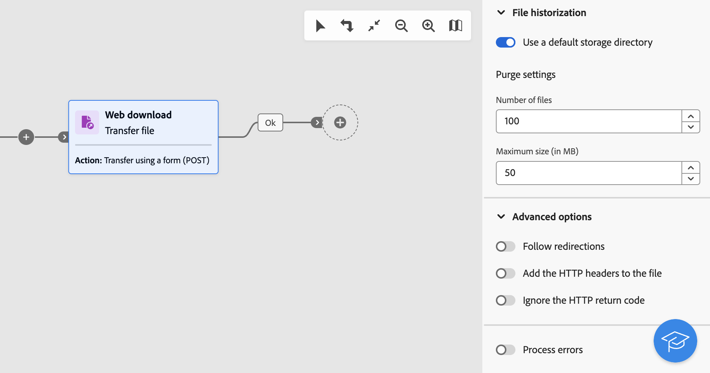

# Bestand overdragen {#transfer-file}

>[!CONTEXTUALHELP]
>id="acw_orchestration_transferfile"
>title="Bestand overdragen"
>abstract="De **Bestand overbrengen** Met activiteit kunt u bestanden ontvangen of verzenden, testen op bestandsaanwezigheid of bestanden op een server weergeven. Het gebruikte protocol kan of server-aan-server protocol of het protocol van HTTP zijn."

>[!CONTEXTUALHELP]
>id="acw_orchestration_transferfile_options"
>title="Opties voor bestandsoverdracht"
>abstract="Opties voor bestandsoverdracht"

>[!CONTEXTUALHELP]
>id="acw_orchestration_transferfile_activity"
>title="Bestandsactiviteiten overdragen"
>abstract="Bestandsactiviteiten overdragen"

>[!CONTEXTUALHELP]
>id="acw_orchestration_transferfile_remoteserver"
>title="Externe server voor bestandsoverdracht"
>abstract="Geef de server op waarmee verbinding moet worden gemaakt."

>[!CONTEXTUALHELP]
>id="acw_orchestration_transferfile_source"
>title="Bestandsbron overdragen"
>abstract="Voer de gewenste bestandsnaam in."

>[!CONTEXTUALHELP]
>id="acw_orchestration_transferfile_advancedoptions_delete_file"
>title="Bronbestanden na overdracht verwijderen"
>abstract="Wis de bronbestanden na een geslaagde overdracht."

>[!CONTEXTUALHELP]
>id="acw_orchestration_transferfile_advancedoptions_display_logs"
>title="De sessielogboeken weergeven"
>abstract="Informatie over de overdrachtsbewerking wordt weergegeven in de werkstroomlogboeken."

>[!CONTEXTUALHELP]
>id="acw_orchestration_transferfile_advancedoptions_list_files"
>title="Alle bestanden weergeven"
>abstract="Met deze optie worden alle bestanden geïndexeerd die zich op de server bevinden in het dialoogvenster **vars.filenames** gebeurtenisvariabele."

>[!CONTEXTUALHELP]
>id="acw_orchestration_transferfile_historization"
>title="Bestandshistorie"
>abstract="Bestandshistorie"

>[!CONTEXTUALHELP]
>id="acw_orchestration_transferfile_process_missing_file"
>title="Ontbrekende bestanden verwerken"
>abstract="Met deze optie kunt u een **Geen bestand** uitgaande overgang na de activiteit."

>[!CONTEXTUALHELP]
>id="acw_orchestration_transferfile_process_errors"
>title="Procesfouten"
>abstract="Met deze optie kunt u een **Fout** uitgaande overgang na de activiteit."

De **Bestand overbrengen** activiteit is **Gegevensbeheer** activiteit. Hiermee kunt u bestanden ontvangen of verzenden, testen op bestandsaanwezigheid of bestanden weergeven op een server. Het gebruikte protocol kan of server-aan-server protocol of het protocol van HTTP zijn.

>[!NOTE]
>
>Met het Web-gebruikersinterface van de Campagne, hebben wij twee activiteiten in één geconsolideerd door allebei samen te voegen **Bestandsoverdracht** en **Webdownload** mogelijkheden. Deze consolidatie heeft op geen enkele wijze invloed op de functionaliteit van de activiteit.

Voer de onderstaande stappen uit om de **Bestand overbrengen** activiteit.

## Kies het overdrachtprotocol en de verrichting {#protocol}

1. Voeg een **Bestand overbrengen** Geef vervolgens het type overdracht op dat u wilt uitvoeren, afhankelijk van het protocol dat u wilt gebruiken:

   * Selecteer bij HTTP-protocol **[!UICONTROL Web Download]**. Op deze manier kunt u een GET of POST een bestand downloaden naar een expliciete URL, een externe account of een Adobe Campaign-instantie.
   * Voor andere server-aan-server protocollen en verwante acties, selecteer **[!UICONTROL File transfer]**.

1. Selecteer de handeling die u wilt uitvoeren met de activiteit. Welke acties beschikbaar zijn, is afhankelijk van het type overdracht dat u hebt geselecteerd. Vouw de onderstaande secties uit voor meer informatie.

   +++Handelingen beschikbaar bij **Bestandsoverdracht** typeactiviteiten

   * **[!UICONTROL File download]**: Download een bestand van de server.
   * **[!UICONTROL File upload]**: Upload een bestand naar de server.
   * **[!UICONTROL Test to see if file exists]**: Controleer of een bepaald bestand aanwezig is op de server. Genereert twee uitgaande overgangen na de activiteit: &quot;Bestand bestaat&quot; en &quot;Bestand bestaat niet&quot;.
   * **[!UICONTROL File listing]**: Alle bestanden weergeven die beschikbaar zijn op de server.

+++

   +++Handelingen beschikbaar bij **Webdownload** typeactiviteiten

   * **[!UICONTROL Simple transfer (GET)]**: Haal een bestand op.
   * **[!UICONTROL Transfer using a form (POST)]**: Upload een bestand en aanvullende parameters.

+++

   

1. Standaard gebruikt de activiteit voor handelingen voor het uploaden van bestanden het bestand dat is opgegeven in de vorige activiteit. Als u een ander bestand wilt gebruiken, schakelt u het **[!UICONTROL Use file from previous activity]** en klik op de knop **[!UICONTROL Add file]** knop.

   In de **[!UICONTROL Source]** Voer de gewenste bestandsnaam in of gebruik de expressie-editor om de bestandsnaam te berekenen met behulp van gebeurtenisvariabelen. [Leer hoe u met gebeurtenisvariabelen en de expressie-editor werkt](../event-variables.md). Herhaal de bewerking om zoveel bestanden toe te voegen als u nodig hebt.

## De overdrachtbestemming definiëren {#destination}

1. In de **[!UICONTROL Remote server]** op een van de volgende manieren opgeven welke server verbinding moet maken:

   * **[!UICONTROL Use connection parameters defined in an external account]**: Maak verbinding met een server met behulp van de verbindingsparameters van een externe account. In de **[!UICONTROL Server folder]** Geef het pad naar het bestand (of naar de map voor handelingen voor het weergeven van bestanden) op.
   * **[!UICONTROL Quick configuration]**: Voer de URL in van het bestand (of de map voor handelingen voor het weergeven van bestanden).
   * **[!UICONTROL Adobe Campaign instance]** (Downloadtype voor webpagina&#39;s): download een bestand van een Adobe Campaign-instantieserver.

   

1. Voor de acties van de POST van de download van het Web, kunt u extra parameters met de verrichting overgaan. Om dit te doen, klik **[!UICONTROL Add parameter]** geeft u vervolgens de naam en de waarde van de parameters op. U kunt zoveel parameters toevoegen als u nodig hebt.

1. Voor het uploaden van bestanden worden de bestanden die op een server zijn geüpload standaard automatisch opgeslagen. Als u deze geschiedenis niet wilt behouden, schakelt u de optie **[!UICONTROL Keep history of files sent]** uit.

## Historialisatie-instellingen {#historization}

Telkens wanneer een activiteit **[!UICONTROL Transfer file]** wordt uitgevoerd, worden de geüploade of gedownloade bestanden opgeslagen in een speciale map. Er wordt één map gemaakt voor elke activiteit van een workflow in het overdrachtsbestand. Bestanden worden standaard opgeslagen in de standaardopslagmap van de installatiemap van Adobe Campaign (`/vars`) voordat ze worden verwerkt. Als u een specifieke map wilt gebruiken, schakelt u het **[!UICONTROL Use a default storage directory]** en voer het pad van de map in.

Het is belangrijk dat u de grootte van deze map kunt beperken om de fysieke ruimte op de server te behouden. Hiertoe kunt u een maximumaantal bestanden of een totale grootte voor de map van de activiteit definiëren. Standaard zijn 100 bestanden en 50 MB geautoriseerd.

Telkens wanneer de activiteit wordt uitgevoerd, wordt de map als volgt gecontroleerd:

* Alleen bestanden die meer dan 24 uur vóór de uitvoering van de activiteit zijn gemaakt, worden in aanmerking genomen.
* Als het aantal bestanden waarmee rekening wordt gehouden groter is dan de waarde van de **[!UICONTROL Number of files]** worden de oudste bestanden verwijderd totdat het maximale aantal toegestane bestanden is bereikt.
* Als de totale grootte van de bestanden waarmee rekening wordt gehouden groter is dan de waarde van de **[!UICONTROL Maximum size (in MB)]** worden de oudste bestanden verwijderd totdat de maximaal toegestane grootte (in MB) is bereikt.

>[!CAUTION]
>
>Als de activiteit niet opnieuw wordt uitgevoerd, wordt de map niet gecontroleerd en ook niet leeggemaakt. Houd hier rekening mee bij het overdragen van grote bestanden.

## Geavanceerde opties voor foutbeheer {#advanced}

1. In de **[!UICONTROL Advanced options]** Er zijn aanvullende opties beschikbaar op basis van het type activiteit dat u configureert. Vouw de onderstaande secties uit voor meer informatie.

   +++Aanvullende opties voor **[!UICONTROL File transfer]** typeactiviteiten

   * **[!UICONTROL Delete the source files after transfer]**: Wis de bronbestanden na een geslaagde overdracht.
   * **[!UICONTROL Display the session logs]**: Als deze optie is geactiveerd, wordt informatie over de overdrachtsbewerking weergegeven in de werkstroomlogboeken nadat de workflow is uitgevoerd.
   * **[!UICONTROL List all files]** (Handelingen voor bestandslijsten): met deze optie worden alle bestanden op de server geïndexeerd in het dialoogvenster `vars.filenames` gebeurtenisvariabele, waarin de bestandsnamen worden gescheiden door de `n` tekens. [Leer hoe u met gebeurtenisvariabelen werkt](../event-variables.md)

+++

   +++Aanvullende opties voor **[!UICONTROL Web download]** typeactiviteiten

   * **[!UICONTROL Follow redirections]**: Met Bestandsomleiding kunt u overschrijvingen gebruiken voor het rechtstreeks invoeren of uitvoeren van gegevens naar een apparaat van een ander type.
   * **[!UICONTROL Add the HTTP headers to the file]**: In sommige gevallen kunt u extra HTTP-headers aan een bestand toevoegen. Meestal, zullen deze kopballen worden gebruikt om extra informatie voor het oplossen van problemendoeleinden te verstrekken, voor [Delen van bronnen tussen verschillende bronnen (CORS)](https://developer.mozilla.org/docs/Web/HTTP/CORS)of om specifieke richtlijnen voor het in cache plaatsen vast te stellen.
   * **[!UICONTROL Ignore the HTTP return code]**: HTTP-retourcodes, ook wel HTTP-statuscodes genoemd, geven het resultaat van een HTTP-aanvraag aan.

1. De **[!UICONTROL Process errors]** kunt u een uitgaande overgang van het type &quot;Error&quot; activeren na de activiteit als er een fout optreedt tijdens de overdracht.

   Daarnaast, voor **Bestandsoverdracht** type activiteiten, **[!UICONTROL Process missing file]** kunt u een uitgaande overgang van het type &quot;Geen bestand&quot; activeren na de activiteit als het bestand niet beschikbaar is op het opgegeven pad.
