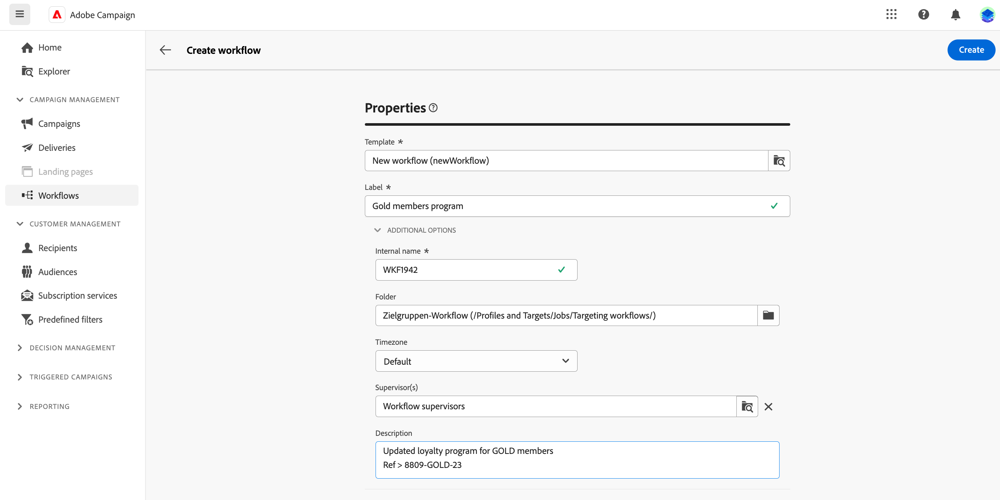
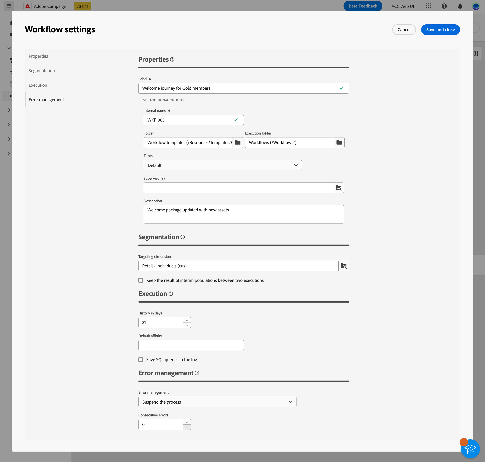

# De workflow maken {#create-first-workflow}

>[!CONTEXTUALHELP]
>id="acw_workflow_creation_properties"
>title="Workfloweigenschappen"
>abstract="Kies in dit scherm de sjabloon die u wilt gebruiken om de workflow te maken en geef een label op. Vouw de sectie EXTRA OPTIONS uit om meer instellingen te configureren, zoals de interne naam van de workflow, de map, de tijdzone en de supervisorgroep. Het wordt hoogst geadviseerd om een supervisorgroep te selecteren zodat de exploitanten worden gealarmeerd als een fout voorkomt."

>[!CONTEXTUALHELP]
>id="acw_campaign_creation_workflow"
>title="Lijst met workflows in de campagne"
>abstract="De **Workflows** worden alle workflows weergegeven die aan de huidige campagne zijn gekoppeld. Klik op de naam van een workflow om deze te bewerken. Gebruik de **Workflow maken** om een nieuwe workflow voor deze campagne toe te voegen."

U kunt zelfstandige workflows of workflows in een campagne maken. De eerste stap bestaat uit het selecteren van een sjabloon en het definiëren van de algemene eigenschappen ervan. Vervolgens kunt u zo nodig aanvullende instellingen configureren.

Voer hiertoe de volgende stappen uit:

1. Een **Zelfstandige workflow**, bladert u naar de **Werknemers** -menu.

   Een **Campagne-workflow**, bladert u naar de **Campagnes** en opent u de campagne waarvoor u een nieuwe workflow wilt maken.

1. Klik op de knop **[!UICONTROL Create workflow]** rechtsboven in het scherm.

   

1. In workflow **Eigenschappen** selecteert u de sjabloon die u wilt gebruiken om de workflow te maken (u kunt ook de standaard ingebouwde sjabloon gebruiken). Meer informatie over sjablonen in [het onderstaande gedeelte](#work-with-workflow-templates-workflow-templates).

1. Voer een label in voor de workflow. Daarnaast raden we u ten zeerste aan een beschrijving toe te voegen aan uw workflow, in het specifieke veld van het dialoogvenster **[!UICONTROL Additional options]** van het scherm.

1. Breid uit **[!UICONTROL Additional options]** om meer instellingen voor de workflow te configureren. Leer hoe u de eigenschappen van de workflow kunt configureren in [deze pagina](workflow-settings.md#properties)

   

1. Klik op de knop **[!UICONTROL Create workflow]** om het maken van uw workflow te bevestigen.

Uw workflow wordt nu gemaakt en beschikbaar in de lijst met workflows. U kunt nu het visuele canvas openen en de taken die het gaat uitvoeren, toevoegen, configureren en ordenen. Leer hoe u workflowactiviteiten kunt ordenen in [deze pagina](orchestrate-activities.md).

## Werken met workflowsjablonen {#workflow-templates}

>[!CONTEXTUALHELP]
>id="acw_workflow_template_for_campaign"
>title="Workflowsjablonen"
>abstract="Workflowsjablonen bevatten vooraf geconfigureerde instellingen en activiteiten die opnieuw kunnen worden gebruikt voor het maken van nieuwe workflows."

Workflowsjablonen bevatten vooraf geconfigureerde instellingen en activiteiten die opnieuw kunnen worden gebruikt voor het maken van nieuwe workflows. U kunt bij het maken van een workflow de sjabloon van uw workflow selecteren uit de workfloweigenschappen. Er wordt standaard een lege sjabloon weergegeven.

U kunt een sjabloon maken op basis van een bestaande workflow of een geheel nieuwe sjabloon maken. Beide methoden worden hieronder beschreven.

>[!BEGINTABS]

>[!TAB Een sjabloon maken op basis van een bestaande workflow]

Voer de volgende stappen uit om een werkstroomsjabloon te maken op basis van een bestaande workflow:

1. Openen voor de **Workflows** en blader aan het werkschema om als malplaatje te bewaren.
1. Klik op de drie stippen rechts van de naam van de workflow en kies **Kopiëren als sjabloon**.

   

1. Bevestig het maken van de sjabloon in het pop-upvenster.
1. In het canvas van het werkschemamalplaatje, controleer, voeg, en vorm de activiteiten toe zoals nodig.
1. Bladeren naar de instellingen, via het dialoogvenster **Instellingen** om de naam van de werkstroomsjabloon te wijzigen en een beschrijving in te voeren.
1. Selecteer de **map** en **uitvoeringsmap** van de template. De map is de locatie waar het werkstroomsjabloon wordt opgeslagen. De uitvoeringsmap is de map waarin workflows worden opgeslagen die op basis van deze sjabloon zijn gemaakt.

   

   De andere eigenschappen komen veel voor in workflows. Meer informatie in [deze pagina](workflow-settings.md#properties)

1. Sla uw wijzigingen op.

Het werkstroomsjabloon is nu beschikbaar in de sjabloonlijst. U kunt een workflow maken op basis van deze sjabloon. Deze workflow wordt vooraf geconfigureerd met de instellingen en activiteiten die in de sjabloon zijn gedefinieerd.

>[!TAB Een geheel nieuwe sjabloon maken]

Ga als volgt te werk om een werkstroomsjabloon helemaal zelf te maken:

1. Openen voor de **Workflows** en blader aan **Sjablonen** tab. U kunt de lijst met beschikbare werkstroomsjablonen bekijken.
1. Klik op de knop **[!UICONTROL Create template]** rechtsboven in het scherm.
1. Voer het label in en open de aanvullende opties om een beschrijving van de werkstroomsjabloon in te voeren.
1. Selecteer de map en de uitvoeringsmap van de sjabloon. De map is de locatie waar het werkstroomsjabloon wordt opgeslagen. De uitvoeringsmap is de map waarin workflows worden opgeslagen die op basis van deze sjabloon zijn gemaakt.

   

   De andere eigenschappen komen veel voor in workflows. Meer informatie in [deze pagina](workflow-settings.md#properties)

1. Klik op de knop **Maken** om uw instellingen te bevestigen.
1. In het canvas van het werkschemamalplaatje, voeg en vorm de activiteiten toe zoals nodig.

   

1. Sla uw wijzigingen op.

Het werkstroomsjabloon is nu beschikbaar in de sjabloonlijst. U kunt een workflow maken op basis van deze sjabloon. Deze workflow wordt vooraf geconfigureerd met de instellingen en activiteiten die in de sjabloon zijn gedefinieerd.

>[!ENDTABS]
