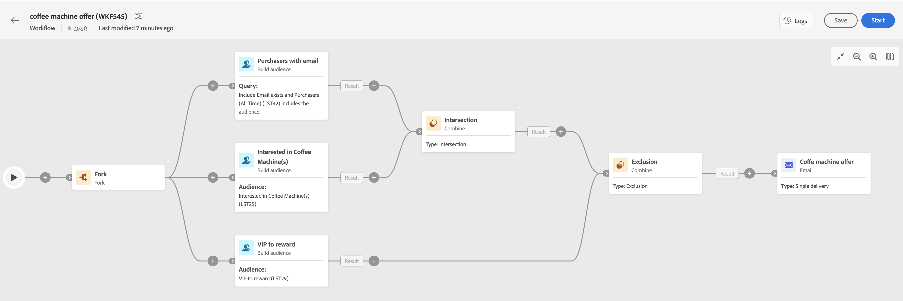

# Belangrijkste principes voor het maken van werkstromen {#gs-workflow-creation}

Met Campagne v8 Web, kunt u werkschema&#39;s in een visueel canvas bouwen om kanaalprocessen zoals segmentatie, campagneuitvoering, dossierverwerking te ontwerpen.

Workflows kunnen worden gemaakt als zelfstandige workflows, via het menu Workflows of rechtstreeks in een campagne. In dat geval wordt de workflow gekoppeld aan de campagne en uitgevoerd samen met alle workflows van de andere campagne.

## Wat zit er in een workflow?

Het workflowdiagram is een weergave van wat er moet gebeuren. Hierin worden de verschillende taken beschreven die moeten worden uitgevoerd en hoe deze aan elkaar zijn gekoppeld.

Elke werkstroom bevat:

* **Activiteiten**: Een activiteit is een uit te voeren taak. De verschillende activiteiten worden op het diagram weergegeven door pictogrammen. Elke activiteit heeft specifieke eigenschappen en andere eigenschappen die voor alle activiteiten gemeenschappelijk zijn.

  In een werkschemadiagram, kan een bepaalde activiteit veelvoudige taken veroorzaken, in het bijzonder wanneer er een lijn of terugkerende acties is.

* **Overgangen**: Overgangen koppelen een bronactiviteit aan een bestemmingsactiviteit en bepalen hun opeenvolging.

* **Worktables**: De werktabel bevat alle informatie die door de overgang wordt overgedragen. Voor elke workflow worden meerdere werktabellen gebruikt. De gegevens in deze tabellen kunnen gedurende de gehele levenscyclus van de workflow worden gebruikt.

## Belangrijkste stappen om een workflow te maken

De belangrijkste stappen voor het maken van workflows zijn:

