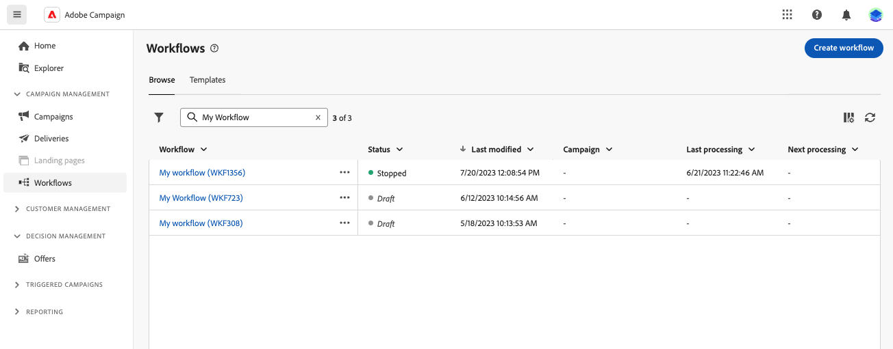

# Belangrijkste principes voor het maken van werkstromen {#gs-workflow-creation}

Met Adobe Campaign Web, kunt u werkschema&#39;s op een visueel canvas bouwen om kanaalprocessen zoals segmentatie, campagneuitvoering, en dossierverwerking te ontwerpen.

## Wat zit er in een workflow? {#gs-workflow-inside}

Het werkschemadiagram vertegenwoordigt het geplande proces. Hierin worden de verschillende taken beschreven die moeten worden uitgevoerd en hoe deze aan elkaar zijn gekoppeld.

{zoomable="yes"}

Elke werkstroom bevat:

* **Activiteiten**: Een activiteit is een uit te voeren taak. De pictogrammen in het diagram geven de verschillende activiteiten weer. Elke activiteit heeft specifieke eigenschappen en eigenschappen die voor alle activiteiten gemeenschappelijk zijn.

  In een werkschemadiagram, kan een bepaalde activiteit veelvoudige taken veroorzaken, vooral wanneer er een lijn of terugkerende acties is.

* **Overgangen**: De overgangen verbinden een bronactiviteit met een bestemmingsactiviteit en bepalen hun opeenvolging.

* **Worktables**: De werklijst bevat alle informatie die door de overgang wordt gedragen. Voor elke workflow worden meerdere werktabellen gebruikt. De gegevens in deze tabellen kunnen gedurende de gehele levenscyclus van de workflow worden gebruikt.

## Belangrijke stappen om een workflow te maken {#gs-workflow-steps}

Met campagnes kunt u op twee manieren een workflow maken:

1. De werkschema&#39;s kunnen als standalone werkschema&#39;s van het **menu van de Werkschema&#39;s** worden gecreeerd.

   {zoomable="yes"}

1. De werkschema&#39;s kunnen direct binnen een campagne van het **1} lusje van het Werkschema {van de campagne worden gecreeerd.** Wanneer inbegrepen in een campagne, voert het werkschema samen met alle andere werkschema&#39;s van de campagne uit, en de rapporteringsmetriek wordt gegroepeerd op campagneniveau.

   {zoomable="yes"}

De belangrijkste stappen voor het maken van workflows zijn als volgt:

{zoomable="yes"}

Deze stappen worden beschreven in de volgende secties:

1. [Uw workflow maken en de eigenschappen ervan definiëren](create-workflow.md)
1. [Activiteiten ordenen en configureren](orchestrate-activities.md)
1. [Geavanceerde workflowinstellingen configureren](workflow-settings.md)
1. [Start uw workflow en controleer de uitvoering ervan](start-monitor-workflows.md)