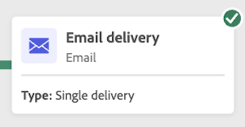
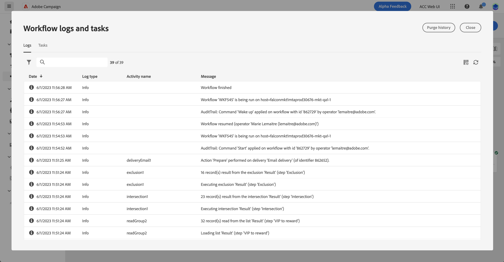

# De workflow starten en controleren {#start-monitor}

Nadat u de workflow hebt gemaakt en de taken hebt ontworpen die u op het canvas wilt uitvoeren, kunt u deze starten en controleren hoe deze wordt uitgevoerd.

## De workflow starten {#start}

Navigeer naar de **[!UICONTROL Workflows]** menu of de bijbehorende campagne en klik op **[!UICONTROL Start]** in de rechterbovenhoek van het canvas

Zodra de workflow is gestart, wordt elke activiteit op het canvas in volgorde uitgevoerd, totdat het einde van de workflow is bereikt.

U kunt de voortgang van doelprofielen in real time volgen gebruikend een visuele stroom. Hierdoor kunt u snel de status van elke activiteit en het aantal profielen identificeren dat tussen de activiteiten overgaat.

## Workflowovergangen {#transitions}

In werkstromen, worden de gegevens die van één activiteit aan een andere door overgangen worden vervoerd opgeslagen in een tijdelijke het werklijst. Deze gegevens kunnen voor elke overgang worden weergegeven. Selecteer hiertoe een overgang om de eigenschappen ervan in de rechterkant van het scherm te openen.

* Klikken **[!UICONTROL Preview schema]** om het schema van de het werklijst te tonen.
* Klikken **[!UICONTROL Preview results]** om de gegevens te visualiseren die in de geselecteerde overgang worden vervoerd.

## Activiteitenuitvoering controleren {#activities}

De visuele indicatoren in de hoger-juiste hoek van elke activiteitendoos staan u toe om hun uitvoering te controleren:

| Visuele indicator | Beschrijving |
|-----|------------|
| {width="70%"} | De activiteit wordt momenteel uitgevoerd. |
| {width="70%"} | De activiteit vereist uw aandacht. Dit kan inhouden dat de verzending van een levering wordt bevestigd of dat de nodige actie wordt ondernomen. |
| {width="70%"} | Er is een fout opgetreden in de activiteit. Open de logbestanden van de workflow voor meer informatie om het probleem op te lossen. |
| {width="70%"} | De activiteit is met succes uitgevoerd. |

## Logboeken en taken controleren {#logs-tasks}

Het controleren van werkstromen logboeken en taken is een zeer belangrijke stap om uw werkschema&#39;s te analyseren en ervoor te zorgen zij behoorlijk lopen. Ze zijn toegankelijk vanuit de **[!UICONTROL Logs]** pictogram dat beschikbaar is in de actiewerkbalk en in het eigenschappenvenster van elke activiteit.

De **[!UICONTROL Logs and tasks]** bevat een historie van de workflowuitvoering, waarin alle handelingen van de gebruiker zijn opgenomen en fouten zijn aangetroffen. Deze geschiedenis wordt opgeslagen voor de duur die is opgegeven in de workflow [uitvoeringsopties](workflow-settings.md). Tijdens deze periode worden alle berichten opgeslagen, zelfs nadat de workflow opnieuw is opgestart. Als u de berichten uit een vorige uitvoering niet wilt opslaan, klikt u op de knop **[!UICONTROL Purge history]** knop.

Er zijn twee soorten informatie beschikbaar:

* De **[!UICONTROL Log]** bevat de uitvoeringsgeschiedenis van alle werkstroomactiviteiten. De uitgevoerde bewerkingen en uitvoeringsfouten worden chronologisch geïndexeerd.
* De **[!UICONTROL Tasks]** tabblad bevat informatie over de volgorde van uitvoering van de activiteiten.

Op beide tabbladen kunt u de weergegeven kolommen en hun volgorde kiezen, filters toepassen en het zoekveld gebruiken om snel de gewenste informatie te zoeken.

## Opdrachten voor workflowuitvoering {#execution-commands}

De actiebalk in de rechterbovenhoek bevat opdrachten waarmee u de uitvoering van de workflow kunt beheren. U kunt:

* **[!UICONTROL Start]** / **[!UICONTROL Resume]** de uitvoering van de workflow, die vervolgens de status In uitvoering krijgt. Als de werkstroom is gepauzeerd, wordt deze hervat, anders wordt deze gestart en worden de initiële activiteiten geactiveerd.

* **[!UICONTROL Pause]** de uitvoering van de workflow, die vervolgens de status Gepauzeerd krijgt. Er zullen geen nieuwe activiteiten worden geactiveerd totdat de activiteiten worden hervat, maar de lopende activiteiten worden niet opgeschort.

* **[!UICONTROL Stop]** een workflow die wordt uitgevoerd en die vervolgens de status Voltooid krijgt. De lopende bewerkingen worden indien mogelijk onderbroken. U kunt de workflow niet hervatten vanaf de plaats waar deze is gestopt.
